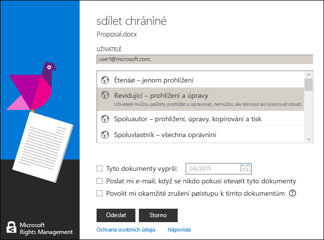

# Uživatelsk&#225; př&#237;ručka aplikace pro sd&#237;len&#237; obsahu Microsoft Rights Management – původn&#237; publikace
Tato uživatelská příručka aplikace pro sdílení obsahu Microsoft Rights Management pro Windows obsahuje následující oddíly:

-   [Evaluating and Installing Microsoft Rights Management sharing application](../Topic/Microsoft_Rights_Management_sharing_application_user_guide_-_original_publication.md#BKMK_Eval)

-   [Using Microsoft Rights Management sharing application](../Topic/Microsoft_Rights_Management_sharing_application_user_guide_-_original_publication.md#BKMK_UsingMSRMSApp)

-   [Using User-Authored Permissions and Sharing Protected Content](../Topic/Microsoft_Rights_Management_sharing_application_user_guide_-_original_publication.md#BKMK_Custom)

-   [Using the Office Toolbar Add-in](../Topic/Microsoft_Rights_Management_sharing_application_user_guide_-_original_publication.md#BKMK_OfficeToolbar)

-   [Administrator’s guidance for Microsoft Rights Management sharing application](../Topic/Microsoft_Rights_Management_sharing_application_user_guide_-_original_publication.md#BKMK_AdminGuide)

Časté otázky a informace o řešení problémů najdete v článku [Nejčastější dotazy k aplikaci pro sdílení obsahu Microsoft Rights Management pro Windows](http://go.microsoft.com/fwlink/?LinkId=303971).

## <a name="BKMK_Eval"></a>Testování a instalace aplikace pro sdílení obsahu Microsoft Rights Management
Tento oddíl vysvětluje, co je aplikace pro sdílení obsahu Microsoft Rights Management a jak se instaluje:

-   [What is the Microsoft Rights Management sharing application?](../Topic/Microsoft_Rights_Management_sharing_application_user_guide_-_original_publication.md#BKMK_WhatIs)

-   [Requirements for Microsoft Rights Management sharing application](../Topic/Microsoft_Rights_Management_sharing_application_user_guide_-_original_publication.md#BKMK_Reqs)

-   [Installing the Microsoft Rights Management sharing application](../Topic/Microsoft_Rights_Management_sharing_application_user_guide_-_original_publication.md#BKMK_Install)

### <a name="BKMK_WhatIs"></a>Co je aplikace pro sdílení obsahu Microsoft Rights Management?
Aplikace pro sdílení obsahu Microsoft Rights Management je volitelná stahovatelná aplikace pro Microsoft Windows, která umožňuje:

-   Vylepšit Průzkumník souborů (ve Windows 7 a starších verzích označovaný jako Průzkumník Windows), který pak umožňuje chránit jeden soubor, hromadně chránit několik souborů nebo všechny soubory ve vybrané složce

-   Přidat podporu pro ochranu libovolného typu souboru a integrovaný prohlížeč pro běžně používané typy textových a obrázkových souborů

-   Přidat nová tlačítka na panel nástrojů Microsoft Office pro Word, PowerPoint a Excel

### <a name="BKMK_Reqs"></a>Požadavky aplikace pro sdílení obsahu Microsoft Rights Management
Abyste aplikaci pro sdílení obsahu Microsoft Rights Management mohli používat, musíte mít v počítači Windows 8.1, Windows 8 nebo Windows 7.

Aplikace pro sdílení obsahu Microsoft Rights Management vyžaduje Klienta služby AD RMS 2.1, který se instaluje jako součást instalačního balíčku. Aplikace pro sdílení obsahu Microsoft Rights Management bude fungovat jenom s touto verzí klienta služby AD RMS.

### <a name="BKMK_Install"></a>Instalace aplikace pro sdílení obsahu Microsoft Rights Management
Při instalaci aplikace pro sdílení obsahu Microsoft Rights Management postupujte takto:

1.  Přejděte na stránku [Microsoft Rights Management](http://go.microsoft.com/fwlink/?LinkId=303970) na webu Microsoftu.

2.  V části **Počítače** klikněte na ikonu  **Aplikace RMS pro systém Windows** a uložte instalační balíček aplikace pro sdílení obsahu Microsoft Rights Management do počítače.

3.  Poklikejte na stažený komprimovaný soubor a pak poklikejte na soubor **setup.exe**. Při zobrazení výzvy k pokračování klikněte na **Ano**.

4.  Na stránce **Instalace aplikace Microsoft RMS** klikněte na **Další** a počkejte na dokončení instalace.

5.  Až instalace skončí, klikněte na **Restartovat** a dokončete instalaci restartováním počítače. Nebo klikněte na **Zavřít** a dokončete instalaci restartováním počítače později.

## <a name="BKMK_UsingMSRMSApp"></a>Používání aplikace pro sdílení obsahu Microsoft Rights Management
Tento oddíl se zabývá různými způsoby používání aplikace pro sdílení obsahu Microsoft Rights Management:

-   [Creating a protected text (.ptxt) file](../Topic/Microsoft_Rights_Management_sharing_application_user_guide_-_original_publication.md#BKMK_CreatePTXT)

-   [Viewing a protected text (.ptxt) or a protected image file](../Topic/Microsoft_Rights_Management_sharing_application_user_guide_-_original_publication.md#BKMK_ViewPTXT)

-   [Creating a generic protected (.pfile) file](../Topic/Microsoft_Rights_Management_sharing_application_user_guide_-_original_publication.md#BKMK_CreatePFILE)

-   [Viewing a generic protected (.pfile) file](../Topic/Microsoft_Rights_Management_sharing_application_user_guide_-_original_publication.md#BKMK_ViewPFILE)

-   [Removing protection from a file](../Topic/Microsoft_Rights_Management_sharing_application_user_guide_-_original_publication.md#BKMK_Unprotect)

### <a name="BKMK_CreatePTXT"></a>Vytvoření chráněného textového souboru (.ptxt)
Aplikace pro sdílení obsahu Microsoft Rights Management se dá použít k převedení běžného textového souboru (.txt) na chráněný textový soubor (.ptxt).

##### Chráněný textový soubor (.ptxt) vytvoříte tak, že

1.  V Průzkumníku souborů klikněte pravým tlačítkem na složku, přejděte na **Nový** a potom klikněte na **Textový dokument**.

2.  Přejmenujte soubor (třeba na Ukázka.txt).

3.  Poklikáním soubor otevřete v Poznámkovém bloku.

4.  V Poznámkovém bloku přidejte do tohoto souboru pár řádků textu (jako v následující ukázce) a pak ho uložte:

    ```
    This is a sample text file.
    This is a sample text file.
    This is a sample text file.
    This is a sample text file. 
    This is a sample text file.
    This is a sample text file.
    ```

5.  Klikněte na soubor pravým tlačítkem, přejděte na **Chránit místně** a v seznamu vyberte šablonu. (Pokud tento nástroj používáte poprvé, budete muset výběrem možnosti **Ochrana definovaná společností** začít stahování šablon pro vaši organizaci.)

6.  Na obrazovce **Aplikace pro sdílení obsahu Microsoft Rights Management** potvrďte zásady, které chcete použít, klikněte na **Použít** a po aktivaci ochrany souboru klikněte na **Zavřít**.

### <a name="BKMK_ViewPTXT"></a>Prohlížení chráněného textového souboru (.ptxt) nebo chráněného obrázkového souboru
Pokud si chcete prohlédnout chráněný textový soubor (.ptxt), v Průzkumníku souborů na tento soubor poklikejte (například na soubor Ukázka.ptxt). Může se zobrazit výzva k autorizaci aplikace za účelem získání práv. V horní části souboru se zobrazí zásady ochrany.

Podobně se dají otevírat a prohlížet chráněné obrázky.

### <a name="BKMK_CreatePFILE"></a>Vytvoření obecného chráněného souboru (.pfile)
Formát obecného chráněného souboru (.pfile) nabízí obecnou úroveň ochrany pro typy souborů, které aplikace pro sdílení obsahu Microsoft Rights Management nebo jiné aplikace s integrovanou ochranou typu RMS přímo nepodporují.

Tento formát dokáže ochránit například soubory .vsd vytvořené v Microsoft Visiu (které v současnosti nepodporuje integrovanou ochranu).

> [!NOTE]
> Soubory, které používají obecnou ochranu, jsou zabezpečené jenom pro ověřování. Uživatel, který je autorizovaný k použití chráněného souboru (.pfile) se ověří a zobrazí se jeho práva a oprávnění, která se ale nedají vynutit, pokud je soubor otevřený v původním formátu (třeba když se soubor .vsd otevře ve Visiu). Uživatel, který není autorizovaný nebo se nedá ověřit, nebude moct tento chráněný soubor otevřít.

##### Obecný chráněný soubor (.pfile) vytvoříte ze souboru výkresu Visia (.vsd) tak, že

1.  V Průzkumníku souborů klikněte pravým tlačítkem na složku, přejděte na **Nový** a potom klikněte na **Nový dokument Visia**.

2.  Přejmenujte soubor (třeba na Ukázka.vsd).

3.  Poklikáním soubor otevřete ve Visiu.

4.  Ve Visiu přidejte do výkresu prvky a pak soubor uložte a zavřete.

5.  Klikněte na soubor pravým tlačítkem, přejděte na **Chránit místně** a vyberte některou šablonu zásad v seznamu. (Pokud tento nástroj používáte poprvé, budete muset výběrem možnosti **Ochrana definovaná společností** začít stahování šablon pro vaši organizaci.)

6.  Na obrazovce **Aplikace pro sdílení obsahu Microsoft Rights Management** vyberte zásadu, kterou chcete použít, a klikněte na **Použít**.

7.  Zobrazí se zpráva s oznámením, že chráněný soubor se uložil jako Sample.vsd.pfile (původní soubor se odstranil).

### <a name="BKMK_ViewPFILE"></a>Prohlížení obecného chráněného souboru (.pfile)
Obecný chráněný soubor (.pfile) si prohlédnete tak, že v Průzkumníku souborů na tento soubor (například Ukázka.vsd.pfile) poklikáte a pak kliknete na **Otevřít**.

### <a name="BKMK_Unprotect"></a>Odebrání ochrany souboru
Aplikace pro sdílení obsahu Microsoft Rights Management vám umožňuje odebrat ochranu souborů, které byly předtím chráněné.

U chráněného souboru můžete odebrat ochranu (vlastně ho odemknout) tak, že použijete možnost **Odebrat ochranu** podle následujícího postupu:

1.  Klikněte pravým tlačítkem na **Sample.ptxt**, přejděte na **Chránit místně** a klikněte na **Odebrat ochranu**. Může se zobrazit výzva k autorizaci aplikace za účelem získání práv.

2.  Soubor Ukázka.ptxt se odstraní a nahradí souborem Ukázka.txt.

## <a name="BKMK_Custom"></a>Použití uživatelem definovaných oprávnění a sdílení chráněného obsahu
Tento oddíl pojednává o tom, jak chránit a využívat soubor pomocí uživatelem definovaných oprávnění, jak sdílet chráněný obsah a jak ochránit několik souborů:

-   [Protecting a file with user-authored permissions](../Topic/Microsoft_Rights_Management_sharing_application_user_guide_-_original_publication.md#BKMK_ProtectCustom)

-   [Consuming files that have user-authored protection](../Topic/Microsoft_Rights_Management_sharing_application_user_guide_-_original_publication.md#BKMK_UserDefined)

-   [Sharing protected content](../Topic/Microsoft_Rights_Management_sharing_application_user_guide_-_original_publication.md#BKMK_ShareProtected)

-   [Using keyboard shortcuts](../Topic/Microsoft_Rights_Management_sharing_application_user_guide_-_original_publication.md#BKMK_AccessKeys)

-   [Applying protection to multiple files and folders](../Topic/Microsoft_Rights_Management_sharing_application_user_guide_-_original_publication.md#BKMK_Multiple)

### <a name="BKMK_ProtectCustom"></a>Ochrana souboru pomocí uživatelem definovaných oprávnění
Uživatelem definovaná ochrana umožňuje:

-   Omezit přístup k souboru jenom na konkrétní seznam jednotlivých uživatelů určených jejich e-mailovými adresami

-   Omezit použití souboru jenom na konkrétní práva, třeba jen na čtení určitého dokumentu

Pokud chcete soubor ochránit pomocí uživatelem definovaných oprávnění, klikněte na něho pravým tlačítkem, klikněte na **Chránit místně** a na **Vlastní oprávnění**. Ukáže se následující obrazovka:


Zadejte e-mailové adresy seznamu uživatelů, posuvníkem vyberte oprávnění k tomuto souboru a klikněte na **Použít**.

### <a name="BKMK_UserDefined"></a>Využívání souborů s uživatelem definovanou ochranou
Většina chráněných souborů, které aplikace pro sdílení obsahu Microsoft Rights Management obsluhuje, bude chráněná úrovněmi ochrany na základě šablon. Aplikace pro sdílení obsahu Microsoft Rights Management ale podporuje taky soubory, které mají uživatelem definovanou úroveň ochrany.

Uživatelem definovaná ochrana umožňuje dosáhnout následujících typů ochrany souboru:

-   Omezit přístup k souboru jenom na úplně konkrétní seznam jednotlivých uživatelů určených jejich e-mailovými adresami

-   Omezit použití souboru na jedno konkrétní právo, třeba jen na čtení určitého dokumentu

U textových a obrázkových formátů souboru tato úroveň ochrany vyžaduje, aby všechny aplikace sloužící k úpravám, ukládání nebo omezení textových nebo obrázkových souborů byly navržené tak, aby podporovaly ochranu RMS a implementovaly rozhraní API, které poskytuje sada AD RMS SDK.

Při prohlížení chráněného textového souboru, u kterého se použila uživatelem definovaná ochrana, si všimnete malého rozdílu v oprávněních zobrazených u souboru, jak znázorňuje následující ukázka.

U souborů, které jsou chráněné formátem souboru obecné ochrany (.pfile) se konkrétní práva nebo oprávnění definovaná uživatelem zobrazují na potvrzovací obrazovce a ne v názvu šablony, která se použila k ochraně souboru, jak ukazuje následující obrázek.


### <a name="BKMK_ShareProtected"></a>Sdílení chráněného obsahu
Pokud chcete ochránit a sdílet obsah, klikněte na soubor pravým tlačítkem a pak klikněte na **Sdílet chráněné**. Ukáže se následující obrazovka:


Zadejte e-mailové adresy seznamu uživatelů, posuvníkem vyberte oprávnění k tomuto souboru a klikněte na **Odeslat**. Aplikace spustí Outlook s načteným e-mailem a přiloženým chráněným souborem. Původní soubor nebude chráněný.

Pokud chcete uživatelům umožnit prohlížení chráněných souborů na zařízení, která nepoužívají Windows, klikněte na **Povolit používání na všech zařízeních**. Uživatelé si budou muset [stáhnout aplikaci pro sdílení obsahu Microsoft Rights Management](http://go.microsoft.com/fwlink/?LinkId=303970) pro svoje zařízení.

### <a name="BKMK_AccessKeys"></a>Používání klávesových zkratek
Stisknutím klávesy **Alt** zobrazíte dostupné přístupové klávesy. Stisknutím klávesy **Alt** + přístupové klávesy vyberete příslušnou možnost. Třeba v dialogu **Sdílet chráněné** zobrazíte stisknutím klávesy **Alt** přístupové klávesy a stisknutím kláves **Alt+U** vyberete **Uživatelé se při každém otevírání tohoto souboru musí přihlásit**.



### <a name="BKMK_Multiple"></a>Použití ochrany na několik souborů a složek
Aplikace pro sdílení obsahu Microsoft Rights Management taky umožňuje použít ochranu na víc než jeden soubor, a to tak, že v Průzkumníku souborů vyberete několik souborů nebo složku, která obsahuje nechráněné soubory.

##### Ochrana několika nebo všech souborů ve vybrané složce

1.  V Průzkumníku souborů vyberte buď několik souborů, nebo složku obsahující soubory, které mají být chráněné.

2.  Klikněte na vybranou složku nebo soubory pravým tlačítkem, přejděte na **Chránit místně** a v seznamu vyberte šablonu. (Pokud tento nástroj používáte poprvé, budete muset výběrem možnosti **Ochrana definovaná společností** začít stahování šablon pro vaši organizaci.)

3.  Na obrazovce **Aplikace pro sdílení obsahu Microsoft Rights Management** zkontrolujte, jestli už jsou soubory chráněné.

Pokud se zobrazí chyby, přečtěte si [Nejčastější dotazy k aplikaci pro sdílení obsahu Microsoft Rights Management pro Windows](http://go.microsoft.com/fwlink/?LinkId=303971).

## <a name="BKMK_OfficeToolbar"></a>Použití doplňku pro panel nástrojů Office
Soubory Wordu, PowerPointu a Excelu můžete chránit a sdílet přímo v Microsoft Office pomocí doplňku aplikace pro sdílení obsahu Microsoft Rights Management na pásu karet Office. Kliknutím na **Sdílet chráněné** na pásu karet spusťte aplikaci pro sdílení obsahu Microsoft Rights Management.


## <a name="BKMK_AdminGuide"></a>Správcovská příručka aplikace pro sdílení obsahu Microsoft Rights Management
Správcovská příručka aplikace pro sdílení obsahu Microsoft Rights Management obsahuje následující oddíly:

-   [Microsoft Rights Management sharing application Technical Overview](../Topic/Microsoft_Rights_Management_sharing_application_user_guide_-_original_publication.md#BKMK_AdminOverview)

-   [Supported File Types](../Topic/Microsoft_Rights_Management_sharing_application_user_guide_-_original_publication.md#BKMK_SupportFileTypes)

-   [Automatic deployment for the Microsoft Rights Management sharing application](../Topic/Microsoft_Rights_Management_sharing_application_user_guide_-_original_publication.md#BKMK_ScriptedInstall)

### <a name="BKMK_AdminOverview"></a>Technický přehled aplikace pro sdílení obsahu Microsoft Rights Management
Aplikace pro sdílení obsahu Microsoft Rights Management je volitelná stahovatelná aplikace pro Microsoft Windows a jiné platformy, která umožňuje:

-   Ochranu jednoho souboru nebo hromadnou ochranu několika souborů a všech souborů ve vybrané složce

-   Plnou podporu pro ochranu libovolného typu souboru a integrovaný prohlížeč pro běžně používané typy textových a obrázkových souborů

-   Obecnou ochranu pro soubory, které ochranu RMS nepodporují

-   Plnou interoperabilitu se soubory chráněnými Správou přístupových práv k informacím v Office

-   Plnou interoperabilitu se soubory PDF chráněnými pomocí SharePointu, FCI a podporovaných nástrojů pro tvorbu PDF

Aplikace pro sdílení obsahu Microsoft Rights Management používá nový [modul runtime Klienta služby AD RMS 2.1](http://www.microsoft.com/download/details.aspx?id=38396). Umožňuje uživatelům chránit obsah pomocí předdefinovaných nebo uživatelem definovaných šablon, které se dají přizpůsobit a nasadit ve vaší organizaci. Využíváním funkcí služby AD RMS 2.1 poskytuje aplikace pro sdílení obsahu Microsoft Rights Management koncovým uživatelům jednoduché prostředí pro ochranu a využití obsahu.

Verze služby Windows Azure AD RMS z října 2013 vám umožňuje nativně chránit dokumenty pomocí Office 2010 a odesílat je lidem v jiné firmě, kteří je můžou využívat pomocí služby Windows Azure AD RMS. Pokud u této verze používáte službu AD RMS v kryptografickém režimu 2, můžete navíc službu RMS používat pro jednotlivce a využívat obsah od lidí z jiné firmy, ve které používají službu Windows Azure AD RMS. Další informace o kryptografickém režimu 2 najdete v článku [Kryptografické režimy služby AD RMS](http://technet.microsoft.com/library/hh867439%28v=ws.10%29.aspx).

Při stahování aplikace pro sdílení obsahu Microsoft Rights Management postupujte takto:

1.  Přihlaste se k [Microsoft Connect](http://connect.microsoft.com/) pomocí svého účtu Microsoft (dřív označovaného jako Live ID).

2.  Na stránce **Domů** vyhledejte **Rights Management Services** a připojte se do této skupiny.

3.  Klikněte na **Soubory ke stažení** a potom klikněte na **Aplikace pro sdílení obsahu Microsoft Rights Management**.

4.  Na stránce **Podrobnosti o stahování** vyberte **Microsoft Rights Management sharing application.zip** a klikněte na **Stáhnout**.

5.  V případě potřeby si nainstalujte Správce přenosu souborů od Microsoftu a dokončete stažení aplikace pro sdílení obsahu Microsoft Rights Management.

#### Úrovně ochrany, které aplikace pro sdílení obsahu Microsoft Rights Management podporuje
Aplikace pro sdílení obsahu Microsoft Rights Management podporuje ochranu na dvou různých úrovních, jak popisuje následující tabulka.

||||
|-|-|-|
|Typ ochrany|Nativní|Obecná|
|Popis|Pro textové a obrázkové soubory, soubory Microsoft Office (Word, Excel, PowerPoint), soubory .pdf a typy souborů jiných aplikací, které podporují službu AD RMS, poskytuje nativní ochrana silnou úroveň ochrany, která zahrnuje jak šifrování, tak prosazování práv (oprávnění).|Pro všechny ostatní aplikace a typy souborů poskytuje obecná ochrana úroveň ochrany, která zahrnuje zapouzdření souboru do souboru typu .pfile a ověřování, kterým se zjistí, jestli je uživatel autorizovaný k otevření souboru.|
|Ochrana|Soubory jsou plně zašifrované, přičemž ochrana se prosazuje následujícími způsoby:<br /><br />-   U uživatelů, kteří soubor dostanou e-mailem nebo kteří k němu mají přístup prostřednictvím oprávnění k souboru nebo ke sdílení, musí dojít k úspěšnému ověření, než se chráněný obsah zobrazí.<br />-   Při zobrazení obsahu v prohlížeči IP (u chráněných textových a obrázkových souborů) nebo v přidružené aplikaci (u všech ostatních podporovaných typů souborů) se navíc plně prosazují užívací práva a zásady nastavené vlastníkem obsahu při ochraně souborů.|Ochrana souboru se prosazuje těmito způsoby:<br /><br />-   U uživatelů, kteří jsou autorizovaní k otevření souboru a mají k němu přístup, musí dojít k úspěšnému ověření, než se chráněný obsah zobrazí. Pokud autorizace selže, soubor se neotevře.<br />-   Zobrazí se užívací práva a zásady nastavené vlastníkem, které autorizované uživatele informují o zamýšlených zásadách používání.<br />-   Při otevírání a zpřístupňování souborů autorizovanými uživateli dochází k protokolování auditu, nepodporované aplikace ale neprosazují užívací práva.|
|Výchozí pro typy souborů|Toto je výchozí úroveň ochrany pro následující typy souborů:<br /><br />-   Textové a obrázkové soubory<br />-   Soubory Microsoft Office (Word, Excel, PowerPoint)<br />-   Soubory .pdf (portable document format)<br /><br />Další informace najdete v části Podporované typy souborů.|Toto je výchozí ochrana pro všechny ostatní typy souborů (například .vsdx, .rtf atd.), u kterých se nepodporuje plná ochrana.|

### <a name="BKMK_SupportFileTypes"></a>Podporované typy souborů
Následující tabulka obsahuje typy souborů, které aplikace pro sdílení obsahu Microsoft Rights Management podporuje.

|Přípona souboru|Popis|Původní přípona souboru|
|-------------------|---------|---------------------------|
|.ptxt|Chráněný textový soubor|.txt|
|.pxml|Chráněný soubor XML|.xml|
|.pjpg|Chráněný obrázkový soubor JPG|.jpg|
|.pjpeg|Chráněný obrázkový soubor JPEG|.jpeg|
|.ppng|Chráněný obrázkový soubor PNG|.png|
|.ptiff|Chráněný obrázkový soubor TIFF|.tiff|
|.pbmp|Chráněný soubor rastrového obrázku|.bmp|
|.pgif|Chráněný obrázkový soubor GIF|.gif|
|.pgiff|Chráněný obrázkový soubor GIFF|.giff|
|.pjpe|Chráněný obrázkový soubor JPE|.jpe|
|.pjfif|Chráněný obrázkový soubor JFIF|.jfif|
|.pjif|Chráněný obrázkový soubor JIF|.jif|
Následující tabulka obsahuje typy souborů, které podporuje Microsoft Office 2013, Office 2010 a Office 2007. Existují dva typy chráničů: MsoIrmProtector a OpcIrmProtector. Další informace o těchto typech chráničů najdete v článku [Chrániče formátů souborů Microsoft Office](http://archive.msdn.microsoft.com/OfficeProtectors).

|||
|-|-|
|Chránič MsoIrmProtector podporuje tyto typy souborů:<br /><br />-   doc<br />-   dot<br />-   xla<br />-   xls<br />-   xlt<br />-   pps<br />-   ppt|Chránič OpcIrmProtector podporuje tyto typy souborů:<br /><br />-   docm<br />-   docx<br />-   dotm<br />-   dotx<br />-   xlam<br />-   xlsb<br />-   xlsm<br />-   xlsx<br />-   xltm<br />-   xltx<br />-   xps<br />-   potm<br />-   potx<br />-   ppsx<br />-   ppsm<br />-   pptm<br />-   pptx<br />-   thmx|

### <a name="BKMK_ScriptedInstall"></a>Automatické nasazení aplikace pro sdílení obsahu Microsoft Rights Management
Verze aplikace Sdílení RMS pro Windows podporuje instalaci pomocí skriptu. Proto je vhodná k nasazení v podnicích.

##### Stažení aplikace Sdílení RMS pro automatické nasazení

1.  Přejděte na stránku [Aplikace pro sdílení obsahu Microsoft Rights Management pro Windows](http://www.microsoft.com/en-us/download/details.aspx?id=40857) na webu Microsoft Download Center a klikněte na **Stáhnout**.

2.  Vyberte a stáhněte soubory, které potřebujete. K dispozici jsou dva balíčky pro instalaci klienta: jeden pro 64bitovou verzi Windows (Microsoft Rights Management sharing application x64.zip) a druhý pro 32bitovou verzi Windows (Microsoft Rights Management sharing application x86.zip).

3.  Rozbalte soubory z komprimovaných instalačních balíčků, například tím, že na ně poklikáte. Rozbalené soubory pak zkopírujte do síťového umístění, ke kterému mají přístup klientské počítače.

Instalační balíčky aplikace Sdílení RMS podporují různé scénáře nasazení a obsahují následující součásti:

|Popis|Scénář nasazení|
|---------|-------------------|
|Pomocník pro přihlášení ke službám Microsoft Online Services|Vyžaduje se pro:<br /><br />-   Office 2010 a Microsoft Azure RMS|
|Oprava hotfix pro Office (KB 2596501)|Vyžaduje se pro:<br /><br />-   Office 2010 a Microsoft Azure RMS|
|Oprava hotfix pro kryptografický režim 2 (KB 2627273)|Vyžaduje se pro:<br /><br />-   Office 2010 a Microsoft Azure RMS|
|Klient služby AD RMS a aplikace Sdílení RMS|Vyžaduje se pro:<br /><br />-   Office 2013 a Microsoft Azure RMS<br />-   Office 2010 a Microsoft Azure RMS<br />-   Office 2013 a Active Directory RMS<br />-   Office 2010 a Active Directory RMS<br />-   Upgrade aplikace Sdílení RMS|
|Doplněk Office pro pás karet|Vyžaduje se pro:<br /><br />-   Office 2013 a Microsoft Azure RMS<br />-   Office 2013 a Active Directory RMS<br />-   Office 2010 a Active Directory RMS<br />-   Upgrade aplikace Sdílení RMS|
|Nástroj pro přípravu Microsoft Azure Active Directory Rights Management|Vyžaduje se pro:<br /><br />-   Office 2010 a Microsoft Azure RMS|
> [!NOTE]
> Pro **Office 2010 a Microsoft Azure RMS** můžete používat službu Microsoft Azure RMS nebo Active Directory RMS, ale chcete zabezpečeně odesílat dokumenty lidem v jiné firmě, ve které používají službu Microsoft Azure RMS.
> 
> Nástroj pro přípravu Microsoft Azure Active Directory Rights Management, jehož instalací a spuštěním umožníte podporu Office 2010, udělá dvě věci:
> 
> -   Úpravou registru zajistí podporu aplikace Sdílení RMS.
> -   „Zavede“ uživatele, což znamená, že počítač kontaktuje server AD RMS ve službě Microsoft Azure RMS a opatří certifikáty, které počítač a uživatel potřebují k používání služby RMS.

Pomocí následujících postupů identifikujte příkazy potřebné k nasazení aplikace Sdílení RMS v těchto scénářích nasazení:

-   Office 2013 a Microsoft Azure RMS

-   Office 2010 a Microsoft Azure RMS

-   Office 2013 nebo Office 2010 a Active Directory RMS

-   Upgrade aplikace Sdílení RMS

Příklady těchto příkazů předpokládají, že jste stažené a rozbalené soubory zkopírovali do sdílené síťové složky, ke které se klientské počítače dostanou příkazem **\\server5\apps\rms** a že v klientských počítačích už je složka s názvem **C:\Log files**, kam se ukládají soubory instalačního protokolu aplikace. U každé instalace zvolíte název souboru instalačního protokolu, který ale musí mít příponu .log.

> [!IMPORTANT]
> Před nasazením aplikace Sdílení RMS musíte sestavit balíček potřebných příkazů v těchto postupech tak, aby instalace proběhla v kontextu počítače pro všechny uživatele a s oprávněními místního správce. Tento balíček pak můžete do počítačů nasadit standardním mechanizmem pro nasazování aplikací, jako jsou například Zásady skupiny nebo System Center Configuration Manager.
> 
> Výjimkou je nástroj pro přípravu Microsoft Azure Active Directory Rights Management: Tento nástroj se musí spustit jednou pro každého uživatele počítače a navíc s vyššími oprávněními, aby se úspěšně upravil registr. Můžete toho dosáhnout různými způsoby – třeba požádat uživatele, aby tento příkaz spustili sami (pomocí odkazu v e-mailové zprávě nebo na portálu helpdesku), nebo jim ho přidat do přihlašovacího skriptu. Pokud nemůžete použít příkaz runas, protože uživatelé nemají účet místního správce, jsou k dispozici vývojové nástroje, které dokážou automaticky zvýšit oprávnění příkazu podle zadaných pravidel.

##### Nasazení aplikace Sdílení RMS pro Office 2013 a Microsoft Azure RMS

1.  Pomocí následujících příkazů nainstalujte Klienta služby AD RMS a aplikaci Sdílení RMS:

    -   64bitová verze Windows: x64\setup_ipviewer.exe /norestart /quiet /msicl "MSIRESTARTMANAGERCONTROL=Disable" /log "&lt;název a cesta k souboru protokolu&gt;"

        ```
        x64\setup_ipviewer.exe /norestart /quiet /msicl "MSIRESTARTMANAGERCONTROL=Disable" /log "<log file path and name>"
        ```

    -   32bitová verze Windows:

        ```
        X86\setup_ipviewer.exe /norestart /quiet /msicl "MSIRESTARTMANAGERCONTROL=Disable" /log "<log file path and name>"
        ```

    Příklad: `\\server5\apps\rms\x64\setup_ipviewer.exe /norestart /quiet /msicl "MSIRESTARTMANAGERCONTROL=Disable" /log "C:\Log files\ipviewerinstall.log"`

2.  Pomocí následujících příkazů nainstalujte doplněk Office:

    -   64bitová verze Office:

        ```
        msiexec.exe /norestart /quiet MSIRESTARTMANAGERCONTROL=Disable /i "x64\Setup64.msi" /L*v "<log file path and name>"
        ```

    -   32bitová verze Office:

        ```
        msiexec.exe /norestart /quiet MSIRESTARTMANAGERCONTROL=Disable /i "x86\Setup.msi" /L*v "<log file path and name>"
        ```

    > [!NOTE]
    > Kvůli dokončení instalace se počítač musí restartovat. Automatické restartování můžete iniciovat například příkazem shutdown /i.

    Příklad: `\\server5\apps\rms\msiexec.exe /norestart /quiet MSIRESTARTMANAGERCONTROL=Disable /i "x64\Setup64.msi" /L*v "C:\Log files\rmsoffice.log"`

##### Nasazení aplikace Sdílení RMS pro Office 2010 a Microsoft Azure RMS

1.  Pomocí následujících příkazů nainstalujte Pomocníka pro přihlášení ke službám Microsoft Online Services:

    -   64bitová verze Windows:

        ```
        msiexec.exe /norestart /quiet MSIRESTARTMANAGERCONTROL=Disable /i "x64\msoidcli_64bit.msi" /L*v "<log file path and name >"
        ```

    -   32bitová verze Windows:

        ```
        msiexec.exe /norestart /quiet MSIRESTARTMANAGERCONTROL=Disable /i "x64\msoidcli_64bit.msi" /L*v "<log file path and name>"
        ```

    Příklad: `\\server5\apps\rms\msiexec.exe /norestart /quiet MSIRESTARTMANAGERCONTROL=Disable /i "x64\msoidcli_64bit.msi" /L*v "C:\Log files\assistant.log"`

2.  Pomocí následujících příkazů nainstalujte opravu hotfix pro Office:

    -   64bitová verze Office:

        ```
        x64\office2010-kb2596501-fullfile-x64-glb.exe /norestart /quiet /log:"<log file path and name >"
        ```

    -   32bitová verze Office:

        ```
        x86\office2010-kb2596501-fullfile-x86-glb.exe /norestart /quiet /log:"<log file path and name>"
        ```

    Příklad: `\\server5\apps\rms\x64\office2010-kb2596501-fullfile-x64-glb.exe /norestart /quiet /log:"C:\Log files\kb2596501install.log"`

3.  Pomocí následujících příkazů nainstalujte opravu hotfix pro kryptografický režim 2:

    -   64bitová verze Windows:

        ```
        wusa.exe /norestart /quiet "x64\Windows6.1-KB2627273-v4-x64.msu" /log:"<log file path and name >"
        ```

    -   32bitová verze Windows:

        ```
        wusa.exe /norestart /quiet "x86\Windows6.1-KB2627273-v4-x86.msu" /log:"<log file path and name>"
        ```

    Příklad: `\\server5\apps\rms\wusa.exe /norestart /quiet "x64\Windows6.1-KB2627273-v4-x64.msu" /log:"C:\Log files\kb267273.log"`

4.  Pomocí následujících příkazů nainstalujte Klienta služby AD RMS a aplikaci Sdílení RMS:

    -   64bitová verze Windows:

        ```
        x64\setup_ipviewer.exe /norestart /quiet /msicl "MSIRESTARTMANAGERCONTROL=Disable" /log "<log file path and name >"
        ```

    -   32bitová verze Windows:

        ```
        X86\setup_ipviewer.exe /norestart /quiet /msicl "MSIRESTARTMANAGERCONTROL=Disable" /log "<log file path and name>"
        ```

    Příklad: `\\server5\apps\rms\x64\setup_ipviewer.exe /norestart /quiet /msicl "MSIRESTARTMANAGERCONTROL=Disable" /log "C:\Log files\ipviewerinstall.log"`

5.  Pomocí následujících příkazů nainstalujte doplněk Office:

    -   64bitová verze Office:

        ```
        msiexec.exe /norestart /quiet MSIRESTARTMANAGERCONTROL=Disable /i "x64\Setup64.msi" /L*v "<log file path and name>"
        ```

    -   32bitová verze Office:

        ```
        msiexec.exe /norestart /quiet MSIRESTARTMANAGERCONTROL=Disable /i "x86\Setup.msi" /L*v "<log file path and name>"
        ```

    > [!NOTE]
    > Kvůli dokončení instalace se počítač musí restartovat. Automatické restartování můžete iniciovat například příkazem shutdown /i.

    Příklad: `\\server5\apps\rms\msiexec.exe /norestart /quiet MSIRESTARTMANAGERCONTROL=Disable /i "x64\Setup64.msi" /L*v "C:\Log files\rmsoffice.log"`

6.  Přidáním následujících příkazů do přihlašovacího skriptu nainstalujte nástroj pro přípravu Microsoft Azure Active Directory Rights Management:

    > [!IMPORTANT]
    > K úspěšnému spuštění tohoto příkazu musí mít uživatelé oprávnění místního správce.

    -   64bitová verze Windows 8:

        ```
        x64\aadrmprep.exe /initiateMe /logfile "<log file path and name>"
        ```

    -   32bitová verze Windows 8:

        ```
        X86\aadrmprep.exe /initiateMe /logfile "<log file path and name>"
        ```

    -   64bitová verze Windows 7:

        ```
        x64\win7\aadrmprep.exe /initiateMe /logfile "<log file path and name>"
        ```

    -   32bitová verze Windows 7:

        ```
        X86\win7\aadrmprep.exe /initiateMe /logfile "<log file path and name>"
        ```

    > [!NOTE]
    > Tento příkaz může uživatele vyzvat k zadání přihlašovacích údajů pro Microsoft Azure. Pokud počítač není připojený k doméně, zobrazí se uživateli výzva. Pokud je počítač připojený k doméně, může tento nástroj použít přihlašovací údaje uložené v mezipaměti.

    Příklad: `\\server5\apps\rms\x64\aadrmprep.exe /initiateMe /logfile "C:\Log files\aadrmprepinstall.log"`

##### Nasazení aplikace Sdílení RMS pro Office 2013 nebo Office 2010 a Active Directory RMS

1.  Pomocí následujících příkazů nainstalujte Klienta služby AD RMS a aplikaci Sdílení RMS:

    -   64bitová verze Windows:

        ```
        x64\setup_ipviewer.exe /norestart /quiet /msicl "MSIRESTARTMANAGERCONTROL=Disable" /log "<log file path and name>"
        ```

    -   32bitová verze Windows:

        ```
        X86\setup_ipviewer.exe /norestart /quiet /msicl "MSIRESTARTMANAGERCONTROL=Disable" /log "<log file path and name>"
        ```

    Příklad: `\\server5\apps\rms\x64\setup_ipviewer.exe /norestart /quiet /msicl "MSIRESTARTMANAGERCONTROL=Disable" /log "C:\Log files\ipviewerinstall.log"`

2.  Pomocí následujících příkazů nainstalujte doplněk Office:

    -   64bitová verze Office:

        ```
        msiexec.exe /norestart /quiet MSIRESTARTMANAGERCONTROL=Disable /i "x64\Setup64.msi" /L*v "<log file path and name>"
        ```

    -   32bitová verze Office:

        ```
        msiexec.exe /norestart /quiet MSIRESTARTMANAGERCONTROL=Disable /i "x86\Setup.msi" /L*v "<log file path and name>"
        ```

    > [!NOTE]
    > Kvůli dokončení instalace se počítač musí restartovat. Automatické restartování můžete iniciovat například příkazem shutdown /i.

    Příklad: `\\server5\apps\rms\msiexec.exe /norestart /quiet MSIRESTARTMANAGERCONTROL=Disable /i "x64\Setup64.msi" /L*v "C:\Log files\rmsofficeinstall.log"`

##### Upgrade aplikace Sdílení RMS

1.  Pomocí následujících příkazů nainstalujte Klienta služby AD RMS a aplikaci Sdílení RMS:

    -   64bitová verze Windows:

        ```
        x64\setup_ipviewer.exe /norestart /quiet /msicl "MSIRESTARTMANAGERCONTROL=Disable" /log "<log file path and name>"
        ```

    -   32bitová verze Windows:

        ```
        X86\setup_ipviewer.exe /norestart /quiet /msicl "MSIRESTARTMANAGERCONTROL=Disable" /log "<log file path and name>"
        ```

    Příklad: `\\server5\apps\rms\x64\setup_ipviewer.exe /norestart /quiet /msicl "MSIRESTARTMANAGERCONTROL=Disable" /log "C:\Log files\ipviewerinstall.log"`

2.  Pomocí následujících příkazů nainstalujte doplněk Office:

    -   64bitová verze Office:

        ```
        msiexec.exe /norestart /quiet MSIRESTARTMANAGERCONTROL=Disable /i "x64\Setup64.msi" /L*v "<log file path and name>"
        ```

    -   32bitová verze Office:

        ```
        msiexec.exe /norestart /quiet MSIRESTARTMANAGERCONTROL=Disable /i "x86\Setup.msi" /L*v "<log file path and name>"
        ```

    > [!NOTE]
    > Kvůli dokončení instalace se počítač musí restartovat. Automatické restartování můžete iniciovat například příkazem shutdown /i.

    Příklad: `\\server5\apps\rms\msiexec.exe /norestart /quiet MSIRESTARTMANAGERCONTROL=Disable /i "x64\Setup64.msi" /L*v "C:\Log files\rmsofficeinstall.log"`

#### <a name="BKMK_verifyscripted"></a>Ověření úspěšné instalace
K ověření úspěšné instalace můžete použít soubory instalačních protokolů.

###### Ověření úspěšné instalace Pomocníka pro přihlášení ke službám Microsoft Online Services

-   Úspěšnost instalace ověříte tak, že v souboru instalačního protokolu vyhledáte následující text: **Stav instalace (chyba nebo úspěšná instalace): 0**

    Příklady řádků po úspěšné instalaci:

    **MSI (s) (9C:88) [18:49:04:007]: Produkt: Microsoft RMS Office Addins -- Instalace byla úspěšně dokončena.**

    **MSI (s) (9C:88) [18:49:04:007]: Instalační služba systému Windows provedla instalaci produktu. Název produktu: Microsoft RMS Office Addins. Verze produktu: 1.0.7. Jazyk produktu: 1033. Výrobce: Microsoft. Stav instalace (úspěch nebo chyba): 0.**

###### Ověření úspěšné instalace opravy hotfix pro Office

-   Úspěšnost instalace ověříte tak, že v souboru instalačního protokolu vyhledáte následující textové řetězce:

    -   64bitová verze Office:

        -   **office2010-kb2596501-fullfile-x64-glb.exe byl ukončen se stavem ÚSPĚCH**

        -   **office2010-kb2596501-fullfile-x64-glb.exe byl ukončen se stavem NOTAPPLICABLE**

    -   32bitová verze Office:

        -   **office2010-kb2596501-fullfile-x86-glb.exe byl ukončen se stavem ÚSPĚCH**

        -   **office2010-kb2596501-fullfile-x86-glb.exe byl ukončen se stavem NOTAPPLICABLE**

###### Ověření úspěšné instalace opravy hotfix pro kryptografický režim 2

-   Úspěšnost instalace ověříte tak, že v souboru instalačního protokolu vyhledáte následující textové řetězce:

    -   64bitová verze Windows:

        -   **Windows6.1-KB2627273-v4-x64.msu byl ukončen se stavem ÚSPĚCH**

        -   **Windows6.1-KB2627273-v4-x64.msu byl ukončen se stavem NOTAPPLICABLE**

    -   32bitová verze Windows:

        -   **Windows6.1-KB2627273-v4-x86.msu byl ukončen se stavem ÚSPĚCH**

        -   **Windows6.1-KB2627273-v4-x86.msu byl ukončen se stavem NOTAPPLICABLE**

###### Ověření úspěšné instalace Klienta služby AD RMS a aplikace Sdílení RMS

-   Úspěšnost instalace ověříte tak, že v souboru instalačního protokolu vyhledáte následující text: **Stav instalace (chyba nebo úspěšná instalace): 0**

    Příklady řádků po úspěšné instalaci:

    **MSI (s) (F0:B8) [14:19:57:854]: Produkt: Active Directory Rights Management Services Client 2.1 -- Instalace byla úspěšně dokončena.**

    **MSI (s) (F0:B8) [14:19:57:854]: Instalační služba systému Windows provedla instalaci produktu. Název produktu: Active Directory Rights Management Services Client 2.1. Verze produktu: 1.0.1179.1. Jazyk produktu: 1033. Výrobce: Microsoft Corporation. Stav instalace (úspěch nebo chyba): 0.**

###### Ověření úspěšné instalace doplňku Office

-   Úspěšnost instalace ověříte tak, že v souboru instalačního protokolu vyhledáte následující text: **Stav instalace (chyba nebo úspěšná instalace): 0**

    Příklady řádků po úspěšné instalaci:

    **MSI (s) (9C:88) [18:49:04:007]: Produkt: Microsoft RMS Office Addins -- Instalace byla úspěšně dokončena.**

    **MSI (s) (9C:88) [18:49:04:007]: Instalační služba systému Windows provedla instalaci produktu. Název produktu: Microsoft RMS Office Addins. Verze produktu: 1.0.7. Jazyk produktu: 1033. Výrobce: Microsoft. Stav instalace (úspěch nebo chyba): 0.**

###### Ověření úspěšné instalace nástroje pro přípravu Microsoft Azure Active Directory Rights Management

-   Úspěšnost instalace ověříte tak, že v souboru instalačního protokolu vyhledáte následující text: **aadrmprep.exe byl ukončen se stavem ÚSPĚCH**

    > [!NOTE]
    > Někdy může tato instalace proběhnout dvakrát; první selže a druhá je úspěšná.

Pokud chcete, můžete ručně zkontrolovat následující změny v registru, které tento nástroj udělá:

-   [HKEY_LOCAL_MACHINE\SOFTWARE\Microsoft\MSDRM\Federation]

    "FederationHomeRealm"="urn:HostedRmsOnlineService:Certification"

-   [HKEY_LOCAL_MACHINE\SOFTWARE\Wow6432Node\Microsoft\MSDRM\Federation]

    "FederationHomeRealm"="urn:HostedRmsOnlineService:Certification"

-   [HKEY_LOCAL_MACHINE\SOFTWARE\Wow6432Node\Microsoft\MSDRM\ServiceLocation\Activation]

    @="&lt;adresa URL certifikace&gt;"

-   [HKEY_CURRENT_USER\SOFTWARE\Microsoft\Office\14.0\Common\DRM]

    DefaultUser="&lt;výchozí_uživatel&gt;"

#### <a name="BKMK_uninstallscripted"></a>Příkazy pro odinstalaci
Ne všechny příkazy pro instalaci, které se vyžadují pro tato nasazení, podporují příkaz pro odinstalaci. Můžete odinstalovat Klienta služby AD RMS, aplikaci Sdílení RMS a doplněk Office. K odinstalaci těchto součástí použijte následující příkazy.

###### Odinstalace Klienta služby AD RMS a aplikace Sdílení RMS

-   Použijte následující příkazy:

    -   64bitová verze Windows:

        ```
        x64\setup_ipviewer.exe /uninstall /quiet
        ```

    -   32bitová verze Windows:

        ```
        x86\setup_ipviewer.exe /uninstall /quiet
        ```

###### Odinstalace doplňku Office

-   Použijte následující příkazy:

    -   64bitová verze Office:

        ```
        msiexec /x \x64\Setup[64].msi /quiet
        ```

    -   32bitová verze Office:

        ```
        msiexec /x \x86\Setup.msi /quiet
        ```

## Viz také
[Stažení aplikace pro sdílení obsahu Microsoft Rights Management (http://go.microsoft.com/fwlink/?LinkId=303970)](http://go.microsoft.com/fwlink/?LinkId=303970)
 [Nejčastější dotazy k aplikaci pro sdílení obsahu Microsoft Rights Management pro Windows](http://go.microsoft.com/fwlink/?LinkId=303971)

