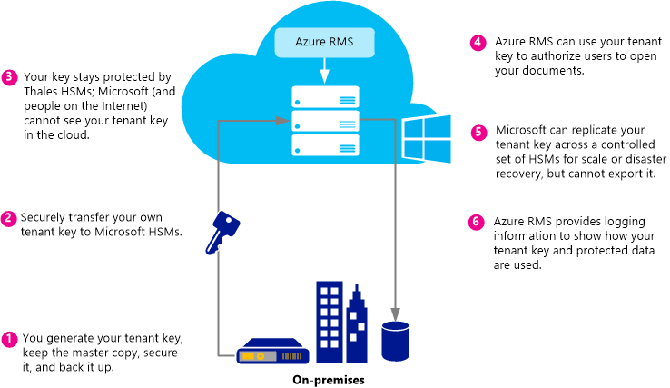

# Pl&#225;nov&#225;n&#237; a implementaci v&#225;š Azure Rights Management klienta kl&#237;č
Pomocí informací v tomto tématu, které vám pomohou plánovat a spravovat své Rights Management service (RMS) klienta klíč pro Azure RMS. Můžete například namísto Microsoft Správa váš klíč klienta (výchozí), můžete spravovat své vlastní klíč klienta dodržovat zvláštních předpisů, které se vztahují k vaší organizace.  Správa vlastní klíč klienta je také označované jako přenést vlastní klíč nebo BYOK.

> [!NOTE]
> Klíč klienta služby RMS je také označována jako klíč pro certifikát serveru poskytovatel licence (vystavování). Azure RMS udržuje jeden nebo více klíčů pro každou organizaci, která se přihlásí k Azure RMS. Vždy, když klíč se používá pro službu RMS v rámci organizace (například uživatelské klíče, klíče počítače, dokumentu šifrovací klíče), jejich kryptograficky řetězce klíč klienta služby RMS.

**Na první pohled:** V následující tabulce slouží jako Stručná příručka k topologii klíče doporučené klienta. Poté pomocí v dalších částech Další informace.

Pokud implementujete Azure RMS pomocí klienta klíč, který je spravováno společností Microsoft, můžete k BYOK později změnit. Však nelze změnit aktuálně váš klíč klienta Azure RMS z BYOK na spravovaných společností Microsoft.

|Z pracovních důvodů|Klíče topologie doporučené klienta|
|-----------------------|--------------------------------------|
|Nasazení Azure RMS rychle a bez nutnosti speciální hardware|Spravováno společností Microsoft|
|Využívat všech funkcí služby IRM v systému Exchange Online s Azure RMS|Spravováno společností Microsoft|
|Vaše klíče jsou vytvořené vámi a chráněna v modulu hardwarového zabezpečení (hardwarového zabezpečení)|BYOK<br /><br />V současné době této konfigurace povede k nižšími funkcí služby IRM v systému Exchange Online. Další informace naleznete [BYOK pricing and restrictions](../Topic/Planning_and_Implementing_Your_Azure_Rights_Management_Tenant_Key.md#BKMK_Pricing) oddílu.|
Pomocí následujících částí, které vám pomohou zvolit který klíč klienta topologie chcete použít, pochopit cyklus klíče klienta, jak implementovat přenést vlastní klíče (BYOK) a jaké má provést následující kroky:

-   [Choose your tenant key topology: Managed by Microsoft (the default) or managed by you (BYOK)](../Topic/Planning_and_Implementing_Your_Azure_Rights_Management_Tenant_Key.md#BKMK_ChooseTenantKey)

-   [BYOK pricing and restrictions](../Topic/Planning_and_Implementing_Your_Azure_Rights_Management_Tenant_Key.md#BKMK_Pricing)

-   [Implementing bring your own key (BYOK)](../Topic/Planning_and_Implementing_Your_Azure_Rights_Management_Tenant_Key.md#BKMK_ImplementBYOK)

-   [Next steps](../Topic/Planning_and_Implementing_Your_Azure_Rights_Management_Tenant_Key.md#BKMK_NextSteps)

## <a name="BKMK_ChooseTenantKey"></a>Zvolte vašem klientovi klíče topologie: Spravováno společností Microsoft (výchozí) nebo spravuje můžete (BYOK)
Rozhodněte, které klíče topologie klienta je nejvhodnější pro vaši organizaci. Ve výchozím nastavení Azure RMS generuje váš klíč klienta a spravuje většinu aspektů klíče životnost klienta. Toto je nejjednodušší možnost s nejnižší režie pro správu. Ve většině případů i nepotřebujete vědět, abyste měli klíč klienta. Stačí přihlášení k Azure RMS a celého procesu správy klíčů je vyřeší společností Microsoft.

Alternativně můžete chtít plnou kontrolu nad vašeho klienta klíče, který zahrnuje vytvoření váš klíč klienta a udržování hlavní kopií na vaše místní. Tento scénář je často označována jako přenést vlastní klíč (BYOK). Když vyberete tuto možnost dojde k následujícímu:

1.  Můžete generovat klíč klienta na vaše místní v souladu se zásadami IT.

2.  Můžete zabezpečenou klíč klienta z modulu hardwarového (hardwarové zabezpečení zabezpečení) vašeho držitelem předá moduly hardwarového zabezpečení, které jsou majetkem a spravováno společností Microsoft. Během tohoto procesu váš klíč klienta nikdy ponechá hranici ochrany hardwaru.

3.  Při přenosu váš klíč klienta do společnosti Microsoft, zůstane chráněné podle společnosti Thales moduly hardwarového zabezpečení. Společnost Microsoft spolupracuje s společnosti Thales zajistit, že váš klíč klienta nemůže být získán z moduly hardwarového zabezpečení společnosti Microsoft.

Přestože je volitelné, budou také pravděpodobně chcete použít blízké používání v reálném čase protokoly Azure RMS, abyste viděli, přesně jak a kdy je používán klíč klienta.

> [!NOTE]
> Jako dodatečnou ochranu opatření používá Azure RMS světů samostatné zabezpečení pro jeho datových center v USA a Kanady, EMEA (Evropa, Blízký východ a Afrika) a Asie. Při správě vlastní klíč klienta je přidruženo k ve světě zabezpečení oblast, ve kterém je váš RMS klient zaregistrován. Můžete například klíč klienta z Evropského zákazníka nelze použít v datacentrech v USA a Kanady nebo Asie.

## <a name="BKMK_OverviewLifecycle"></a>Klíče životnost klienta
Pokud se rozhodnete, že společnosti Microsoft by měla spravovat váš klíč klienta, Microsoft zpracovává většinu operací klíče životního cyklu. Nicméně pokud se rozhodnete spravovat váš klíč klienta, zodpovídáte za několik operací klíče životního cyklu a některé další postupy.

Následující diagramy zobrazit a porovnává tyto dvě možnosti. První diagram ukazuje, jak malé režie správce nejsou pro vás ve výchozím nastavení při Microsoft spravuje klíč klienta.


Druhý diagram zobrazuje další kroky potřebné při správě vlastní klíč klienta.



Pokud se rozhodnete odeslat do společnosti Microsoft spravovat váš klíč klienta, není nutné ke generování klíče žádná další akce a můžete přeskočit následující oddíly a přejděte přímo ke [Next steps](../Topic/Planning_and_Implementing_Your_Azure_Rights_Management_Tenant_Key.md#BKMK_NextSteps).

Pokud se rozhodnete spravovat váš klíč klienta sami, přečtěte si níže uvedených částech najdete další informace.

### Další informace o přidání společnosti Thales moduly hardwarového zabezpečení a společnosti Microsoft
Azure RMS společnosti Thales moduly hardwarového zabezpečení používá k ochraně vašich klíčů.

Společnosti Thales e zabezpečení je přední globálního zprostředkovatele šifrování dat a řešení zabezpečení internetoví na finanční služby, špičkových technologií, výrobu, státní správa a technologie sektory. S 40 rok track záznam ochrany podnikové a informací vládou řešení společnosti Thales jsou používány čtyři z pěti největší energie a aerospace společností, 22 NATO zemí a zabezpečit více než 80 % po celém světě platební transakce.

Společnost Microsoft spolupracuje s společnosti Thales k vylepšení stav techniky pro moduly hardwarového zabezpečení. Tato vylepšení umožňují získat typické výhody hostované služby bez vzdát kontrolu nad své klíče. Konkrétně tato vylepšení umožňují spravovat moduly hardwarového zabezpečení tak, aby nemáte do společnosti Microsoft. Jako cloudové služby Azure RMS škálování v krátké lhůtě ke splnění špičky využití vaší organizace. Současně je chráněn váš klíč uvnitř moduly hardwarového zabezpečení společnosti Microsoft: Je zachovat kontrolu nad klíče životního cyklu, protože generování klíče a převést jej do moduly hardwarového zabezpečení společnosti Microsoft.

Další informace naleznete v tématu [společnosti Thales moduly hardwarového zabezpečení a Azure RMS](http://www.thales-esecurity.com/msrms/cloud) na webové stránce společnosti Thales.

## <a name="BKMK_Pricing"></a>Ceny BYOK a omezení
Organizace, která mají IT spravovat předplatné Azure můžete použít BYOK a protokolovat jeho používání bez dalších poplatků. Organizace, které používají služby RMS pro uživatele, nelze použít BYOK a protokolování, protože nemají správce klienta ke konfiguraci těchto funkcí.

> [!NOTE]
> Další informace o RMS pro osoby, naleznete v tématu [RMS pro jednotlivce i Azure Rights Management](../Topic/RMS_for_Individuals_and_Azure_Rights_Management.md).


Protokolování a BYOK bezproblémovou práci s každou aplikaci, která umožňuje integraci s Azure RMS. To zahrnuje cloudové služby, například služby SharePoint Online, místní servery se systémem Exchange a SharePoint, které pracují s Azure RMS pomocí konektoru služby RMS a klientských aplikací, jako je například Office 2013. Zobrazí se bez ohledu na to, které aplikace zadá požadavky Azure RMS protokoly použití klíče.

Existuje jedna výjimka: V současné době **Azure RMS BYOK není kompatibilní s systému Exchange Online**.  Pokud chcete použít systému Exchange Online, doporučujeme při zavádění Azure RMS ve výchozím režimu správy klíčů nyní, kde společnost Microsoft generuje a spravuje váš klíč. Máte možnost přesunout do BYOK později, například pokud podporuje Azure RMS BYOK systému Exchange Online. Pokud však nelze počkat, Další možností je nyní nasazení Azure RMS pomocí BYOK s nižšími RMS funkce pro systému Exchange Online (nechráněné e-mailů a nechráněné přílohy zůstat plně funkční):

-   Chráněné e-mailů nebo chráněné přílohy v aplikaci Outlook Web Access nelze zobrazit.

-   Chráněné e-mailů na mobilních zařízeních, které používají Exchange ActiveSync IRM nelze zobrazit.

-   Přenosu dešifrování (například k vyhledávání malwaru) a deník dešifrování není možné, takže chráněný e-mailů a chráněné přílohy budou přeskočeny.

-   Přenos ochrany pravidel a dat Zabránění ztrátě (DLP), vynutit zásady IRM není možné, takže ochrany RMS nelze použít pomocí těchto metod.

-   Na serveru hledání chráněné e-mailů, takže chráněný e-mailů budou přeskočeny.

Použijete-li Azure RMS BYOK s nižšími RMS funkcí pro systému Exchange Online, RMS bude fungovat se e-mailových klientů v aplikaci Outlook v systému Windows a Mac a v dalších e-mailu klientech, které nepoužívají Exchange ActiveSync IRM.

Při migraci na Azure RMS ze služby AD RMS, jste mohli importovat váš klíč jako důvěryhodné domény publikování (důvěryhodné domény publikování) na serveru Exchange Online (nazývané také BYOK v systému Exchange terminologie, který je oddělen od Azure RMS BYOK). V tomto případě je nutné odebrat důvěryhodné domény publikování ze systému Exchange Online, aby se zabránilo konfliktní šablony a zásady. Další informace naleznete v tématu [Odebrat RMSTrustedPublishingDomain](https://technet.microsoft.com/library/jj200720%28v=exchg.150%29.aspx) v knihovně rutiny systému Exchange Online.

V některých případech v Azure RMS BYOK výjimky systému Exchange Online není ve praxe došlo k potížím. Můžete například spustit organizace, které potřebují protokolování a BYOK jejich data aplikací (Exchange, SharePoint, systému Office) místně a používání Azure RMS pro funkci, která není snadno k dispozici s místním AD RMS (například spolupráci s jinými společnostmi a přístup z mobilních klientů). BYOK a protokolování pracovní i v tomto případě a povolit organizace mít plnou kontrolu nad předplatnému Azure RMS.

## <a name="BKMK_ImplementBYOK"></a>Implementace přenést vlastní klíč (BYOK)
Pokud jste se rozhodli vytvářet a spravovat své klienty klíčem, použijte informace a postupy v této části přenést danému klíči (BYOK):

-   [Prerequisites for BYOK](../Topic/Planning_and_Implementing_Your_Azure_Rights_Management_Tenant_Key.md#BKMK_Preqs)

-   [Generate and transfer your tenant key – over the Internet](../Topic/Planning_and_Implementing_Your_Azure_Rights_Management_Tenant_Key.md#BKMK_BYOK_Internet)

-   [Generate and transfer your tenant key – in person](../Topic/Planning_and_Implementing_Your_Azure_Rights_Management_Tenant_Key.md#BKMK_BYOK_InPerson)

> [!IMPORTANT]
> Pokud jste už začali používat [!INCLUDE[aad_rightsmanagement_1](../Token/aad_rightsmanagement_1_md.md)] (služba je aktivován) a mají uživatelé, kteří spuštění systému Office 2010, obraťte se na služby podpory zákazníků společnosti Microsoft (CSS) před spuštěním tyto postupy. V závislosti na tom, scénáře a požadavky, můžete použít BYOK, ale s některá omezení nebo další kroky.
> 
> Pokud má vaše organizace určité zásady pro zpracování klíče také kontaktujte šablon stylů CSS.

### <a name="BKMK_Preqs"></a>Předpoklady pro BYOK
Podívejte se na téma v následující tabulce seznam nezbytně nutné pro přenesení vlastní klíč (BYOK).

|Požadavek|Další informace|
|-------------|-------------------|
|Odběr, který podporuje Azure RMS|Další informace o dostupných odběry, naleznete v části [Cloud odběry, které podporují službu Azure RMS](../Topic/Requirements_for_Azure_Rights_Management.md#BKMK_SupportedSubscriptions) v oddílu [Požadavky pro Azure Rights Management](../Topic/Requirements_for_Azure_Rights_Management.md) tématu.|
|RMS se nepoužívá pro jednotlivé uživatele nebo systému Exchange Online. Nebo pokud používáte systému Exchange Online, pochopit a přijmout omezení týkající se použití BYOK s této konfigurace.|Další informace o omezení a aktuální omezení pro BYOK naleznete [BYOK pricing and restrictions](../Topic/Planning_and_Implementing_Your_Azure_Rights_Management_Tenant_Key.md#BKMK_Pricing) v tomto tématu. **Important:** V současné době BYOK není kompatibilní s systému Exchange Online.|
|Společnosti Thales hardwarového zabezpečení, karty SmartCard a podporu softwaru<br /><br />Při migraci ze služby AD RMS k Azure RMS pomocí softwaru klíče na klíč hardwaru, musí mít minimální verze 11.62 pro ovladače společnosti Thales.|Musí mít přístup k modulu hardwarového zabezpečení společnosti Thales a základní znalosti provozní společnosti Thales moduly hardwarového zabezpečení. Podívejte se na téma [modulu hardwarového zabezpečení společnosti Thales](http://www.thales-esecurity.com/msrms/buy) pro seznam kompatibilní modelů nebo zakoupit modul hardwarového zabezpečení, pokud nemáte jednu.|
|Pokud chcete převést váš klíč klienta přes Internet, nikoli fyzicky existovat v Redmond, USA:<br /><br />1.  V režimu offline x 64 pracovní stanici s minimální operační systém Windows Windows 7 a společnosti Thales nShield softwaru, který je alespoň verze 11.62.<br />    Je-li této pracovní stanici běží systém Windows 7, je nutné [nainstalujte rozhraní Microsoft .NET Framework 4.5](http://go.microsoft.com/fwlink/?LinkId=225702).<br />2.  Pracovní stanice, který je připojen k Internetu a má minimální operační systém Windows Windows 7.<br />3.  Jednotku USB nebo jiné přenosné úložné zařízení, která má alespoň 16 MB volného místa.|Tyto požadavky nejsou povinná, je-li přenášeny do Redmond a přenosu klienta klíč osobně.<br /><br />Z důvodu zabezpečení doporučujeme, aby první pracovní stanice není připojen k síti. Nicméně to není vynucována programově. **Note:** V části pokyny, které následují této pracovní stanici se nazývá odpojeného pracovní stanice.<br />Kromě toho je-li váš klíč klienta pro produkční sítě, doporučujeme, které umožňují pracovní stanici druhou, samostatnou stáhněte si sadu nástrojů a uložit klíč klienta. Ale pro účely testování, můžete použít stejnou pracovní stanici jako první. **Note:** V části pokyny, které následují druhý pracovní stanice uvedené jako pracovní stanice připojeného k Internetu.|
|Volitelné: Předplatné Azure|Pokud chcete do protokolu vašeho klienta použití klíče (a využití Rights Management), musí mít předplatné Azure a dostatečné úložiště na Azure k ukládání protokolů.|
Postupy, které generují a používat vlastní klíč klienta v závislosti na tom, zda chcete provést prostřednictvím Internetu nebo v osoby:

-   **Prostřednictvím Internetu:** To vyžaduje, aby některé kroky navíc konfigurace, například stažením a použitím sadu nástrojů a rutin prostředí Windows PowerShell. Však není třeba fyzicky být v zařízení společnosti Microsoft pro přenos váš klíč klienta. Zabezpečení je spravován následujících metod:

    -   Je-li z offline pracovní stanici, která omezuje možnost napadení Generovat klíč klienta.

    -   Klíč klienta je šifrovány s klíč Exchange klíč (KEK), která zůstává šifrované, dokud se přenese do služby RMS Azure, moduly hardwarového zabezpečení. Pouze zašifrované verzi klienta klíče ponechá původní pracovní stanice.

    -   Nástroj nastaví vlastnosti ve své klienty klíč, který váže váš klíč klienta do světa zabezpečení Azure RMS. Proto po RMS Azure, moduly hardwarového zabezpečení přijímat a dešifrovat klíč klienta, pouze tyto moduly hardwarového zabezpečení můžete použít. Není možné exportovat klíč klienta. Touto vazbou jsou vynuceny moduly hardwarového zabezpečení společnosti Thales.

    -   Klíč Exchange klíč (KEK) používaný k šifrování váš klíč klienta v rámci služby RMS Azure, moduly hardwarového zabezpečení, je vygenerována a není možné exportovat. Moduly hardwarového zabezpečení vynutit, že může být žádná zrušte verze KEK mimo moduly hardwarového zabezpečení. Kromě toho sada nástrojů zahrnuje rovněž potvrzení od společnosti Thales, KEK není možné exportovat a byl vytvořen v rámci genuine hardwarového zabezpečení, která byla společnost společnosti Thales.

    -   Sadu nástrojů zahrnuje rovněž potvrzení od společnosti Thales, aby na světě Azure RMS zabezpečení byl vygenerován také genuine hardwarového zabezpečení, který je společnosti Thales. To ukáže vám, že společnost Microsoft používá genuine hardwaru.

    -   Společnost Microsoft používá samostatné KEKs stejně jako samostatné světů zabezpečení v každé zeměpisné oblasti, která zajistí, že váš klíč klienta lze použít pouze v datacentrech v oblasti, ve kterém je šifrovány. Můžete například klíč klienta z Evropského zákazníka nelze použít v datových center, nebo Americká Severní Asie.

    > [!NOTE]
    > Váš klíč klienta můžete bezpečně procházet nedůvěryhodným počítačů a sítí vzhledem k tomu, že je šifrovány a zabezpečen s úrovní oprávnění řízení přístupu, díky čemuž je použít pouze v rámci vašeho moduly hardwarového zabezpečení a moduly hardwarového zabezpečení společnosti Microsoft pro Azure RMS. Můžete použít skripty, které jsou obsaženy v sadu nástrojů ověřit bezpečnostní opatření a přečtěte si další informace o tom, jak to funguje ze společnosti Thales: [Správy hardwaru klíčů v cloudu RMS](https://www.thales-esecurity.com/knowledge-base/white-papers/hardware-key-management-in-the-rms-cloud).

-   **Osobně:** To vyžaduje, abyste se obrátili Microsoft služby podpory zákazníkům (CSS) můžete naplánovat přenosu klíče události pro Azure RMS. Microsoft Office musí projít v Redmond, Washington, USA pro přenos klienta klíč ve světě zabezpečení Azure RMS.

### <a name="BKMK_BYOK_Internet"></a>Generovat a přenosu klienta klíč – přes Internet
Pokud chcete převést váš klíč klienta přes Internet, nikoli přenášeny do zařízení společnosti Microsoft pro přenos klienta klíč osobně pomocí následujících postupů:

-   [Prepare your Internet-connected workstation](../Topic/Planning_and_Implementing_Your_Azure_Rights_Management_Tenant_Key.md#BKMK_InternetPrepareWorkstation)

-   [Prepare your disconnected workstation](../Topic/Planning_and_Implementing_Your_Azure_Rights_Management_Tenant_Key.md#BKMK_DisconnectedPrepareWorkstation)

-   [Generate your tenant key](../Topic/Planning_and_Implementing_Your_Azure_Rights_Management_Tenant_Key.md#BKMK_InternetGenerate)

-   [Prepare your tenant key for transfer](../Topic/Planning_and_Implementing_Your_Azure_Rights_Management_Tenant_Key.md#BKMK_InternetPrepareTransfer)

-   [Transfer your tenant key to Azure RMS](../Topic/Planning_and_Implementing_Your_Azure_Rights_Management_Tenant_Key.md#BKMK_InternetTransfer)

#### <a name="BKMK_InternetPrepareWorkstation"></a>Připravit pracovní stanici připojeného k Internetu
Chcete-li připravit pracovní stanici, který je připojen k Internetu, postupujte podle kroků 3:

-   [Step 1: Install Windows PowerShell for Azure Rights Management](../Topic/Planning_and_Implementing_Your_Azure_Rights_Management_Tenant_Key.md#BKMK_PrepareInternetConnectedWorkstation1)

-   [Step 2: Get your Azure Active Directory tenant ID](../Topic/Planning_and_Implementing_Your_Azure_Rights_Management_Tenant_Key.md#BKMK_PrepareInternetConnectedWorkstation2)

-   [Step 3: Download the BYOK toolset](../Topic/Planning_and_Implementing_Your_Azure_Rights_Management_Tenant_Key.md#BKMK_PrepareInternetConnectedWorkstation3)

##### <a name="BKMK_PrepareInternetConnectedWorkstation1"></a>Krok 1: Instalace prostředí Windows PowerShell pro Azure Rights Management
Z pracovní stanice připojeného k Internetu stáhněte a nainstalujte modul prostředí Windows PowerShell pro službu Rights Management Azure.

> [!NOTE]
> Pokud jste dříve stáhli tento modul prostředí Windows PowerShell, spusťte následující příkaz ke kontrole, že vaše číslo verze je alespoň 2.1.0.0: `(Get-Module aadrm -ListAvailable).Version`

Pokyny k instalaci, naleznete v tématu [Instalace prostředí Windows PowerShell pro službu Azure Rights Management](../Topic/Installing_Windows_PowerShell_for_Azure_Rights_Management.md).

##### <a name="BKMK_PrepareInternetConnectedWorkstation2"></a>Krok 2: Získejte ID klienta služby Azure Active Directory
Spuštění prostředí Windows PowerShell s **Spustit jako správce** možnost a potom spusťte následující příkazy:

-   Použití [Připojit AadrmService](http://msdn.microsoft.com/library/windowsazure/dn629415.aspx) se připojit ke službě Azure RMS:

    ```
    Connect-AadrmService
    ```
    Po zobrazení výzvy zadejte své [!INCLUDE[aad_rightsmanagement_1](../Token/aad_rightsmanagement_1_md.md)] klienta přihlašovací údaje správce (obvykle použijete účet, který je globálního správce služby Azure Active Directory nebo Office 365).

-   Použití [Get-AadrmConfiguration](http://msdn.microsoft.com/library/windowsazure/dn629410.aspx) rutina zobrazíte konfiguraci klienta:

    ```
    Get-AadrmConfiguration
    ```
    Z výstupu uložte identifikátor GUID z prvního řádku (BPOSId). Toto je vaše ID klienta služby Azure Active Directory, které budete potřebovat později při přípravě váš klíč klienta pro nahrávání.

-   Použití [odpojení AadrmService](http://msdn.microsoft.com/library/windowsazure/dn629416.aspx) rutina odpojení od službou Azure RMS, dokud nebudete připraveni odeslat váš klíč:

    ```
    Disconnect-AadrmService
    ```

Nezavírejte okno prostředí Windows PowerShell.

##### <a name="BKMK_PrepareInternetConnectedWorkstation3"></a>Krok 3: Stáhněte si sadu nástrojů BYOK
Přejděte na Microsoft Download Center a [Stáhněte si sadu nástrojů BYOK](http://go.microsoft.com/fwlink/?LinkId=335781) pro danou oblast:

|Oblast|Název balíčku|
|----------|-----------------|
|Severní Amerika|AzureRMS-BYOK-nástroje spojené States.zip|
|Evropa|AzureRMS BYOK nástroje Europe.zip|
|Asie|AzureRMS BYOK nástroje AsiaPacific.zip|
Sadu nástrojů obsahuje následující položky:

-   Balíček klíč Exchange klíč (KEK), který obsahuje název začíná **BYOK-KEK-pkg -**.

-   Zabezpečení světě balíček, který obsahuje název začíná **BYOK-SecurityWorld-pkg -**.

-   Skript v jazyce python s názvem **verifykeypackage.py**.

-   Do příkazového řádku spustitelného souboru s názvem **KeyTransferRemote.exe**, soubor metadat s názvem **KeyTransferRemote.exe.config**, a přidružené knihovny DLL.

-   Visual C++ Distribuovatelný balíček, s názvem **vcredist_x64.exe**.

Zkopírujte balíček na jednotku USB nebo jiných přenosných úložiště.

#### <a name="BKMK_DisconnectedPrepareWorkstation"></a>Připravit odpojeného pracovní stanice
Chcete-li připravit pracovní stanici, který není připojen k síti (Internet nebo interní sítě), postupujte takto 2:

-   [Step 1: Prepare the disconnected workstation with Thales HSM](../Topic/Planning_and_Implementing_Your_Azure_Rights_Management_Tenant_Key.md#BKMK_PrepareDisconnectedWorkstation1)

-   [Step 2: Install the BYOK toolset on the disconnected workstation](../Topic/Planning_and_Implementing_Your_Azure_Rights_Management_Tenant_Key.md#BKMK_PrepareDisconnectedWorkstation2)

##### <a name="BKMK_PrepareDisconnectedWorkstation1"></a>Krok 1: Připravit odpojeného pracovní stanici s hardwarového společnosti Thales zabezpečení
Na odpojeného pracovní stanici nainstalovat software podpory nCipher (společnosti Thales) do počítače se systémem Windows a poté hardwarového zabezpečení společnosti Thales připojit k tomuto počítači.

Ujistěte se, že společnosti Thales nástroje jsou v zadané cestě **(%nfast_home%\bin** a **%nfast_home%\python\bin**). Například zadejte následující příkaz:

```
set PATH=%PATH%;”%nfast_home%\bin”;”%nfast_home%\python\bin”
```
Další informace naleznete v uživatelské příručce součástí hardwarového zabezpečení společnosti Thales nebo navštivte webovou stránku společnosti Thales pro Azure RMS na [http://www.thales-esecurity.com/msrms/cloud](http://www.thales-esecurity.com/msrms/cloud).

##### <a name="BKMK_PrepareDisconnectedWorkstation2"></a>Krok 2: Nainstalujte sadu nástrojů BYOK na odpojeného pracovní stanice
Zkopírovat balíček sadu nástrojů BYOK z jednotky USB nebo jiných přenosných úložiště a pak proveďte následující kroky:

1.  Extrahujte soubory z balíčku stažené do libovolné složky.

2.  V této složce spouštěny vcredist_x64.exe.

3.  Postupujte podle pokynů na instalaci komponenty modulu runtime Visual C++ pro sadu Visual Studio 2012.

#### <a name="BKMK_InternetGenerate"></a>Generovat klíč klienta
Na odpojeného pracovní stanici, následujících kroků 3 ke generování vlastních klienta klíče:

-   [Step 1: Create a security world](../Topic/Planning_and_Implementing_Your_Azure_Rights_Management_Tenant_Key.md#BKMK_InternetGenerate1)

-   [Step 2: Validate the downloaded package](../Topic/Planning_and_Implementing_Your_Azure_Rights_Management_Tenant_Key.md#BKMK_InternetGenerate2)

-   [Step 3: Create a new key](../Topic/Planning_and_Implementing_Your_Azure_Rights_Management_Tenant_Key.md#BKMK_InternetGenerate3)

##### <a name="BKMK_InternetGenerate1"></a>Krok 1: Vytvořit bezpečnostní světa
Spusťte příkazový řádek a potom spusťte program společnosti Thales nový světa.

```
new-world.exe --initialize --cipher-suite=DLf1024s160mRijndael --module=1 --acs-quorum=2/3
```
Tento program vytvoří **zabezpečení světě** souboru na % NFAST_KMDATA%\local\world, který odpovídá složce aplikací\Místní C:\ProgramData\nCipher\Key správy. Můžete použít různé hodnoty pro kvora, ale v našem příkladu, budete vyzváni k zadání tři prázdné karty a kódy PIN pro každý z nich. Pak bude nutné mít přístup pro správu ve světě zabezpečení (zadaný kvora) jakékoli dvě karty.  Staňte se tyto karty **Správce karta nastavit** pro nový svět zabezpečení. V tomto okamžiku můžete zadat heslo nebo PIN kód pro každé kartě ACS nebo přidat později pomocí příkazu.

> [!TIP]
> Aktuální stav konfigurace vašeho hardwarového zabezpečení můžete ověřit pomocí `nkminfo` příkazu.

Proveďte následující kroky:

1.  Instalace zprostředkovatele CNG společnosti Thales, jak je popsáno v dokumentaci společnosti Thales a nakonfigurovat tak, aby používat nový světa zabezpečení.

2.  Zpět nahoru na světě soubor v **%nfast_kmdata%\local**. Zabezpečení a ochraně soubor světě, karty správce a kódy PIN prostřednictvím a ujistěte se, že nikdo jedné nemá přístup k více než jednu kartu.

##### <a name="BKMK_InternetGenerate2"></a>Krok 2: Ověření staženého balíčku
Tento krok je nepovinný, ale doporučuje tak, že je možné ověřit následující:

-   Klíče pro výměnu klíč, který je součástí sadu nástrojů byl vygenerován z genuine hardwarového zabezpečení společnosti Thales.

-   Hodnota hash světa Azure RMS zabezpečení, která je součástí sadu nástrojů byl vytvořen v genuine hardwarového zabezpečení společnosti Thales.

-   Klíče pro výměnu klíče je není možné exportovat.

> [!NOTE]
> K ověření staženého balíčku, modul hardwarového zabezpečení musí být připojen, zapnuto a musí mít světě zabezpečení v něm (například ten, který jste právě vytvořili).

###### Chcete-li ověřit staženého balíčku

1.  Spusťte skript verifykeypackage.py ovládání jednu z následujících akcí, v závislosti na vaší oblasti:

    -   Pro Severní Amerika:

        ```
        python verifykeypackage.py -k BYOK-KEK-pkg-NA-1 -w BYOK-SecurityWorld-pkg-NA-1
        ```

    -   Pro Evropa:

        ```
        python verifykeypackage.py -k BYOK-KEK-pkg-EU-1 -w BYOK-SecurityWorld-pkg-EU-1
        ```

    -   Pro Asie:

        ```
        python verifykeypackage.py -k BYOK-KEK-pkg-AP-1 -w BYOK-SecurityWorld-pkg-AP-1
        ```

    > [!TIP]
    > Software společnosti Thales zahrnuje Python překladač na adrese %NFAST_HOME%\python\bin

2.  Přesvědčte se, že zobrazí následující příkaz, který udává úspěšné ověření: **Výsledek:  ÚSPĚCH**

Tento skript ověří řetězu podepisující osoba až do společnosti Thales kořenový klíč. Hash pro tento kořenový klíč je vložen do skriptu a jeho hodnota by měla být **59178a47 de508c3f 291277ee 184f46c4 f1d9c639**. Můžete také zkontrolovat, tato hodnota samostatně přechodem [web společnosti Thales](http://www.thalesesec.com/).

Nyní jste připraveni vytvořit nový klíč, který bude váš klíč klienta služby RMS.

##### <a name="BKMK_InternetGenerate3"></a>Krok 3: Vytvořit nový klíč
Generovat klíč CNG pomocí společnosti Thales **generatekey** a **cngimport** programy.

Spusťte následující příkaz ke generování klíče:

```
generatekey --generate simple type=RSA size=2048 protect=module ident=contosokey plainname=contosokey nvram=no pubexp=
```
Při spuštění tohoto příkazu pomocí následujících pokynů:

-   Délka klíče jsme doporučujeme 2048 však také podporují 1024 bitů klíče RSA pro stávající zákazníky služby AD RMS, kteří mají tyto klíče a migraci do Azure RMS.

-   Nahraďte hodnotu *contosokey* pro **ident** a **plainname** s libovolnou hodnotu řetězce. Minimalizovat režie pro správu a snížení rizika chyb, doporučujeme použít stejnou hodnotu pro obě a používat všechny znaky malými písmeny.

-   Pubexp je ponecháno prázdné pole (výchozí) v tomto příkladu, ale můžete zadat konkrétní hodnoty. Další informace naleznete v dokumentaci společnosti Thales.

Potom spusťte následující příkaz pro import klíč CNG:

```
cngimport --import -M --key=contosokey --appname=simple contosokey
```
Při spuštění tohoto příkazu pomocí následujících pokynů:

-   Nahradit *contosokey* se stejnou hodnotou, kterou jste zadali v [Step 1: Create a security world](../Topic/Planning_and_Implementing_Your_Azure_Rights_Management_Tenant_Key.md#BKMK_InternetGenerate1) z *Generovat klíč klienta* oddílu.

-   Použití **- M** tak, že klíč je vhodný pro tento scénář. Bez toho budou výsledné klíč klíč specifické pro uživatele pro aktuálního uživatele.

Tento příkaz vytvoří soubor Tokenizovaná klíč ve složce %NFAST_KMDATA%\local, jejichž název začíná s **key_caping_** za nímž následuje identifikátor SID. Příklad: **key_caping_machine--801c1a878c925fd9df4d62ba001b94701c039e2fb**. Tento soubor obsahuje zašifrovaného klíče.

> [!TIP]
> Aktuální stav konfigurace klíčů lze zobrazit pomocí `nkminfo –k` příkazu.

Tento soubor klíče Tokenizovaná na bezpečné místo zálohujte.

> [!IMPORTANT]
> Při přenosu později váš klíč do Azure RMS, Microsoft nelze exportovat tento klíč zpět tak, že je stále velmi důležité zálohovat svůj klíč a zabezpečení svět bezpečně. Obraťte se na společnosti Thales pokyny a doporučené postupy pro zálohování váš klíč.

Nyní jste připraveni k přenosu váš klíč klienta do Azure RMS.

#### <a name="BKMK_InternetPrepareTransfer"></a>Připravit váš klíč klienta pro přenos
Na odpojeného pracovní stanici, následujících kroků 4 připravit vlastní klíč klienta:

-   [Step 1: Create a copy of your key with reduced permissions](../Topic/Planning_and_Implementing_Your_Azure_Rights_Management_Tenant_Key.md#BKMK_InternetPrepareTransfer1)

-   [Step 2: Inspect the new copy of the key](../Topic/Planning_and_Implementing_Your_Azure_Rights_Management_Tenant_Key.md#BKMK_InternetPrepareTransfer2)

-   [Step 3: Encrypt your key by using Microsoft’s Key Exchange Key](../Topic/Planning_and_Implementing_Your_Azure_Rights_Management_Tenant_Key.md#BKMK_InternetPrepareTransfer3)

-   [Step 4: Copy your key transfer package to the Internet-connected workstation](../Topic/Planning_and_Implementing_Your_Azure_Rights_Management_Tenant_Key.md#BKMK_InternetPrepareTransfer4)

##### <a name="BKMK_InternetPrepareTransfer1"></a>Krok 1: Vytvořit kopii klíče s nižšími oprávnění
Chcete-li snížit oprávnění na váš klíč klienta, postupujte takto:

-   Z příkazového řádku spusťte jednu z následujících akcí, v závislosti na vaší oblasti:

    -   Pro Severní Amerika:

        ```
        KeyTransferRemote.exe -ModifyAcls -KeyAppName simple -KeyIdentifier contosokey -ExchangeKeyPackage BYOK-KEK-pkg-NA-1 -NewSecurityWorldPackage BYOK-SecurityWorld-pkg-NA-1
        ```

    -   Pro Evropa:

        ```
        KeyTransferRemote.exe -ModifyAcls -KeyAppName simple -KeyIdentifier contosokey -ExchangeKeyPackage BYOK-KEK-pkg-EU-1 -NewSecurityWorldPackage BYOK-SecurityWorld-pkg-EU-1
        ```

    -   Pro Asie:

        ```
        KeyTransferRemote.exe -ModifyAcls -KeyAppName simple -KeyIdentifier contosokey -ExchangeKeyPackage BYOK-KEK-pkg-AP-1 -NewSecurityWorldPackage BYOK-SecurityWorld-pkg-AP-1
        ```

Při spuštění tohoto příkazu nahradit *contosokey* se stejnou hodnotu jste zadali v [Step 1: Create a security world](../Topic/Planning_and_Implementing_Your_Azure_Rights_Management_Tenant_Key.md#BKMK_InternetGenerate1) z *Generovat klíč klienta* oddílu.

Budete požádáni o zařadit vaše karty ACS světě zabezpečení a je-li zadána, své heslo nebo PIN kód.

Po dokončení příkazu, zobrazí se **výsledek: Úspěch** a kopii klíče klienta s nižšími oprávněními bude v souboru s názvem key_xferacId_*&lt; contosokey &gt;*.

##### <a name="BKMK_InternetPrepareTransfer2"></a>Krok 2: Zkontrolovat novou kopii klíč
Můžete také spouštět společnosti Thales nástroje pro potvrzení minimální oprávnění na nový klíč klienta:

-   aclprint.PY:

    ```
    "%nfast_home%\bin\preload.exe" -m 1 -A xferacld -K contosokey "%nfast_home%\python\bin\python" "%nfast_home%\python\examples\aclprint.py"
    ```

-   kmfile-dump.exe:

    ```
    "%nfast_home%\bin\kmfile-dump.exe" "%NFAST_KMDATA%\local\key_xferacld_contosokey"
    ```

Při spuštění tyto příkazu nahradit *contosokey* se stejnou hodnotu jste zadali v [Step 1: Create a security world](../Topic/Planning_and_Implementing_Your_Azure_Rights_Management_Tenant_Key.md#BKMK_InternetGenerate1) z *Generovat klíč klienta* oddílu.

##### <a name="BKMK_InternetPrepareTransfer3"></a>Krok 3: Šifrování své klíče pomocí klíče pro výměnu klíč společnosti Microsoft
V závislosti na vaší oblasti spustíte jednu z následujících příkazů:

-   Pro Severní Amerika:

    ```
    KeyTransferRemote.exe -Package -KeyIdentifier contosokey -ExchangeKeyPackage BYOK-KEK-pkg-NA-1 -NewSecurityWorldPackage BYOK-SecurityWorld-pkg-NA-1 -TenantBposId GUID -KeyFriendlyName ContosoFirstkey
    ```

-   Pro Evropa:

    ```
    KeyTransferRemote.exe -Package -KeyIdentifier contosokey -ExchangeKeyPackage BYOK-KEK-pkg-EU-1 -NewSecurityWorldPackage BYOK-SecurityWorld-pkg-EU-1 -TenantBposId GUID -KeyFriendlyName ContosoFirstkey
    ```

-   Pro Asie:

    ```
    KeyTransferRemote.exe -Package -KeyIdentifier contosokey -ExchangeKeyPackage BYOK-KEK-pkg-AP-1 -NewSecurityWorldPackage BYOK-SecurityWorld-pkg-AP-1 -TenantBposId GUID -KeyFriendlyName ContosoFirstkey
    ```

Při spuštění tohoto příkazu pomocí následujících pokynů:

-   Nahradit *contosokey* s identifikátorem, který používá ke generování klíče v [Step 1: Create a security world](../Topic/Planning_and_Implementing_Your_Azure_Rights_Management_Tenant_Key.md#BKMK_InternetGenerate1) z *Generovat klíč klienta* oddílu.

-   Nahradit *identifikátor GUID* s Azure Active Directory klienta ID, který je načten v [Step 2: Get your Azure Active Directory tenant ID](../Topic/Planning_and_Implementing_Your_Azure_Rights_Management_Tenant_Key.md#BKMK_PrepareInternetConnectedWorkstation2) z *připravit pracovní stanici připojeného k Internetu* oddílu.

-   Nahradit *ContosoFirstKey* s popiskem, který se bude používat pro své jméno výstupní soubor.

Pokud to úspěšném dokončení se zobrazí **výsledek: Úspěch** a bude nový soubor v aktuální složce, která má následující název: TransferPackage -*ContosoFirstkey*.byok

##### <a name="BKMK_InternetPrepareTransfer4"></a>Krok 4: Zkopírovat klíče přenosu balíčku do pracovní stanice připojeného k Internetu
Použít jednotku USB nebo jiné přenosné úložné ke zkopírování výstupní soubor z předchozího kroku (KeyTransferPackage -*ContosoFirstkey*.byok) pracovní stanici připojeného k Internetu.

> [!NOTE]
> Použijte bezpečnostní postupy k ochraně souboru, protože obsahuje svým privátním klíčem.

#### <a name="BKMK_InternetTransfer"></a>Převést váš klíč klienta do Azure RMS
V pracovní stanici připojeného k Internetu postupujte takto 3 k přenosu nový klíč klienta do Azure RMS:

-   [Step 1: Connect to Azure RMS](../Topic/Planning_and_Implementing_Your_Azure_Rights_Management_Tenant_Key.md#BKMK_InternetTransfer1)

-   [Step 2: Upload the key package](../Topic/Planning_and_Implementing_Your_Azure_Rights_Management_Tenant_Key.md#BKMK_InternetTransfer2)

-   [Step 3: Enumerate your tenant keys – as needed](../Topic/Planning_and_Implementing_Your_Azure_Rights_Management_Tenant_Key.md#BKMK_InternetTransfer3)

##### <a name="BKMK_InternetTransfer1"></a>Krok 1: Připojit k Azure RMS
Zpět na okno prostředí Windows PowerShell a zadejte následující příkaz:

1.  Znovu se připojte k [!INCLUDE[aad_rightsmanagement_1](../Token/aad_rightsmanagement_1_md.md)] služby:

    ```
    Connect-AadrmService
    ```

2.  Použití [Get-AadrmKeys](http://msdn.microsoft.com/library/windowsazure/dn629420.aspx) rutina zobrazíte aktuální konfiguraci klienta klíče:

    ```
    Get-AadrmKeys
    ```

##### <a name="BKMK_InternetTransfer2"></a>Krok 2: Uložit balíček klíče
Použití [Přidat AadrmKey](http://msdn.microsoft.com/library/windowsazure/dn629418.aspx) rutina chcete uložit balíček klíče přenosu, který jste zkopírovali z odpojeného pracovní stanice:

```
Add-AadrmKey –KeyFile <PathToPackageFile> -Verbose
```
> [!WARNING]
> Zobrazí se výzva k potvrzení této akce. Je důležité porozumět, že tuto akci nelze vrátit zpět. Při odesílání klíč klienta automaticky se změní primární klienta klíč vaší organizace a uživatelé budou začít používat tento klíč klienta, když chrání dokumenty a soubory.

Je-li nahrávání úspěšné, zobrazí se následující zpráva: **Služba Rights management úspěšně přidán klíč.**

Očekávané zpoždění replikace pro změnu šířit všem [!INCLUDE[aad_rightsmanagement_1](../Token/aad_rightsmanagement_1_md.md)] datových center.

##### <a name="BKMK_InternetTransfer3"></a>Krok 3: Vytvořit výčet klíčů své klienty –, podle potřeby
Rutina Get-AadrmKeys znovu použít, a zkontrolujte změny v klíči vašeho klienta a vždy, když chcete zobrazit seznam klíčů klienta. Zobrazí klíče klienta patří klíč klienta počáteční generovaný společnosti Microsoft a žádné klíče klienta, které jste přidali:

```
Get-AadrmKeys
```
Klíč klienta, která je označena **Active** je ten, který vaše organizace používá v současnosti k ochraně dokumenty a soubory.

Nyní jste dokončili všechny kroky potřebné pro přenesení vlastní klíč prostřednictvím Internetu a můžete přejít na [Next steps](../Topic/Planning_and_Implementing_Your_Azure_Rights_Management_Tenant_Key.md#BKMK_NextSteps).

### <a name="BKMK_BYOK_InPerson"></a>Generovat a přenosu klienta klíč – osobně
Pokud nebudete chtít převést váš klíč klienta přes Internet, ale namísto toho přenést své klíč klienta osobně, použijte následující postupy.

-   [Generate your tenant key](../Topic/Planning_and_Implementing_Your_Azure_Rights_Management_Tenant_Key.md#BKMK_GenerateKey)

-   [Transfer your tenant key to Azure RMS](../Topic/Planning_and_Implementing_Your_Azure_Rights_Management_Tenant_Key.md#BKMK_Transfer)

#### <a name="BKMK_GenerateKey"></a>Generovat klíč klienta
Chcete-li generovat vlastní klíč klienta, postupujte takto 3:

-   [Step 1: Prepare a workstation with Thales HSM](../Topic/Planning_and_Implementing_Your_Azure_Rights_Management_Tenant_Key.md#BKMK_GenerateYourKey1)

-   [Step 2: Create a security world](../Topic/Planning_and_Implementing_Your_Azure_Rights_Management_Tenant_Key.md#BKMK_GenerateYourKey2)

-   [Step 3: Create a new key](../Topic/Planning_and_Implementing_Your_Azure_Rights_Management_Tenant_Key.md#BKMK_GenerateYourKey3)

##### <a name="BKMK_GenerateYourKey1"></a>Krok 1: Připravit pracovní stanici s hardwarového společnosti Thales zabezpečení
Nainstalujte software podpory nCipher (společnosti Thales) do počítače se systémem Windows. Připojte hardwarového zabezpečení společnosti Thales k tomuto počítači. Ujistěte se, že společnosti Thales nástroje jsou v zadané cestě. Další informace naleznete v uživatelské příručce součástí hardwarového zabezpečení společnosti Thales nebo navštivte webovou stránku společnosti Thales pro Azure RMS na [http://www.thales-esecurity.com/msrms/cloud](http://www.thales-esecurity.com/msrms/cloud).

##### <a name="BKMK_GenerateYourKey2"></a>Krok 2: Vytvořit bezpečnostní světa
Spusťte příkazový řádek a potom spusťte program společnosti Thales nový světa.

```
new-world.exe --initialize --cipher-suite=DLf1024s160mRijndael --module=1 --acs-quorum=2/3
```
Tento program vytvoří **zabezpečení světě** souboru na % NFAST_KMDATA%\local\world, který odpovídá složce aplikací\Místní C:\ProgramData\nCipher\Key správy. Můžete použít různé hodnoty pro kvora, ale v našem příkladu, budete vyzváni k zadání tři prázdné karty a kódy PIN pro každý z nich. Žádné dvě karty pak bude udělí úplný přístup do světa zabezpečení.  Staňte se tyto karty **Správce karta nastavit** pro nový svět zabezpečení.

Proveďte následující kroky:

1.  Instalace zprostředkovatele CNG společnosti Thales, jak je popsáno v dokumentaci společnosti Thales a nakonfigurovat tak, aby používat nový světa zabezpečení.

2.  Zálohujte soubor světa. Zabezpečení a ochraně soubor světě, karty správce a kódy PIN prostřednictvím a ujistěte se, že nikdo jedné nemá přístup k více než jednu kartu.

Nyní jste připraveni vytvořit nový klíč, který bude váš klíč klienta služby RMS.

##### <a name="BKMK_GenerateYourKey3"></a>Krok 3: Vytvořit nový klíč
Generovat klíč CNG pomocí společnosti Thales **generatekey** a **cngimport** programy.

Spusťte následující příkaz ke generování klíče:

```
generatekey --generate simple type=RSA size=2048 protect=module ident=contosokey plainname=contosokey nvram=no pubexp=
```
Při spuštění tohoto příkazu pomocí následujících pokynů:

-   Délka klíče jsme doporučujeme 2048 však také podporují 1024 bitů klíče RSA pro stávající zákazníky služby AD RMS, kteří mají tyto klíče a migraci do Azure RMS.

-   Nahraďte hodnotu *contosokey* pro **ident** a **plainname** s libovolnou hodnotu řetězce. Minimalizovat režie pro správu a snížení rizika chyb, doporučujeme použít stejnou hodnotu pro obě a používat všechny znaky malými písmeny.

-   Pubexp je ponecháno prázdné pole (výchozí) v tomto příkladu, ale můžete zadat konkrétní hodnoty. Další informace naleznete v dokumentaci společnosti Thales.

Potom spusťte následující příkaz pro import klíč CNG:

```
cngimport --import –M --key=contosokey --appname=simple contosokey
```
Při spuštění tohoto příkazu pomocí následujících pokynů:

-   Nahradit *contosokey* se stejnou hodnotou, kterou jste zadali v kroku 1.

-   Použití **- M** tak, že klíč je vhodný pro tento scénář. Bez toho budou výsledné klíč klíč specifické pro uživatele pro aktuálního uživatele.

Tento příkaz vytvoří soubor Tokenizovaná klíč ve složce %NFAST_KMDATA%\local, jejichž název začíná s **key_caping_** za nímž následuje identifikátor SID. Příklad: **key_caping_machine--801c1a878c925fd9df4d62ba001b94701c039e2fb**. Tento soubor obsahuje zašifrovaného klíče.

Tento soubor klíče Tokenizovaná na bezpečné místo zálohujte.

> [!IMPORTANT]
> Při přenosu později váš klíč do Azure RMS, společnost Microsoft bude mít neobnovitelná kopii klíče. To znamená, že nikdo lze načíst kód Product key z moduly hardwarového zabezpečení společnosti Microsoft. Umožňuje ponechat exkluzivní kontrolu nad váš klíč klienta. Proto je stále velmi důležité zálohovat svůj klíč a zabezpečení svět bezpečně. Obraťte se na společnosti Thales pokyny a doporučené postupy pro zálohování váš klíč.

Nyní jste připraveni k přenosu váš klíč klienta do Azure RMS.

#### <a name="BKMK_Transfer"></a>Převést váš klíč klienta do Azure RMS
Po vygenerování můžete vlastní klíč, musíte přenést na Azure RMS jej před použitím. Pro nejvyšší úroveň zabezpečení je tento převod ruční proces, který vyžaduje, abyste plout k systému Microsoft office v Redmond, Washington, USA. K dokončení tohoto procesu, postupujte podle kroků 3:

-   [Step 1: Bring your key to Microsoft](../Topic/Planning_and_Implementing_Your_Azure_Rights_Management_Tenant_Key.md#BKMK_TransferYourKey1)

-   [Step 2: Transfer your key to the Window Azure RMS security world](../Topic/Planning_and_Implementing_Your_Azure_Rights_Management_Tenant_Key.md#BKMK_TransferYourKey2)

-   [Step 3: Closing procedures](../Topic/Planning_and_Implementing_Your_Azure_Rights_Management_Tenant_Key.md#BKMK_TransferYourKey3)

###### Krok 1: Přenést klíč společnosti Microsoft

-   Obraťte se na Microsoft služby podpory zákazníkům (CSS) můžete naplánovat přenosu klíče události pro Azure RMS. Převeďte následující společnosti Microsoft – Redmond:

    -   Kvora vaše pro správu karty. Pokud jste provedli předchozí pokynů uvedených v [Step 2: Create a security world](../Topic/Planning_and_Implementing_Your_Azure_Rights_Management_Tenant_Key.md#BKMK_GenerateYourKey2), jsou dvě vaše tři karty.

    -   Pracovníky oprávnění k provedení pro správu karty a kódy PIN, obvykle dvě (jeden pro každé kartě).

    -   Světové zabezpečení souboru (% NFAST_KMDATA%\local\world) na jednotce USB.

    -   Tokenizovaná klíč souboru na jednotce USB.

###### Krok 2: Přenos váš klíč ve světě zabezpečení okna Azure RMS

1.  Po přijetí ve společnosti Microsoft pro přenos váš klíč k následujícímu:

    -   Společnost Microsoft poskytuje v režimu offline pracovní stanici, který má hardwarového zabezpečení společnosti Thales, který je připojen, společnosti Thales software nainstalovaný a předinstalovaná Azure RMS zabezpečení světě soubor do složky C:\Temp\Destination.

    -   V této pracovní stanici načíst soubor zabezpečení světě a Tokenizovaná klíč souboru z jednotky USB do složky C:\Temp\Source.

    -   Azure RMS operátory váš klíč zabezpečenou ve světě zabezpečení Azure RMS pomocí nástrojů společnosti Thales.

    Tento proces bude vypadat podobně jako následující, kde se poslední parametr xfer im klíč v tomto příkladu nahrazuje své jméno Tokenizovaná klíč souboru:

    **C:\ &gt; mk-reprogram.exe--vlastníka c:\Temp\Destination přidat c:\Temp\Source**

    **C:\ &gt; klíč. xfer im.exe c:\Temp\Source c:\Temp\Destination--c:\Temp\Source\key_caping_machine--801c1a878c925fd9df4d62ba001b94701c039e2fb modulu**

2.  MK přeprogramovat vyzve vám a Azure RMS operátory zařadit svého příslušného správce karty a kódy PIN. Tyto příkazy výstupní klíč souboru Tokenizovaná v C:\Temp\Destination obsahující klíč chráněné službou Azure RMS zabezpečení světa.

###### Krok 3: Zavření postupy

-   Ve vaší přítomnosti Azure RMS operátory postupujte takto:

    -   Spusťte nástroj, který společnost Microsoft vyvinula ve spolupráci s společnosti Thales, která odstraňuje dvou oprávnění: Oprávnění k obnovení klíče a oprávnění ke změnám oprávnění. Po dokončení se tato kopii klíče je uzamčen ve světě zabezpečení Azure RMS. Moduly hardwarového zabezpečení společnosti Thales nedovolí operátory Azure RMs s jejich karty Správce obnovení ve formátu prostého textu kopii klíče.

    -   Zkopírujte výsledný soubor klíče na jednotku USB později odeslat ke službě Azure RMS.

    -   Objekt pro vytváření reset modul hardwarového zabezpečení a mazat čistého pracovní stanice.

Nyní jste dokončili všechny kroky potřebné pro přenesení vlastní klíč osobně a může vrátit pro vaši organizaci pro další kroky.

## <a name="BKMK_NextSteps"></a>Další kroky

1.  Začněte používat váš klíč klienta:

    -   Pokud jste tak ještě neučinili, je nutné nyní aktivovat službu Rights Management, tak, aby vaše organizace může začít používat RMS. Uživatelé okamžitě začít používat váš klíč klienta (spravováno společností Microsoft nebo spravuje můžete).

        Další informace o funkci aktivace naleznete v tématu [Aktivace Azure Rights Management](../Topic/Activating_Azure_Rights_Management.md).

    -   Pokud jste již aktivován Rights Management a poté se rozhodl spravovat vlastní klíč klienta, uživatelé se postupně přechod z původní klíč klienta do nový klíč klienta a rozložit celá tato migrace může trvat několik týdnů k dokončení. Dokumenty a soubory, které nebyly chráněny s starý klíč klienta zůstane dostupný na autorizované uživatele.

2.  Zvažte povolení protokolování využití, které protokoly každé transakce, který provede RMS.

    Pokud jste se rozhodli spravovat vlastní klíč klienta, protokolování obsahuje informace o použití váš klíč klienta. Naleznete v následujícím příkladu souboru protokolu, které se zobrazí v aplikaci Excel kde **dešifrování** a **SignDigest** typy požadavků zobrazit, je používán klíč klienta.

    

    Další informace o protokolování využití naleznete v tématu [Protokolování a analýza využití Azure Rights Management](../Topic/Logging_and_Analyzing_Azure_Rights_Management_Usage.md).

3.  Udržujte váš klíč klienta.

    Další informace naleznete v tématu [Operace pro klíč klienta Azure Rights Management](../Topic/Operations_for_Your_Azure_Rights_Management_Tenant_Key.md).

## Viz také
[Konfigurace Azure Rights Management](../Topic/Configuring_Azure_Rights_Management.md)

