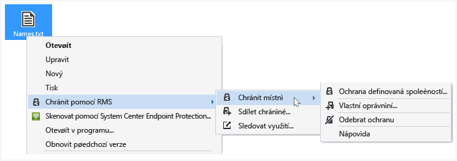
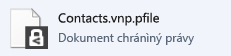

# Chr&#225;nit soubor v zař&#237;zen&#237; (chr&#225;nit m&#237;stně) s použit&#237;m Rights Management, aplikace pro sd&#237;len&#237;
Pokud zadáte ochranu souboru na místě, nahradí soubor původní, již nejsou chráněna. Nechejte na soubor, kde je, zkopírujte do jiné složky nebo zařízení nebo sdílet složku, že je v a soubor bude i nadále chráněn. Můžete také připojit chráněný soubor k e-mailovou zprávu, i když je doporučeným způsobem, jak sdílet chráněný soubor e-mailem přímo z Průzkumníka souboru nebo aplikace systému Office (viz [Soubor, který můžete sdílet e-mailem pomocí Rights Management, aplikace pro sdílení chránit](../Topic/Protect_a_file_that_you_share_by_email_by_using_the_Rights_Management_sharing_application.md)).

> [!TIP]
> Pokud se zobrazí všechny chyby, když se pokusíte k ochraně souborů, odkazovat na [Nejčastější dotazy týkající se společnost Microsoft Rights Management sdílení aplikací pro systém Windows](http://go.microsoft.com/fwlink/?LinkId=303971).

## K ochraně souboru na zařízení (chránit místně)

1.  V Průzkumníku souboru vyberte soubor k ochraně. Klepněte pravým tlačítkem myši, vyberte možnost **chránit s RMS**, a potom vyberte **chránit místně**. Příklad:

    

    > [!NOTE]
    > Pokud se nezobrazí **chránit s RMS** možnost, je pravděpodobné, že buď není v počítači nainstalována aplikace pro sdílení obsahu RMS, nebo k dokončení instalace je nutné restartovat váš počítač. Další informace o tom, jak nainstalovat aplikaci sdílení RMS naleznete v tématu [Stáhněte si a nainstalujte Rights Management, aplikace pro sdílení](../Topic/Download_and_install_the_Rights_Management_sharing_application.md).

2.  Proveďte jednu z následujících akcí:

    -   Vyberte šablonu zásad: Jedná se o předdefinované oprávnění, která obvykle omezení přístupu a používání uživatelům ve vaší organizaci. Například, pokud je název vaší organizace "Contoso, Ltd", se mohou zobrazit **společnosti Contoso, Ltd - pouze důvěrné zobrazení**. Pokud je to poprvé mít chráněný soubor v tomto počítači, je nejprve nutné k výběru **Ochrana definovaná společností** Chcete-li stáhnout šablony.

        Při příštím kliknutí **chránit na místě** možnost, zobrazí se až 10 šablony lze vybírat. Pokud existuje více než 10 šablony, které jsou k dispozici a ten, který chcete, aby se nezobrazí, klikněte na tlačítko **Ochrana definovaná společností** ke stažení a podívat na šablony.

        Když vyberete šablonu zásad, můžete také chránit více soubory a složky. Když vyberete složku, všechny soubory v této složce jsou vybrány automaticky pro ochranu, ale nové soubory, které vytvoříte v této složce nebude chráněn automaticky.

    -   Vyberte **vlastní oprávnění**: Tuto možnost zvolte, pokud šablony, které neposkytují úroveň ochrany, které potřebujete, nebo chcete explicitně nastavení možností ochrany sami. Zadejte možnosti, které chcete použít pro tento soubor v [ochrany dialogové okno Přidat](http://technet.microsoft.com/library/dn574738.aspx), a potom klikněte na tlačítko **použít**.

3.  Může se rychle zobrazit dialogové okno o tom, že soubor je chráněn a fokus vrátí do souboru Průzkumníka. Vybraný soubor nebo soubory jsou nyní chráněna. V některých případech (při přidání ochrany změní příponu názvu souboru) původní soubor v Průzkumníku soubor je nahrazen nový soubor, který má ikonu zámku ochrany Rights Management. Příklad:

    

Pokud potřebujete později odebrat ochranu ze souboru, naleznete v části [Odebrat ochranu ze souboru s použitím Rights Management, aplikace pro sdílení](../Topic/Remove_protection_from_a_file_by_using_the_Rights_Management_sharing_application.md).

## Příklady a další informace
Příklady pro jak je možné použít Rights Management, sdílení aplikací a návody, naleznete v následujících částech v uživatelské příručce sdílení aplikace Rights Management:

-   [Příklady použití aplikace pro sdílení obsahu RMS](../Topic/Rights_Management_sharing_application_user_guide.md#BKMK_SharingExamples)

-   [Co chcete provést?](../Topic/Rights_Management_sharing_application_user_guide.md#BKMK_SharingInstructions)

## Viz také
[Průvodce Rights Management sdílení aplikace uživatele](../Topic/Rights_Management_sharing_application_user_guide.md)

