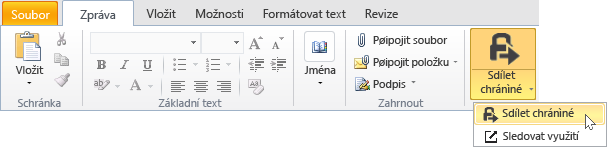
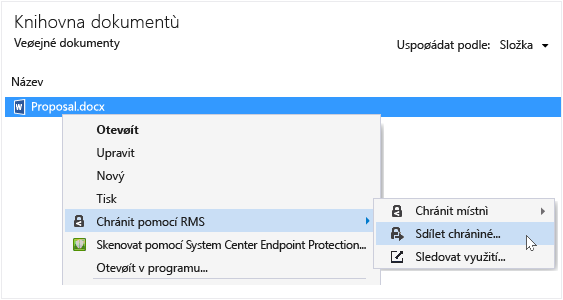
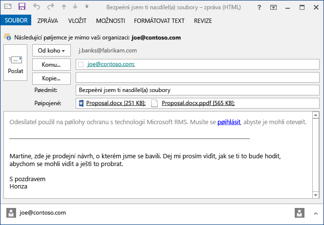

# Soubor, kter&#253; můžete sd&#237;let e-mailem pomoc&#237; Rights Management, aplikace pro sd&#237;len&#237; chr&#225;nit
Pokud zadáte ochranu souboru, který můžete sdílet e-mailem, vytvoří novou verzi původní soubor. Původní soubor zůstane nechráněné a nové verze je chráněný a automatické připojení k e-mailu, kterou pak odeslat.

V některých případech (pro soubory, které jsou vytvořeny tak, že aplikace Microsoft Word, Excel a PowerPoint) vytvoří aplikace pro sdílení obsahu RMS dvě verze souboru, který ji připojí k e-mailové zprávě. Druhý verze souboru má **.ppdf** příponu názvu souboru a je ve formátu PDF stínovou kopii souboru. Tato verze souboru zajišťuje, že příjemců, kterým se může vždy přečíst soubor, i v případě, že nemají stejné aplikace nainstalována, který jste použili při jeho vytvoření. To je často případ, kdy uživatelé číst e-mailu na mobilních zařízeních a chcete zobrazit jejich příloh e-mailů. Stačí k otevření souboru, je aplikace pro sdílení obsahu RMS. Potom může číst připojený soubor, ale nebudou moci změnit, dokud se otevřou jiné verzi souboru pomocí aplikace podporující RMS.

Pokud vaše organizace používá Azure RMS, můžete sledovat určité soubory, které můžete ochránit sdílení:

-   Vyberte možnost přijímat e-mailů, když někdo pokusí otevřít tyto chráněné přílohy. Pokaždé, když je získat přístup k souboru, zobrazí se upozornění, kteří se pokusili otevřít soubor a kdy a zda byly úspěšné (byly úspěšně ověřeny) nebo ne.

-   Použijte dokumentaci sledování webu. Můžete dokonce ukončit sdílení souborů, tím, že odvolá k němu přístup na webu sledování dokumentu. Další informace naleznete v tématu [Sledování a odvolání dokumenty, pokud použijete aplikaci sdílení RMS](../Topic/Track_and_revoke_your_documents_when_you_use_the_RMS_sharing_application.md).

## Používání aplikace Outlook: K ochraně soubor, který můžete sdílet e-mailem

1.  Umožňuje vytvořit e-mailové zprávě a připojit jako přílohu. Poté na **zpráva** ve **RMS** klikněte na možnost **sdílet chráněné** a potom klikněte na tlačítko **sdílet chráněné** znovu:

    

    Pokud nevidíte toto tlačítko, je pravděpodobné, že buď není v počítači nainstalována aplikace pro sdílení obsahu RMS, není nainstalována nejnovější verze, nebo k dokončení instalace je nutné restartovat váš počítač. Další informace o tom, jak nainstalovat aplikaci sdílení naleznete v tématu [Stáhněte si a nainstalujte Rights Management, aplikace pro sdílení](../Topic/Download_and_install_the_Rights_Management_sharing_application.md).

2.  Zadejte možnosti, které chcete použít pro tento soubor v [sdílet chráněné dialogové okno](http://technet.microsoft.com/library/dn574738.aspx), a potom klikněte na tlačítko **Odeslat nyní**.

### Další možnosti, jak chránit soubor, který sdílíte e-mailem
Kromě sdílení chráněných souborů pomocí aplikace Outlook, můžete použít také tyto možnosti:

-   Z Průzkumníka souboru: Tuto metodu lze použít pro všechny soubory.

-   Z aplikace sady Office: Tuto metodu lze použít pro aplikace, které aplikace pro sdílení obsahu RMS podporuje pomocí doplněk Office tak, aby se zobrazily **RMS** skupina na pásu karet.

##### Pomocí Průzkumníka souboru nebo aplikace systému Office: K ochraně soubor, který můžete sdílet e-mailem

1.  Použijte jednu z následujících možností:

    -   Pro soubor Explorer: Klikněte pravým tlačítkem soubor, vyberte možnost **chránit s RMS**, a potom vyberte **sdílet chráněné**:

        

    -   Pro Office aplikací, Word, Excel a PowerPoint: Ujistěte se, že jste uložili soubor nejprve. Poté na **Home** ve **RMS** klikněte na možnost **sdílet chráněné** a potom klikněte na tlačítko **sdílet chráněné** znovu:

        

    Pokud tyto možnosti pro ochranu nevidíte, je pravděpodobné, že buď není v počítači nainstalována aplikace pro sdílení obsahu RMS, není nainstalována nejnovější verze, nebo k dokončení instalace je nutné restartovat váš počítač. Další informace o tom, jak nainstalovat aplikaci sdílení naleznete v tématu [Stáhněte si a nainstalujte Rights Management, aplikace pro sdílení](../Topic/Download_and_install_the_Rights_Management_sharing_application.md).

2.  Zadejte možnosti, které chcete použít pro tento soubor v [sdílet chráněné dialogové okno](http://technet.microsoft.com/library/dn574738.aspx), a potom klikněte na tlačítko **Odeslat**.

3.  Může se rychle zobrazit dialogové okno o tom, zda soubor je chráněn a zobrazí se e-mailovou zprávu pro vás vytvořen, která udává příjemci, že přílohy jsou chráněny pomocí aplikace Microsoft RMS a, musí se přihlásit. Po klepnutí na odkaz pro přihlášení, naleznete pokyny a odkazů, abyste měli jistotu, mohou otevřít chráněné přílohu.

    Příklad:

    

    Jsou vám zajímá: [Co je .ppdf soubor, který se automaticky vytvoří?](../Topic/Dialog_box_options_for_the_Rights_Management_sharing_application.md#BKMK_PPDF)

4.  Volitelné: Je možné změnit cokoli, co chcete, aby v této e-mailové zprávě. Například můžete přidat nebo změnit předmět nebo text ve zprávě.

    > [!WARNING]
    > I když můžete přidat nebo odebrat uživatele z tohoto e-mailu, tím nedojde ke změně oprávnění pro přílohy, které jste zadali v **sdílet chráněné** dialogového okna. Pokud chcete změnit oprávnění, například udělit oprávnění k otevření souboru, zavřete e-mailovou zprávu bez uložení nebo jeho odesláním nové osoby a vraťte se ke kroku 1.

5.  Odešlete e-mailovou zprávu.

## Příklady a další informace
Příklady pro jak je možné použít Rights Management, sdílení aplikací a návody, naleznete v následujících částech v uživatelské příručce sdílení aplikace Rights Management:

-   [Příklady použití aplikace pro sdílení obsahu RMS](../Topic/Rights_Management_sharing_application_user_guide.md#BKMK_SharingExamples)

-   [Co chcete provést?](../Topic/Rights_Management_sharing_application_user_guide.md#BKMK_SharingInstructions)

## Viz také
[Průvodce Rights Management sdílení aplikace uživatele](../Topic/Rights_Management_sharing_application_user_guide.md)

