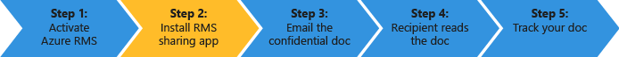

# Rychl&#233; zah&#225;jen&#237; kurzu Azure Rights Management
Použijte tento kurz rychle vyzkoušet Microsoft Azure Rights Management (také označované jako Azure RMS) pro vaši organizaci s právě 5 kroky, které by měla trvat méně než 15 minut. Budete aktivovat službu, zabezpečeně odesílat důvěrný dokument e-mailem někomu v jiné organizaci a pak budou moci sledovat při otevření tohoto dokumentu. Když důvěrný dokument je e-mailem, je zašifrován při přenosu a lze je číst pouze osoba, že jsou odeslána do, pomocí oprávnění, které jsou nastaveny odesílatelem.

V tomto kurzu je zaměřena na správci IT a konzultanty, aby mohl snadněji vyhodnotit Azure Rights Management jako řešení ochrany informací v organizaci. V provozním prostředí pokyny k aktivaci služby by provádí správce a pokyny k odeslání dokumentu by provedeným koncovým uživatelům. Obě sady pokyny jsou zahrnuty v tomto kurzu k předvedení scénář začátku do konce bezpečně odesílání důvěrný dokument někomu v jiné organizaci. Pokud máte potíže dokončení tohoto kurzu, odesílat e-mailovou zprávu na [AskIPTeam](mailto:askipteam@microsoft.com?subject=Having%20problems%20with%20the%20Quick%20Start%20tutorial) a pomůžeme vám.

Tento kurz budete potřebovat následující:

-   Odběr, který podporuje Azure Rights Management. To může být na placené předplatné nebo zkušební verzi předplatného. Pokud chcete použít pro sledování, dokumentů, který je vyžadován v kroku 5 v tomto kurzu, vaše předplatné musí podporovat sledování dokumentů. Další informace o možnosti odběru a odkazy na bezplatné zkušební verze, najdete v části [Cloud odběry, které podporují službu Azure RMS](../Topic/Requirements_for_Azure_Rights_Management.md#BKMK_SupportedSubscriptions) v oddílu [Požadavky pro Azure Rights Management](../Topic/Requirements_for_Azure_Rights_Management.md) tématu.

    Tip: Pokud potřebujete získat předplatné, proveďte předem vzhledem k tomu, že tento proces může někdy trvat nějakou dobu pro dokončení.

-   Účet správce pro přihlášení k Centru správy Office 365 nebo na portálu Azure, takže můžete aktivovat službu Rights Management. Tento účet musí mít také e-mailovou adresu a pracovní e-mailové služby (například Exchange Online nebo serveru Exchange Server).

-   Počítač se systémem Windows (minimum Windows 7 SP1) a má nainstalovanou Office 2016, Office 2013 nebo Office 2010.

Začněme.

## Krok 1: Aktivovat službu Rights Management

I když můžete mít odběr, který podporuje Azure Rights Management, služba je ve výchozím nastavení vypnuta. Aktivovat, můžete použít buď Centru správy Office 365, nebo na portálu Azure:

-   Pokud máte předplatné Office 365, které zahrnuje Azure Rights Management nebo předplatné služeb Office 365, který vyloučí Azure Rights Management ale máte předplatné pro samostatnou službu Azure RMS: **Pomocí centra pro správu služeb Office 365**.

-   Pokud nemáte předplatné Office 365: **Použití portálu Azure**.

#### Chcete-li aktivovat službu Rights Management v Centru správy Office 365

1.  Přejděte na stránku [portálu Office 365](https://portal.office.com/) a přihlaste se pomocí pracovního nebo školního účtu.

2.  Pokud nejsou Centru správy Office 365 automaticky zobrazeny, vyberte ikonu Spouštěč aplikace v levém horním a zvolte **Admin**.**Správce** dlaždice se zobrazí pouze správcům služeb Office 365.

    > [!TIP]
    > Centrum nápovědu správce naleznete v tématu [Centrum správy the Office 365 – Nápověda správce](https://support.office.com/article/About-the-Office-365-admin-center-Admin-Help-58537702-d421-4d02-8141-e128e3703547).

3.  V levém podokně rozbalte **Nastavení služby**.

4.  Klikněte na tlačítko **Rights Management**.

5.  Na **RIGHTS MANAGEMENT** klikněte na tlačítko **Spravovat**.

6.  Na **rights management** klikněte na tlačítko **Aktivovat**.

7.  Po zobrazení výzvy **Chcete aktivovat službu Rights Management?**, klikněte na tlačítko **Aktivovat**.

Nyní byste měli vidět **Rights management je aktivována** a deaktivovat (je nutné ručně aktualizovat stránku)

V tomto okamžiku neklikejte na **Rozšířené funkce**. Tím přejdete na portál Azure kde lze konfigurovat šablon, které nejsou potřeba pro tento kurz. Místo toho můžete zavřít Centru správy Office 365.

#### Chcete-li aktivovat službu Rights Management z portálu Azure

1.  Přejděte na stránku [portálu Azure](http://go.microsoft.com/fwlink/p/?LinkID=275081) a přihlaste se.

2.  V levém podokně klikněte na tlačítko **služby ACTIVE DIRECTORY**.

3.  Z **služby active directory** klikněte na tlačítko **RIGHTS MANAGEMENT**.

4.  Vybrat adresář pro správu pro [!INCLUDE[aad_rightsmanagement_2](../Token/aad_rightsmanagement_2_md.md)], klikněte na tlačítko **Aktivovat**, a potom potvrďte vaše akce.

**RIGHTS MANAGEMENT stav** by nyní měl zobrazovat **Active** a **Aktivovat** je nahrazen možnost **DEAKTIVOVAT**.

Přestože můžete nakonfigurovat další možnosti pro Rights Management na portálu, tyto nejsou potřeba pro tento kurz tak můžete zavřít na portálu Azure.

To je vše, které je třeba provést pro tento první krok. Služba je aktivována, aby všichni uživatelé ve vaší organizaci teď můžete začít chránit důležité a citlivých dokumentů. V provozním prostředí můžete omezit, kdo tuto operaci provést zpočátku pro postupné zavedení. Ale to není nezbytné, aby v tomto kurzu.

I když nejsou zahrnuty v tomto provozním nasazení, pravděpodobně bude také pravděpodobně chcete konfigurovat vlastní šablony. Šablony usnadňují uživatelům rychle použít správné nastavení, když potřebují chránit soubory. Při aktivaci Rights Management, automaticky získat 2 výchozí šablony a je pravděpodobné, můžete doplnit vlastní šablony v provozním prostředí. Ale šablony nejsou potřebné pro účely tohoto návodu, takže si budete chtít přejít na další krok.

|Pokud chcete získat další informace|Další informace|
|---------------------------------------|-------------------|
|O aktivaci služby Rights Management a řízení, kdo může chránit soubory a e-mailové služby je aktivován →|[Aktivace Azure Rights Management](../Topic/Activating_Azure_Rights_Management.md)|
|O výchozí šablony a jak vytvořit nové vlastní šablony →|[Konfigurace vlastních šablon pro Azure Rights Management](../Topic/Configuring_Custom_Templates_for_Azure_Rights_Management.md)|

## Krok 2: Instalace aplikace pro sdílení obsahu Rights Management

Aplikace (také označované jako "aplikace sdílení RMS") pro sdílení obsahu Rights Management není požadavek pro Azure Rights Management, ale doporučujeme pro všechny počítače a mobilní zařízení, které podporují Azure Rights Management. Aplikace sdílení RMS integruje s Office aplikace nainstalováním Office doplněk tak, aby uživatelé mohli snadno chránit soubory přímo z pásu karet. Je také umožňuje chránit všechny typy souborů použitím obecnou ochranu pro soubory, které nejsou podporovány nativně Azure Rights Management a dokumentu sledování webu pro uživatele k sledování a odvolávání souborů, které mají chráněné. Budeme používat sledování lokality později v tomto kurzu dokumentů.

Tato aplikace je zdarma ke stažení a nabízí skriptované instalace pro provozní prostředí. Ale pro účely tohoto návodu jsme budete jej nainstalovat místně.

#### Ke stažení a instalaci Rights Management, aplikace pro sdílení

1.  Přejděte [Microsoft Rights Management](http://go.microsoft.com/fwlink/?LinkId=303970) stránku na webu společnosti Microsoft.

2.  V **počítače** oddíl, klikněte na ikonu **aplikace RMS pro systém Windows** a uložit **Setup.exe** souboru k instalaci aplikace pro sdílení obsahu Microsoft Rights Management.

3.  Pro místní instalaci musí ke spuštění souboru Setup.exe, který byl stažen používat účet správce. Pokud se zobrazí výzva, aby bylo možné pokračovat, klikněte na tlačítko **Ano**.

4.  Na **Instalační program aplikace Microsoft RMS** klikněte na tlačítko **Další**, a počkejte na dokončení instalace.

5.  Po dokončení instalace, klikněte na tlačítko **Restartujte** Pokud budete vyzváni k restartování počítače, nebo klikněte na tlačítko  **Zavřít** k dokončení instalace.

Nyní jste připraveni začít s ochranou soubory, které obsahují informace, které chcete sdílet, ale pouze s uživateli, který určíte.

|Pokud chcete získat další informace|Další informace|
|---------------------------------------|-------------------|
|O místní instalace aplikace pro Windows a uživatel → pokyny pro sdílení obsahu Rights Management|[Průvodce Rights Management sdílení aplikace uživatele](http://technet.microsoft.com/library/dn339006.aspx)|
|O skriptované instalace aplikace pro Windows a další technické informace → pro sdílení obsahu Rights Management|[Průvodce Rights Management sdílení aplikace Správce](http://technet.microsoft.com/library/dn339003.aspx)|
|Chcete-li porozumět rozdílu mezi nativní ochranou a obecnou ochranou →|[Jaký je rozdíl mezi obecnou ochranou a integrovanou (nativní) ochranou?](https://technet.microsoft.com/library/dn574738.aspx)|

## Krok 3: E-mailu dokumentu, který chcete chránit

V tomto kroku nejprve vytvořit a uložit dokument aplikace Word, který bude představovat váš dokument, který chcete chránit a pojmenujte ji pomocí **Confidential.docx**. Pro tento kurz nezávisle na tom, jaký text ve skutečnosti obsahuje, ale můžete jej obsahují text, takže můžete snadněji potvrdit, že autorizovanému příjemci by mohl číst. Může například zadejte: **Pokud jste to čtení z vaší e-mailových příloh, odesílatel úspěšně sdílí soubor, který byl chráněn pomocí Azure RMS.**

Poté můžete začít bezpečně sdílet tento dokument e-mailem.

#### Bezpečné sdílení dokumentu e-mailem

1.  Pomocí aplikace Outlook, vytvořte novou zprávu a připojte soubor, který jste právě vytvořili.

2.  V **k** zadejte jednu nebo více e-mailová adresa adresy. Ujistěte se, jako je například zadejte e-mailovou adresu do zaměstnání **janetm@contoso.com** nebo **p.dover@fabrikam.com** vzhledem k tomu, že v současné době Azure Rights Management nepodporuje osobní e-mailové adresy, které můžete použít doma od poskytovatele sítě Internet. Nedělejte si starosti o tom, jestli osoba, kterou chcete odeslat jej do také má Azure Rights Management, nebo ne.

3.  Zadejte předmět, jako je například  **důvěrný dokument** a zadejte krátký zpráv pro e-mailu, jako je například **Přečtěte si tento důvěrný dokument a nelze jej sdílet s ostatními.**

4.  Poté na **zpráva** ve **RMS** klikněte na možnost **sdílet chráněné** a potom klikněte na tlačítko **sdílet chráněné** znovu:

5.  V **sdílet chráněné** dialogové okno:

    1.  Vyberte **Viewer – zobrazení pouze**.

        To znamená, že naše příjemců budou moci dokument zobrazit, nikoli však upravit nebo vytisknout.

    2.  Vyberte **e-mailu mě, když někdo pokusí otevřít tyto dokumenty**.

        Dostanete e-mailového oznámení pokaždé, když příjemce pokusí otevřít přílohu a také pokud někdo jiný pokusí jej otevřít – například příjemce předá e-mailu s kolegy. V tomto scénáři poslední uvidíte, že byl odepřen přístup a z podrobností o uživateli můžete rozhodnout, zda odeslat tomuto uživateli kopii dokumentu, který lze otevřít.

    3.  Vyberte **Povolit mi okamžité zrušení přístupu k těmto dokumentům**.

        Tato možnost vyžaduje příjemce, které chcete mít připojení k Internetu pokaždé, když jsou otevřete přílohu, ale s využitím, pokud později odvolat dokumentu, při dalším pokusu o otevření, že není budou moci. Pokud tuto možnost nevyberete, může být příjemce nemůže otevřít, a to i bez připojení k Internetu, ale s nevýhodou, že pokud později odvolat dokumentu, může dojít k prodlevám při při které se projeví.

    4.  Klikněte na tlačítko **nyní odeslat**.

        E-mailu s přílohou, je odeslána na e-mailové adresy, které jste zadali. Kromě e-mailové zprávy uvidí pokyny jak číst přiložený dokument, který je chráněn Azure Rights Management.

Nyní jste poslali chráněný dokument, jste připraveni požádejte příjemce, aby čekat na doručení a otevřete jej. Ale nezavírejte aplikace Outlook, protože použijeme ji znovu v našich posledním krokem ke sledování přílohu.

|Pokud chcete získat další informace|Další informace|
|---------------------------------------|-------------------|
|Úplné pokyny a alternativní metody pro ochranu souborů, které sdílejí → e-mailem|[Soubor, který můžete sdílet e-mailem pomocí Rights Management, aplikace pro sdílení chránit](https://technet.microsoft.com/library/dn574735.aspx)|
|O možnostech v **sdílet chráněné** → dialogové okno|[Možnosti dialogového okna pro službu Rights Management, aplikace pro sdílení](https://technet.microsoft.com/library/dn574738.aspx)|

## Krok 4: Požádejte příjemce, aby-mailem dokument otevřít

Příjemci použít mnoho zařízení ke čtení chráněný dokument, který se odesílají jako přílohy e-mailu. Zařízení zahrnují Ipady, Iphony, Android tablety a telefony, počítače se systémem Mac, jakož i počítače se systémem Windows.

Zeptejte se ke čtení e-mailové zprávy, které jste odeslali. Uvidí vaši e-mailovou zprávu a před tímto následující text:

**Odesílatel je chráněný pomocí Microsoft RMS přílohy. Musíte** [přihlásit](http://aka.ms/rms) **abyste je mohli otevřít.**

Po kliknutí na odkaz, je trvá pokyny k instalaci aplikace sdílení RMS a v případě potřeby přihlášení ke službám bezplatný účet. Bezplatný účet uděluje je předplatné pro službu RMS pro jednotlivce, který zajistí, že oprávněným uživatelům mohou vždy číst chráněný dokument i v případě, že jejich organizace nemá Azure RMS. Poté jsou připravené ke čtení chráněná příloha pomocí následujících pokynů.

#### Chcete-li zobrazit přílohy chráněný dokument

1.  Protože Azure Rights Management chráněný dokument aplikace Word, existují dva přílohy e-mailové zprávy. Toto jsou ve skutečnosti dvě verze stejného souboru, ale s různé přípony souborů. Otevřít verzi, která má **.ppdf** příponu názvu souboru (**Confidential.ppdf**).

    Pokud máte verzi [Office na zařízení, který podporuje Rights Management](https://technet.microsoft.com/library/dn655136.aspx), můžete otevřít verzi souboru (**Confidential.docx**) tak, aby se otevře v aplikaci Word.

2.  Pokud se zobrazí výzva k zadání uživatelského jména a hesla, zadejte uživatelské jméno v stejný formát jako e-mailovou adresu, která byla použita k odesílání e-mailu a příloh. Například **janetm@contoso.com** nebo **p.dover@fabrikam.com**. Vaše heslo zadejte heslo, které jste zadali při registraci pro službu RMS pro jednotlivce. Nebo, pokud vaše organizace používá Azure RMS, zadejte heslo obvyklé práce.

Dokument se otevře a nyní může načíst obsah. Řekněme například, ji může **Pokud to můžete číst z přílohy e-mailu, odesílatel úspěšně sdílí soubor, který byl chráněn pomocí Azure RMS.** Protože je jen pro čtení, nelze změnit obsah.

Jako volitelný krok může požádat příjemce e-mailu předat jiných osob, které jste nezahrnuli původní e-mailu. I v případě, že tyto ostatní uživatelé pracovat v organizaci, která má Azure Rights Management nebo se vztahují pro své vlastní RMS pro jednotlivce předplatné, nebudou moci otevřete přílohu. Pokud jsou jejich vyzval k jejich uživatelské jméno, bude odepřen přístup k dokumentu.

Teď, když příjemce otevřel přílohu a volitelně předávat někomu dalšímu, očekávají, že e-mailového oznámení, která generuje sestavy této aktivity. Ale e-mailové zprávy jsou snadno ztratíte v čase, tak lepší způsob ke sledování, který se připojil dokumentu je použití webu, což je popsáno v posledním kroku pro sledování dokumentů.

|Pokud chcete získat další informace|Další informace|
|---------------------------------------|-------------------|
|Úplné pokyny pro zobrazení souborů, které jsou chráněny → Azure Rights Management|[Zobrazení a použití souborů, které bylo chráněno Rights Management](https://technet.microsoft.com/library/dn574741.aspx)|
|O bezplatné předplatné služby RMS pro jednotlivce →|[RMS pro jednotlivce i Azure Rights Management](../Topic/RMS_for_Individuals_and_Azure_Rights_Management.md)|
|O dvě verze souboru se zobrazí připojených k e-mailové zprávy →|[Co je .ppdf soubor, který se automaticky vytvoří?](https://technet.microsoft.com/library/dn574738.aspx)|

## Krok 5: Sledovat chráněný dokument

> [!NOTE]
> Pro tento krok musí mít odběr, který podporuje sledování dokumentů. Chcete-li zkontrolovat, zda vaše předplatné zahrnuje sledování dokumentů, naleznete v části [Rights Management Services (RMS)-porovnání nabídek](https://technet.microsoft.com/dn858608.aspx).

Tento krok je nepovinný, ale většina uživatelů, například vědět, pokud příloha odeslání lidem byl otevřen, když a dokonce i z umístění, kde. Příklad:

-   Odpověď od osob se očekává podle zadaného časového a můžete zobrazit z webu sledování dokumentu dokumentu Jana nebyl otevřen, i když se blíží konečného termínu. Odeslat jí zpracování e-mailu nebo telefonicky jí Připomínáme včas.

-   Po sledování toho, že někomu otevře dokument, zpracování požádat svého if Jana žádný dotaz nebo vyžaduje další informace.

#### Chcete-li sledovat chráněný dokument

1.  Pomocí aplikace Outlook, na **Domů** na kartě **RMS** seskupit, klikněte na **sledovat využití**.

2.  Pokud se zobrazí **chránit a sdílené složky na vaše podmínky** klikněte na tlačítko **přihlásit** a zadat uživatelské jméno a heslo znovu.

3.  Na **Sdílené dokumenty** stránky, zobrazí se dokumentu, který je připojen k e-mailu, **Confidential.docx**. V tomto okamžiku je soubor pouze zobrazeny, ale jako další chráněné dokumenty sdílíte, v seznamu se zvýší.

    Z této stránky zobrazí se při sdílené dokumentu (při odeslání e-mailu pomocí chráněné přílohy), datum poslední aktivity a název příjemce, které jste poslali e-mailu k. Klikněte na název dokumentu další podrobnosti.

4.  Na novou stránku, která má název souboru, který jste klikli, uvidíte souhrnných detailů pouze dokumentu, a seznam dalších možností, které jsou k dispozici pro dokument (**seznamu**, **Časová osa**, **mapy**, **Nastavení**).

    Každý možnost prozkoumat různé způsoby, jak sledovat chráněný dokument. Nebo stále na **Souhrn** klikněte na tlačítko **Otevřít v aplikaci Excel** export informací do tabulkového procesoru, nebo klikněte na **odvolat přístup** ukončení sdílení dokumentu.

Můžete vrátit k tomuto webu sledovat další aktivitu chráněný dokument nebo odvolat přístup, pokud je to nezbytné. Lokality můžete dokonce přístup z mobilního zařízení nebo tabletu, pomocí prohlížeče s tímto odkazem: [pro sledování dokumentů](http://go.microsoft.com/fwlink/?LinkId=529562)

|Pokud chcete získat další informace|Další informace|
|---------------------------------------|-------------------|
|Úplné pokyny pro sledování vaší → dokumenty|[Sledování a odvolání dokumenty, pokud použijete aplikaci sdílení RMS](https://technet.microsoft.com/library/dn986611.aspx)|
|Dvě minuty videa, vysvětluje a zobrazuje → pro sledování dokumentů|[Sledování dokumentů Azure RMS a odvolaných certifikátů.](http://channel9.msdn.com/Series/Information-Protection/Azure-RMS-Document-Tracking-and-Revocation)|
|Pro řešení problémů a zákazníka → dotazy|[Nejčastější dotazy týkající se sledování dokumentů](https://technet.microsoft.com/dn947488)|

## Další kroky
V tomto kurzu prošli pouze jeden scénář pro jak Azure RMS chránit vaše data. Ostatní běžné použití naleznete v tématu [Azure RMS v akci](https://technet.microsoft.com/library/jj585026.aspx) část [Co je Azure Rights Management?](../Topic/What_is_Azure_Rights_Management_.md) článku. V tomto článku, které mohou být také užitečné jsou ostatní části, například jak Azure RMS funguje a jaký obchodních problémů lze vyřešit.

Pokud jste připraveni začít nasazovat Azure RMS, použijte [Plán nasazení Azure Rights Management](../Topic/Azure_Rights_Management_Deployment_Roadmap.md) kroky nasazení a odkazy na postupy.

## Viz také
[Začínáme s Azure Rights Management](../Topic/Getting_Started_with_Azure_Rights_Management.md)

