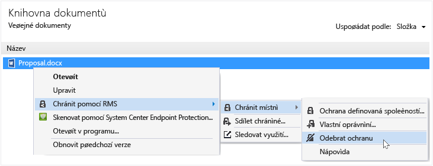

# Odebrat ochranu ze souboru s použit&#237;m Rights Management, aplikace pro sd&#237;len&#237;
Odebrat ochranu ze souboru (což je odemknout souboru) který byl dříve chráněn pomocí aplikace pro sdílení obsahu RMS, použijte **odebrat ochranu** možnost z Průzkumníka souboru.

> [!IMPORTANT]
> Musíte být vlastníkem souboru odebrat ochranu.

### Chcete-li odebrat ochranu ze souboru

1.  File Explorer, klikněte pravým tlačítkem na soubor (například Sample.ptxt), vyberte možnost **chránit s RMS**, klikněte na tlačítko **chránit místně**, a potom klikněte na tlačítko **odebrat ochranu**:

    

    Můžete být vyzváni k zadání pověření.

Původní chráněný soubor je odstraněna (například Sample.ptxt) a nahradit soubor, který má stejný název, ale nechráněné příponu názvu (například Sample.txt).

## Příklady a další informace
Příklady pro jak je možné použít Rights Management, sdílení aplikací a návody, naleznete v následujících částech v uživatelské příručce sdílení aplikace Rights Management:

-   [Příklady použití aplikace pro sdílení obsahu RMS](../Topic/Rights_Management_sharing_application_user_guide.md#BKMK_SharingExamples)

-   [Co chcete provést?](../Topic/Rights_Management_sharing_application_user_guide.md#BKMK_SharingInstructions)

## Viz také
[Průvodce Rights Management sdílení aplikace uživatele](../Topic/Rights_Management_sharing_application_user_guide.md)

