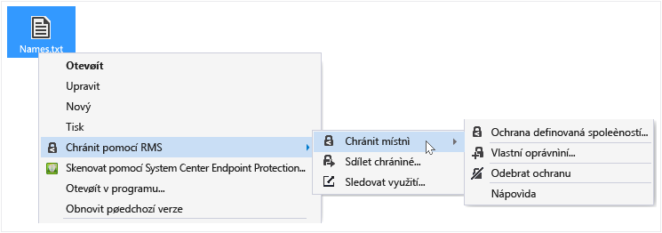
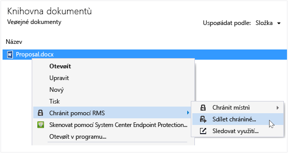
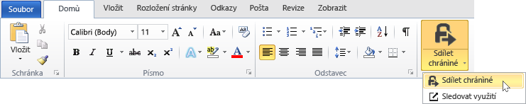

# Uživatelsk&#225; př&#237;ručka aplikace pro sd&#237;len&#237; obsahu Rights Management – revize pro jedno t&#233;ma
Aplikace pro sdílení obsahu Microsoft Rights Management (RMS) pro Windows vám pomáhá chránit důležité dokumenty a obrázky před lidmi, kteří by je neměli vidět, a to i když dokumenty nebo obrázky odešlete e-mailem nebo je uložíte na jiné zařízení. Tato aplikace slouží taky k otevírání a používání souborů chráněných jinými lidmi pomocí stejné technologie Rights Management.

Abyste mohli aplikaci Sdílení RMS nainstalovat, potřebujete jenom počítač s Windows 7 a účet místního správce. Then [download and install](http://go.microsoft.com/fwlink/?LinkId=303970) this free application from Microsoft.

If you have questions that are not answered by this guide, see [FAQ for Microsoft Rights Management Sharing Application for Windows](http://go.microsoft.com/fwlink/?LinkId=303971).

Tady je několik příkladů, jak vám aplikace pro sdílení obsahu může pomáhat chránit soubory.

|Chci…|Jak na to|
|---------|-------------|
|**...bezpečně sdílet finanční informace s někým, kdo není z mojí organizace, ale komu důvěřuji.**  Spolupracujete s partnerskou společností a chcete jí e-mailem poslat excelovou tabulku s plánovanými prodejními čísly. Chcete, aby mohli čísla zobrazit, ale nemohli je měnit.|Použijete v Excelu na pásu karet tlačítko Sdílet chráněné, zadáte e-mailové adresy dvou osob, se kterými v partnerské firmě spolupracujete, vyberete na posuvníku možnost Čtenář a kliknete na Odeslat.  Až e-mail dorazí do partnerské společnosti, můžou tabulku zobrazit jenom příjemci uvedení v e-mailu – a nemůžou ji uložit, upravit, vytisknout ani přeposlat.  Podrobnosti: See **Protect a file that you share by email** in the [What do you want to do?](../Topic/Rights_Management_sharing_application_user_guide_-_revision_for_single_topic.md#BKMK_UsingMSRMSApp) section of this guide.|
|**… bezpečně poslat dokument někomu, kdo používá zařízení s iOS**  Chcete e-mailem poslat hodně důvěrný wordový dokument spolupracovníkovi, o kterém víte, že si pravidelně čte e-maily na zařízení s iOS.|V Průzkumníku souborů kliknete na soubor pravým tlačítkem a vyberete Sdílet chráněné. V aplikaci pro sdílení obsahu RMS vyberete možnost Povolit používání na všech zařízeních a odešlete spolupracovníkovi daný soubor jako přílohu.  Příjemce obdrží e-mail na svém zařízení s iOS, klikne ve zprávě na odkaz a dozví se, jak stáhnout aplikaci Sdílení RMS, nainstaluje si verzi pro zařízení s iOS a pak si dokument prohlédne.  Podrobnosti: See **Protect a file that you share by email** in the [What do you want to do?](../Topic/Rights_Management_sharing_application_user_guide_-_revision_for_single_topic.md#BKMK_UsingMSRMSApp) section of this guide.|
|**… si přečíst přílohu, která přišla v e-mailové zprávě obsahující bezpečně sdílený soubor s přílohou, ale nemůžu, protože moje firma nepoužívá Rights Management**  Odesílatel e-mailu je někdo, komu důvěřujete, protože jste s ním dřív obchodovali. Předpokládáte, že vám posílá informace o nové potenciální obchodní příležitosti.|Budete postupovat podle pokynů v e-mailu a kliknutím na odkaz si zaregistrujete Microsoft Rights Management. Microsoft ověří, jestli vaše organizace nemá předplatné na Office 365, pošle vám e-mailovou zprávu k provedení bezplatného procesu registrace a vy se pak pomocí svého nového účtu přihlásíte. Kliknutím na druhý odkaz v e-mailu si nainstalujete aplikaci pro sdílení obsahu Rights Management a pak otevřete přílohu e-mailu a přečtete si o nové obchodní příležitosti.  Podrobnosti: See **View and use files that have been protected by Rights Management** in the [What do you want to do?](../Topic/Rights_Management_sharing_application_user_guide_-_revision_for_single_topic.md#BKMK_UsingMSRMSApp) section of this guide.|
|**… ochránit důvěrné firemní soubory na svém notebooku, aby k nim neměli přístup lidé, kteří nepracují ve firmě**  Hodně cestujete a pro zpřístupnění a aktualizaci souborů ve složce, která musí být chráněná proti neautorizovanému přístupu, používáte notebook.|Na notebooku máte nainstalovanou aplikaci Sdílení RMS. Používáte Průzkumník souborů k ochraně souborů pomocí šablony, která zajistí rychlou ochranu souborů. Pokud vám notebook ukradnou, máte jistotu, že se k těmto dokumentům nedostane nikdo, kdo nepracuje ve vaší firmě.  Podrobnosti: See **Protect a file on a device (protect in-place)** in the [What do you want to do?](../Topic/Rights_Management_sharing_application_user_guide_-_revision_for_single_topic.md#BKMK_UsingMSRMSApp) section of this guide.|

## Co chcete udělat?
Při práci s chráněnými soubory vám pomůžou následující pokyny.

### Stažení a instalace aplikace pro sdílení obsahu Rights Management

1.  Go to the [Microsoft Rights Management](http://go.microsoft.com/fwlink/?LinkId=303970) page on the Microsoft website.

2.  In the **Computers** section, click the icon for the **RMS app for Windows** and save the Microsoft Rights Management sharing application installation package to your computer.

3.  Double click the compressed file that was downloaded, and then double-click **setup.exe**. If you are prompted to continue, click **Yes**.

    > [!TIP]
    > You might have to scroll to the bottom of the list in the current folder to see **setup.exe**.

4.  On the **Setup Microsoft RMS** page, click **Next**, and wait for the installation to finish.

5.  When the installation finishes, click **Restart** to restart your computer and complete the installation. Or, click **Close** and restart your computer later to complete the installation.

Teď můžete začít chránit svoje soubory nebo prohlížet soubory chráněné jinými uživateli.

#### Další informace
Abyste mohli nainstalovat aplikaci pro sdílení obsahu, musíte mít místní účet správce. Pokud se nepřihlásíte jako místní správce, můžete při spuštění souboru Setup.exe v kroku 3 použít možnost **Spustit jako správce**.

### Ochrana souboru v zařízení (místní ochrana)

1.  V Průzkumníkovi souborů vyberte soubor, složku nebo víc souborů, které chcete chránit. Klikněte pravým tlačítkem a vyberte **Chránit místně**. Příklad:

    

    > [!NOTE]
    > Pokud se možnost **Chránit místně** nezobrazuje, nejspíš nemáte v počítači nainstalovanou aplikaci pro sdílení obsahu nebo se její instalace musí dokončit restartováním počítače. Další informace o instalaci aplikace pro sdílení najdete v tématu **Stažení a instalace aplikace pro sdílení obsahu Rights Management** v části [What do you want to do?](../Topic/Rights_Management_sharing_application_user_guide_-_revision_for_single_topic.md#BKMK_UsingMSRMSApp) této příručky.

2.  Udělejte jednu z těchto věcí:

    -   Vyberte šablonu zásad: Jedná se o předdefinovaná oprávnění, která omezují přístup a použití na osoby ve vaší organizaci. Pokud soubor chráníte na tomto počítači poprvé, budete napřed muset vybrat možnost **Ochrana definovaná společností** pro stažení šablon. Název šablon začíná názvem vaší firmy, za kterým následuje popisný název oprávnění. Příklad: **Contoso – jenom pro důvěrné prohlížení**

    -   Vyberte **Vlastní oprávnění**: Tuto možnost zvolte, pokud šablony neposkytují úroveň ochrany, kterou potřebujete. Třeba když chcete udělit přístup lidem mimo vaši organizaci nebo chcete explicitně nastavit možnosti ochrany sami. Zadejte požadované možnosti pro tento soubor v dialogu **Přidat ochranu** a potom klikněte na **Použít**.

        > [!NOTE]
        > Další informace o možnostech v tomto dialogovém okně najdete v tématu **Zadání možností v dialogovém okně Rights Management** v části [What do you want to do?](../Topic/Rights_Management_sharing_application_user_guide_-_revision_for_single_topic.md#BKMK_UsingMSRMSApp) této příručky.

3.  Může se krátce zobrazit dialog s oznámením, že probíhá ochrana souboru, a pak se fokus vrátí do Průzkumníka souborů. Vybrané soubory jsou teď chráněné. V některých případech (když se při přidání ochrany změní přípona souboru) se původní soubor v Průzkumníku souborů nahradí novým souborem, který má ikonu zámku ochrany Rights Management. Příklad:

    

Pokud později potřebujete odebrat ochranu některého souboru, přečtěte si téma **Odebrání ochrany souboru** v části [What do you want to do?](../Topic/Rights_Management_sharing_application_user_guide_-_revision_for_single_topic.md#BKMK_UsingMSRMSApp) této příručky.

#### Další informace
Při místní ochraně souboru se nahradí původní nechráněný soubor. Tento soubor pak můžete nechat tam, kde je, zkopírovat ho do jiné složky nebo zařízení nebo tuto složku nasdílet, a soubor zůstane chráněný. Chráněný soubor můžete taky přiložit k e-mailové zprávě, i když se doporučuje sdílet ho e-mailem přímo z Průzkumníka souborů nebo z některé aplikace Office (viz **Ochrana souboru sdíleného e-mailem** v části [What do you want to do?](../Topic/Rights_Management_sharing_application_user_guide_-_revision_for_single_topic.md#BKMK_UsingMSRMSApp) této příručky).

Stejným způsobem se dá chránit víc souborů současně nebo složka. V případě složky se ochrana vybere automaticky pro všechny soubory v dané složce, ale nové soubory, které ve složce vytvoříte, nebudou chráněné automaticky.

Pokud se při chránění souborů zobrazí nějaké chyby, přečtěte si [Nejčastější dotazy k aplikaci pro sdílení obsahu Microsoft Rights Management pro Windows](http://go.microsoft.com/fwlink/?LinkId=303971).

### Ochrana souboru sdíleného e-mailem

1.  Použijte jednu z následujících možností:

    -   V Průzkumníkovi souborů: Klikněte na soubor pravým tlačítkem a vyberte **Sdílet chráněné**:

        

    -   V aplikaci Office: Nejdřív zkontrolujte, že je soubor uložený. Potom ve skupině **Ochrana** klikněte na **Sdílet chráněné**.

        

    > [!NOTE]
    > Pokud se tyto možnosti pro sdílení ochrany nezobrazují, nejspíš nemáte v počítači nainstalovanou aplikaci pro sdílení obsahu nebo se její instalace musí dokončit restartováním počítače. Další informace o instalaci aplikace pro sdílení najdete v tématu **Stažení a instalace aplikace pro sdílení obsahu Rights Management** v části [What do you want to do?](../Topic/Rights_Management_sharing_application_user_guide_-_revision_for_single_topic.md#BKMK_UsingMSRMSApp) této příručky.

2.  Zadejte požadované možnosti pro tento soubor v dialogu **Sdílet chráněné** a potom klikněte na **Odeslat**.

    

    > [!NOTE]
    > Další informace o možnostech v tomto dialogovém okně najdete v tématu **Zadání možností v dialogovém okně Rights Management** v části [What do you want to do?](../Topic/Rights_Management_sharing_application_user_guide_-_revision_for_single_topic.md#BKMK_UsingMSRMSApp) této příručky.

3.  Může se krátce zobrazit dialogové okno s oznámením, že soubor je chráněný, a pak se zobrazí automaticky vytvořená e-mailová zpráva s předmětem **Bezpečně jsem ti nasdílel(a) soubory**. Přílohou této e-mailové zprávy je chráněný soubor, který jste vybrali, a text e-mailu obsahuje odkazy na tyto položky:

    -   RMS pro jednotlivce

    -   Aplikace pro sdílení obsahu RMS

    -   Tato uživatelská příručka

    Příklad:

    

4.  Volitelné: V této e-mailové zprávě můžete cokoli změnit. Můžete třeba doplnit nebo změnit předmět nebo text zprávy.

    > [!WARNING]
    > Přestože v této e-mailové zprávě můžete přidat nebo odebrat příjemce, nezmění se tím oprávnění přílohy, která jste zadali v dialogu **Sdílet chráněné**. Pokud chcete tato oprávnění změnit, třeba dát nové osobě oprávnění k otevření souboru, zavřete e-mailovou zprávu bez uložení nebo odeslání a vraťte se ke kroku 1.

5.  Odešlete e-mailovou zprávu.

#### Další informace
Při ochraně souboru, který sdílíte e-mailem, se vytvoří nová verze původního souboru. Původní soubor zůstane nechráněný a nová chráněná verze se automaticky přiloží k e-mailu, který pak odešlete.

E-mailová zpráva má výchozí předmět a výchozí text, který se dá před odesláním změnit.

Soubor sdílený e-mailem se dá chránit dvěma způsoby:

-   Z Průzkumníka souborů: Tato metoda se dá použít pro všechny soubory.

-   Z aplikace Office: Tato metoda se dá použít pro aplikace, které aplikace pro sdílení obsahu Rights Management podporuje, s využitím doplňku pro Office, takže uvidíte skupinu **Ochrana** na pásu karet.

> [!NOTE]
> Tato verze aplikace pro sdílení obsahu Rights Management neobsahuje doplněk pro Outlook, který by umožňoval chránit soubory a e-mailové zprávy přímo v aplikaci Outlook. Místo toho použijte postup uvedený v tomto oddílu.

### Zobrazení a používání souborů chráněných aplikací Rights Management

#### Zobrazení chráněného souboru
V Průzkumníkovi souborů nebo e-mailové zprávě obsahující přílohu poklikejte na chráněný soubor a pokud se zobrazí výzva, zadejte přihlašovací údaje. Způsob otevření souboru závisí na tom, jak je chráněný.

-   Pokud je soubor chráněný obecně (má příponu .pfile):

    Zobrazí se dialogové okno **chráněný soubor** z aplikace pro sdílení obsahu, které sděluje, kdo nastavil ochranu souboru a že se očekává, že zachováte oprávnění spoluvlastníka. Zobrazí se informace, že pokud soubor otevřete, bude se tato akce auditovat.

    

    Pokud chcete soubor přečíst, klikněte na **Otevřít**.

-   Pokud je soubor chráněný nativně (nemá příponu .pfile):

    Soubor se otevře pomocí aplikace přidružené k původní příponě názvu souboru a v horní části souboru se zobrazí nápis informující o omezení. Nápis může obsahovat informace o oprávněních k souboru nebo odkaz na tato oprávnění. Může se třeba zobrazovat nápis informující o tom, že **oprávnění je momentálně omezené**. Kliknutím na něj zobrazíte skutečná oprávnění, která se u souboru používají, a osoby, které k němu mají přístup:

    

    Tento soubor se taky audituje a toto auditování se provádí tak dlouho, dokud je soubor chráněný.

##### Další informace
Před zobrazením chráněného souboru musí RMS nejdřív kontrolou vašeho uživatelského jména a hesla ověřit, jestli máte k zobrazení souboru oprávnění. Někdy jsou přihlašovací údaje uložené v mezipaměti a výzva k jejich zadání se nezobrazí. Pokud nejsou, zobrazí se výzva k jejich zadání.

Pokud vaše organizace nepoužívá Microsoft Azure Rights Management (Microsoft Azure RMS) ani AD RMS, můžete požádat o bezplatný účet, který bude přijímat vaše přihlašovací údaje, abyste mohli otevírat soubory chráněné pomocí RMS. Pokud chcete o tento účet požádat, klikněte na odkaz žádosti o [službu RMS pro jednotlivce](http://go.microsoft.com/fwlink/?LinkId=309469).

#### Používání chráněných souborů (třeba úpravy a tisk souboru)
Pokud má chráněný soubor příponu .pfile:

-   Uložte otevřený soubor a dejte mu novou příponu, která je přidružená k aplikaci, kterou chcete použít.

    Třeba pokud je soubor chráněný pomocí názvu souboru document.vsdx.pfile, zobrazte daný soubor a v Průzkumníkovi souborů ho uložte jako document.vsdx.

    Nový soubor už dál není chráněný. Pokud ho chcete chránit, je potřeba udělat to ručně. Pokyny najdete v části **Ochrana souboru na zařízení (místní ochrana) pomocí aplikace pro sdílení obsahu Rights Management**v části [What do you want to do?](../Topic/Rights_Management_sharing_application_user_guide_-_revision_for_single_topic.md#BKMK_UsingMSRMSApp) této příručky.

Pokud původně chráněný soubor nemá příponu .pfile:

-   Nemůžete udělat nic jiného než daný soubor jenom zobrazit, pokud nemáte aplikaci, která funguje se službou Rights Management. Takovým aplikacím se říká aplikace kompatibilní s technologií Rights Management. Příkladem aplikací kompatibilních s technologií Rights Management jsou aplikace z Office 2013 a Office 2010 (třeba Word, Excel, PowerPoint a Outlook). Aplikace, které nejsou od Microsoftu, ale od jiných dodavatelů softwaru nebo třeba vaše vlastní podnikové aplikace, můžou být s technologií Rights Management taky kompatibilní.

    Aplikace, které jsou kompatibilní s technologií Rights Management, umí otevírat soubory chráněné pomocí jiných aplikací kompatibilních s technologií Rights Management. Zachovávají přiřazenou ochranu souborů, a to i v případě, že soubor upravíte nebo uložíte pod jiným názvem nebo do jiného umístění. Tyto aplikace vám umožňují používat soubor na základě oprávnění, která jsou k souboru momentálně přiřazená, takže pokud máte nějaká oprávnění, můžete je využít. Třeba pokud je soubor chráněný jako Jen pro čtení, nebudete moct v souboru provádět změny ani ho vytisknout.

### Odebrání ochrany souboru
V Průzkumníku souborů klikněte na soubor (třeba Sample.ptxt) pravým tlačítkem, klikněte na **Chránit místně** a potom klikněte na **Odebrat ochranu**:

Může se zobrazit výzva k zadání přihlašovacích údajů.

#### Další informace
Původní chráněný soubor (například Ukázka.ptxt) se odstraní a nahradí se souborem, který má stejný název, ale příponu nechráněného souboru (například Ukázka.txt).

Pokud chcete u souboru, který byl dřív chráněný pomocí aplikace Sdílení RMS, odebrat ochranu (soubor odemknout), použijte možnost **Odebrat ochranu** v Průzkumníku souborů.

> [!IMPORTANT]
> Abyste mohli ochranu odebrat, musíte být vlastníkem souboru.

### Používání klávesových zkratek v aplikaci pro sdílení obsahu Rights Management
Stisknutím klávesy **Alt** zobrazíte dostupné přístupové klávesy a potom stisknutím klávesy **Alt** + přístupové klávesy vyberete příslušnou možnost.

#### Další informace
Například v dialogovém okně **sdílet chráněné** stisknutím klávesy **Alt** zobrazte přístupové klíče a pak stisknutím kombinace **Alt+U** zaškrtněte políčko **Pokaždé, když budou uživatelé chtít tento soubor otevřít, se budou muset přihlásit**.

### Zadání možností v dialogovém okně Rights Management

|Možnost|Popis|
|-----------|---------|
|**UŽIVATELÉ**|Zadejte e-mailové adresy lidí, kterým chcete umožnit otevřít soubor. Jednotlivé adresy oddělte středníkem. Můžou to být e-mailové adresy v rámci vaší organizace i mimo ni.  Příklad: janatm@contoso.com; p.dobes@fabricom.com|
|**Povolit používání na všech zařízeních**|Pokud vyberete tuto možnost, která umožňuje uživatelům otevírat soubor na mobilních zařízeních, třeba na iPadu, nastaví se oprávnění automaticky na **SPOLUVLASTNÍK** (všechna oprávnění) a soubor bude chráněný prostředky obecné ochrany.|
|**OPRÁVNĚNÍ**|Posuňte jezdec na oprávnění, které požadujete pro tento soubor.  V některých případech jsou oprávnění automaticky nastavená na SPOLUVLASTNÍK a nejdou změnit. K tomu dojde, když vyberete možnost **Povolit používání na všech zařízeních**. A dojde k tomu taky v případě, když chcete chránit soubor, který se nedá nativně chránit pomocí RMS, a musí být proto chráněný obecně. Aplikace pro sdílení obsahu o tom rozhodne na základě přípony názvu souboru. **Tip:** Na stránce [Microsoft Rights Management](http://go.microsoft.com/fwlink/?LinkId=303970) na webu Microsoftu můžete rychle zkontrolovat, které aplikace podporují integrovanou ochranu.|
|**Uživatelé se budou muset přihlásit pokaždé, když budou chtít tento soubor otevřít.**|Tuhle možnost vyberte, když potřebujete vyšší zabezpečení souboru. Při každém přístupu určených uživatelů k souboru se totiž vždy vyžaduje ověření. Pokud nejsou jejich přihlašovací údaje uložené v mezipaměti, zobrazí se jim výzva k zadání jejich uživatelského jména a hesla. Toto nastavení ale vyžaduje, aby tito uživatelé měli při otevírání souboru vždy přístup k internetu. Zobrazování výzev k odemknutí souboru a čekání na dokončení procesu ověřování může být frustrující.|
|**Platnost obsahu vyprší dne**|Tuhle možnost vyberte jenom pro soubory citlivé na čas, které by vámi vybraní uživatelé neměli mít možnost otevřít po zadaném datu. Původní soubor budete moct i dál otevřít.|

#### Další informace
Tato tabulka vám pomůže v aplikaci pro sdílení obsahu při zadávání možností v dialogovém okně **Přidat ochranu** nebo **Sdílet chráněné**. Tohle dialogové okno se zobrazí, když chráníte soubor na místě a vyberete vlastní oprávnění nebo když chráníte soubor pro sdílení.

Další informace o ochraně souboru na místě a o ochraně souboru pro sdílení najdete v části [What do you want to do?](../Topic/Rights_Management_sharing_application_user_guide_-_revision_for_single_topic.md#BKMK_UsingMSRMSApp) této příručky.

## Viz také
[Průvodce Rights Management sdílení aplikace Správce](../Topic/Rights_Management_sharing_application_administrator_guide.md)
 [Stažení aplikace pro sdílení obsahu Microsoft Rights Management](http://go.microsoft.com/fwlink/?LinkId=303970)
 [Nejčastější dotazy k aplikaci pro sdílení obsahu Microsoft Rights Management pro Windows](http://go.microsoft.com/fwlink/?LinkId=303971)

