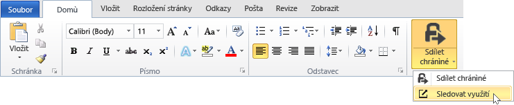
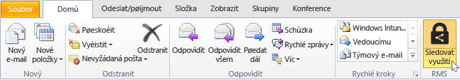
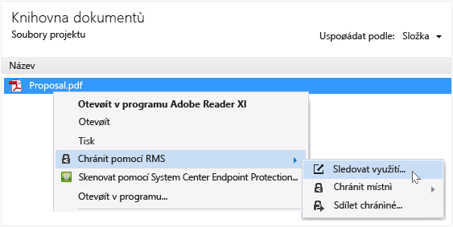
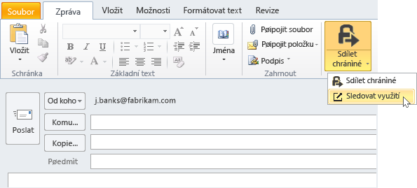

# Sledov&#225;n&#237; a odvol&#225;n&#237; dokumenty, pokud použijete aplikaci sd&#237;len&#237; RMS
Po zajištění ochrany dokumentů pomocí aplikace, pokud vaše organizace používá Azure Rights Management, spíše než Active Directory Rights Management Services sdílení RMS, můžete sledovat, jak uživatelé používají chráněné dokumenty. V případě potřeby můžete také odvolat přístup k těmto dokumentům, pokud chcete ukončit sdílení je. Chcete-li to provést, použijte **lokality pro sledování dokumentů**, které je přístupné z počítače se systémem Windows, počítače se systémem Mac a to i z tablety a telefony.

> [!TIP]
> Minutu dvě videa: [Sledování Azure RMS dokumentů a zrušení](http://channel9.msdn.com/Series/Information-Protection/Azure-RMS-Document-Tracking-and-Revocation)

Při přístupu k této lokalitě, přihlaste se a můžete dokumenty sledovat. Poskytnutí vaše organizace má [odběr, který podporuje sledování dokumentů a odvolání](https://technet.microsoft.com/dn858608.aspx) a jsou přiřazeny licenci pro tento odběr, pak uvidíte kdo se pokusil otevřít soubory, které budete chránit a jestli byly úspěšné (úspěšně ověřený) nebo ne. Pokaždé, když by byl proveden pokus o přístup k dokumentu a jejich umístění v době. Kromě toho:

-   Pokud je třeba ukončit sdílení dokumentu: Klikněte na tlačítko **odvolání přístupu**, Všimněte si, dobu, kterou dokumentu bude i nadále k dispozici a rozhodnout, zda chcete-li umožnit uživatelům víte, že budete odvolání přístupu k dokumentu jste dříve sdílené a zadat vlastní zprávu.

-   Pokud chcete exportovat do aplikace Excel: Klikněte na tlačítko **Otevřít v aplikaci Excel**, takže můžete poté upravovat data a vytvářet vlastní zobrazení a grafy.

-   Pokud chcete nakonfigurovat e-mailová oznámení: Klikněte na tlačítko **Nastavení** a vyberte možnost jak a zda má být odeslány e-mailem, při přístupu k dokumentu.

-   Pokud máte dotazy nebo poskytnout zpětnou vazbu o sledování webu dokumentů: Klikněte na ikonu Nápověda k přístupu [Nejčastější dotazy týkající se sledování dokumentů](http://go.microsoft.com/fwlink/?LinkId=523977).

## Pomocí sady Office pro přístup k dokumentu sledování webu

-   Pro Office aplikací, Word, Excel a PowerPoint: Na **Home** ve **RMS** klikněte na možnost **sdílet chráněné**, a potom klikněte na tlačítko **sledovat využití**.

    

-   Pro aplikaci Outlook: Na **Home** ve  **RMS** klikněte na možnost **sledovat využití**:

    

Pokud tyto možnosti pro službu RMS nevidíte, je pravděpodobné, že buď není v počítači nainstalována aplikace pro sdílení obsahu RMS, není nainstalována nejnovější verze, nebo k dokončení instalace je nutné restartovat váš počítač. Další informace o tom, jak nainstalovat aplikaci sdílení naleznete v tématu [Stáhněte si a nainstalujte Rights Management, aplikace pro sdílení](../Topic/Download_and_install_the_Rights_Management_sharing_application.md).

### Další možnosti, jak sledovat a odvolání dokumenty
Kromě sledování dokumentů na počítače se systémem Windows s použitím aplikace systému Office, můžete také použít tyto možnosti:

-   **Pomocí webového prohlížeče**: Tuto metodu lze použít pro všechna podporovaná zařízení.

-   **Používání nástroje Průzkumník soubor**: Tuto metodu lze použít pro počítače se systémem Windows.

-   **Pomocí e-mailovou zprávu aplikace Outlook**: Tuto metodu lze použít pro počítače se systémem Windows.

##### Pomocí webového prohlížeče pro přístup k webu sledování doc

-   Pomocí podporované prohlížeče, přejděte na [Sledování webu dokumentů](http://go.microsoft.com/fwlink/?LinkId=529562).

    Podporované prohlížeče: Doporučujeme používat aplikaci Internet Explorer, která je alespoň verze 10, ale můžete použít některý z následujících prohlížečů použití dokumentu sledování webu:

    -   Aplikace Internet Explorer: Alespoň verze 10

    -   Aplikace Internet Explorer 9 s alespoň MS12-037: Kumulativní aktualizace zabezpečení pro aplikaci Internet Explorer: 12. června 2012

    -   Mozilla Firefox: Alespoň verze 12

    -   Apple Safari 5: Alespoň verze 5

    -   Google Chrome: Alespoň verze 18

##### Pomocí Průzkumníka souboru pro přístup k dokumentu sledování webu

-   Klikněte pravým tlačítkem soubor, vyberte možnost **chránit s RMS**, a potom vyberte **sledovat využití**:

    

##### Pomocí e-mailovou zprávu aplikace Outlook pro přístup k webu sledování doc

-   V e-mailovou zprávu v **zpráva** ve  **RMS** klikněte na možnost **sdílet chráněné**, a potom klikněte na tlačítko **sledovat využití**:

    

## Příklady a další informace
Příklady pro jak je možné použít Rights Management, sdílení aplikací a návody, naleznete v následujících částech v uživatelské příručce sdílení aplikace Rights Management:

-   [Příklady použití aplikace pro sdílení obsahu RMS](../Topic/Rights_Management_sharing_application_user_guide.md#BKMK_SharingExamples)

-   [Co chcete provést?](../Topic/Rights_Management_sharing_application_user_guide.md#BKMK_SharingInstructions)

## Viz také
[Průvodce Rights Management sdílení aplikace uživatele](../Topic/Rights_Management_sharing_application_user_guide.md)

