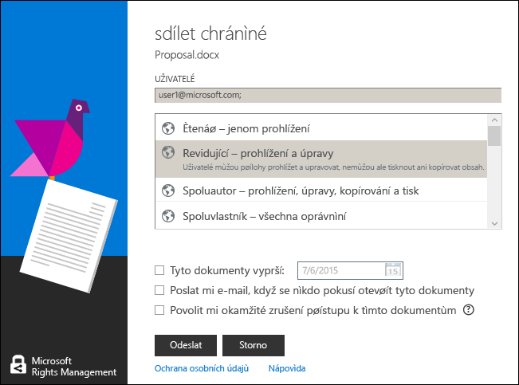

# Použit&#237; kl&#225;vesov&#253;ch zkratek v Rights Management, aplikace pro sd&#237;len&#237;
Pokud použijete aplikaci sdílení RMS, stiskněte klávesu **Alt** klávesy vidět klíče pro přístup k dispozici a potom stiskněte klávesu **Alt** + přístupový kód a vyberte možnost.

Například v **sdílet chráněné** dialogové okno, stiskněte klávesu **Alt** vidět klíče pro přístup a potom stiskněte klávesu **Alt + m** k výběru **e-mailu mi, když se někdo pokusí otevřít tyto dokumenty** zaškrtávací políčko.

## Příklady a další informace
Příklady pro jak je možné použít Rights Management, sdílení aplikací a návody, naleznete v následujících částech v uživatelské příručce sdílení aplikace Rights Management:

-   [Příklady použití aplikace pro sdílení obsahu RMS](../Topic/Rights_Management_sharing_application_user_guide.md#BKMK_SharingExamples)

-   [Co chcete provést?](../Topic/Rights_Management_sharing_application_user_guide.md#BKMK_SharingInstructions)

## Viz také
[Průvodce Rights Management sdílení aplikace uživatele](../Topic/Rights_Management_sharing_application_user_guide.md)

