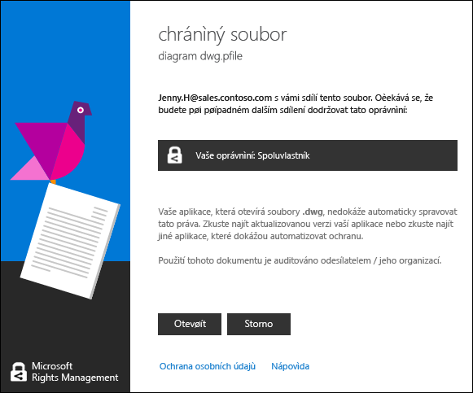

# Zobrazen&#237; a použit&#237; souborů, kter&#233; bylo chr&#225;něno Rights Management
Pokud [RMS (Rights Management) aplikace pro sdílení je nainstalován ve vašem počítači](https://technet.microsoft.com/library/dn574734%28v=ws.10%29.aspx), jednoduše dvojitým kliknutím zobrazíte chráněný soubor. Soubor může být přílohy v e-mailové zprávě, nebo může zobrazit, při použití Průzkumníka souboru.

> [!NOTE]
> Aby bylo možné zobrazit chráněný soubor, musíte RMS nejprve potvrdit, že jste oprávněni zobrazit soubor, který ji nemá kontrolou své uživatelské jméno a heslo. V některých případech to může být uložena do mezipaměti a nebude zobrazen dotaz, k zadání pověření. V ostatních případech budou vyzváni k zadání pověření.
> 
> Pokud vaše organizace nepoužívá Azure Rights Management (Azure RMS) nebo služby AD RMS, můžete použít k bezplatnému účtu, který bude přijímat pověření, aby mohli otevřít soubory, které jsou chráněny pomocí služby RMS:
> 
> -   Chcete-li použít pro tento účet, klepněte na odkaz požádat o [RMS pro osoby,](http://go.microsoft.com/fwlink/?LinkId=309469).
> 
>     Při registraci, použijte e-mailovou adresu společnosti, nikoli osobní e-mailovou adresu. Pokud jsou přihlášení vzhledem k tomu, že vám byly odeslány e-mailem chráněný přílohy, použijte stejný e-mailovou adresu, která byla použita k odesílání e-mailové zprávy.
> -   Další informace naleznete v tématu [RMS pro jednotlivce i systému Windows Azure Rights Management](http://technet.microsoft.com/library/dn592127.aspx).

## Chcete-li zobrazit chráněný soubor.
Pomocí Průzkumníka souboru nebo e-mailovou zprávu, která obsahuje přílohu, poklepejte na chráněný soubor a zadejte svá pověření, pokud se zobrazí výzva k tomu.

Pokud se zobrazí dvě verze souboru, ale s různé přípony souborů, otevřete soubor, který má příponu souboru .ppdf pouze v případě, že je druhý soubor nebude otevřen. Pokud je verze .ppdf nelze otevřít buď, nainstalujte nejprve [aplikaci sdílení RMS](http://technet.microsoft.com/library/dn574734.aspx), který zná otevření souborů, které mají příponu názvu souboru .ppdf.

> [!NOTE]
> Další informace naleznete v tématu "[Co je .ppdf soubor, který se automaticky vytvoří?](../Topic/Dialog_box_options_for_the_Rights_Management_sharing_application.md#BKMK_PPDF)".

Jak soubor se otevře závisí na jak je chráněn, které poznáte podle vidí příponu názvu souboru. V každém případě otevírání souboru může být zaznamenávány a zůstává auditovaných, jako je chráněn. Kromě toho pokud soubor byl odeslán jako e-mailu, se odesílatel může být upozorněni e-mailem pokaždé, když se otevřít soubor.

|Příponu názvu souboru a ochrany|Další informace|
|-----------------------------------|-------------------|
|Soubor má **.pfile** přípony názvu souboru.  Soubor byl chráněn ke generické chybě.|Při otevření souboru, naleznete **chráněný soubor** dialogového okna z sdílení aplikace, která určí, kdo chráněný soubor a očekávaného přijmout vedlejšího vlastníka oprávnění. Klikněte na tlačítko **Open** ke čtení souboru.  |
|Soubor má **.ppdf** přípony názvu souboru nebo je chráněný soubor text či obrázek (například **.ptxt** nebo **.pjpg**).  Soubor je chráněn nativně jako kopii jen pro čtení.|Soubor se otevře v prohlížeči, který nainstaluje aplikaci sdílení RMS. Tento soubor je jen pro čtení, i když uložit jej do jiného umístění nebo ji přejmenovat.|
|Jiné přípony názvů souborů.  Soubor byl nativně chránit.|Otevře se soubor s použitím aplikace, která je přidružena k původní příponu názvu souboru a omezení banner se zobrazí v horní části souboru. Hlavičky může zobrazit oprávnění, které jsou použity k souboru, nebo ji zadat odkaz na jejich zobrazení. Například, mohou se zobrazit následující kde musíte klepnout na **oprávnění je momentálně omezené** Chcete-li zobrazit skutečná oprávnění, které jsou použity k souboru a osoby, které k němu přístup:  |
Úplný seznam přípon názvů souborů, které podporuje Rights Management, naleznete [Podporované typy souborů a přípon souborů](../Topic/Rights_Management_sharing_application_administrator_guide.md#BKMK_SupportFileTypes) oddíly v  [Průvodce Rights Management sdílení aplikace Správce](../Topic/Rights_Management_sharing_application_administrator_guide.md). Pokud vaše příponu názvu souboru není uveden, použijte vyhledávání na webu a zjistěte, zda je příponu názvu souboru je podporován jiná aplikace.

> [!NOTE]
> IF, po potvrzení, že soubor je chráněn systémem Rights Management a nelze otevřít soubor, stáhněte si a používat [Security Analyzer RMS](https://www.microsoft.com/en-us/download/details.aspx?id=46437). Postupujte podle pokynů v nástroji zjišťovat problémy ve vašem počítači, které mohou zabránit otevírání chráněný dokument.

## Chcete-li používat soubory, které je chráněno (pro příklad, úpravy a tisk souboru)
Pokud po otevření chráněný soubor, kterou chcete více než jen číst (například upravit, kopírovat a vytisknout):

|Příponu názvu souboru|Pokyny|
|-------------------------|----------|
|Soubor má **.pfile** přípony názvu souboru.|Otevřít soubor uložit a přiřaďte jí novou příponu názvu souboru, který je přidružen k aplikaci, kterou chcete použít.  Pokud soubor byl chráněný pomocí document.vsdx.pfile název souboru, zobrazte soubor a v Průzkumníku soubor uložte soubor jako document.vsdx.  Nový soubor je již chráněna. Pokud chcete chránit, je nutné provést ručně. Pokyny naleznete v tématu [Chránit soubor v zařízení &#40;chránit místně&#41; s použitím Rights Management, aplikace pro sdílení](../Topic/Protect_a_file_on_a_device__protect_in-place__by_using_the_Rights_Management_sharing_application.md).|
|Soubor má **.ppdf** přípony názvu souboru nebo je chráněný soubor text či obrázek (například **.ptxt** nebo **.pjpg**).|Můžete zobrazit pouze v souboru a Pokud přejmenujete nebo přesunete jej, ochrany spočívá v souboru.|
|Jiné přípony názvů souborů.|Zařízení musí mít aplikace, která jste srozuměni s tím Rights Management používat tyto soubory. Tyto aplikace se nazývají RMS enlightened aplikací. Aplikace z Office 2016, Office 2013 a Office 2010 (například Word, Excel, PowerPoint a aplikace Outlook) jsou příklady aplikací, které jsou enlightened pro službu Rights Management. Ale aplikace, které nejsou převedeny do společnosti Microsoft, například dalších softwarových společností a vlastní-firemní aplikace, může být také enlightened pro službu Rights Management.  Aplikace, které jsou enlightened pro službu Rights Management vědět, jak otevřít soubory, které bylo chráněno jiných Rights Management enlightened aplikací. Také přetrvávají ochranu, která se použije k nim, i v případě úpravy souboru nebo uložit na jiný název souboru nebo jiné umístění. Tyto aplikace umožňují použít soubor podle oprávnění, která jsou aktuálně aplikované na soubor, tak, že pokud máte oprávnění pro použití v souboru, lze provést. Například může být možné upravit soubor, ale ne vytisknout.|

## Příklady a další informace
Příklady pro jak je možné použít Rights Management, sdílení aplikací a návody, naleznete v následujících částech v uživatelské příručce sdílení aplikace Rights Management:

-   [Příklady použití aplikace pro sdílení obsahu RMS](../Topic/Rights_Management_sharing_application_user_guide.md#BKMK_SharingExamples)

-   [Co chcete provést?](../Topic/Rights_Management_sharing_application_user_guide.md#BKMK_SharingInstructions)

## Viz také
[Průvodce Rights Management sdílení aplikace uživatele](../Topic/Rights_Management_sharing_application_user_guide.md)

