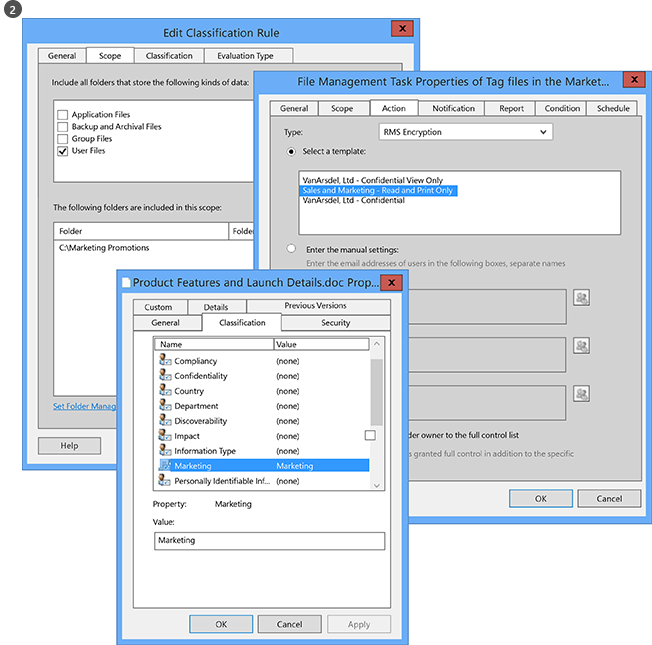
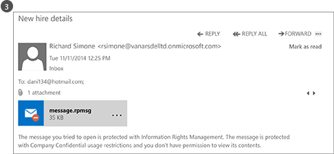

# Co je Azure Rights Management?
Azure Rights Management (Azure RMS) je řešení ochrany informací pro organizace, které chcete chránit svá data v dnešních náročné pracovním prostředí.

Tyto výzvy zahrnují muset být připojená k Internetu, s uživatelů bere osobní zařízení pro práci, přístup k datům společnosti na cestách a Domovská stránka a sdílení s důležitá obchodní partnery citlivé informace. Jako součást jejich každodenní práci uživatelé sdílejí informace pomocí e-mailu, sdílení souborů lokalit a cloudové služby. V těchto scénářích tradiční zabezpečení ovládacích prvků (například seznamy řízení přístupu a oprávnění systému souborů NTFS) a bránami firewall omezenou účinnost pokud chcete ochranu firemních dat při stále umožňují uživatelům pracovat efektivně.

V porovnání může Azure RMS chránit vaše společnost citlivé informace v těchto scénářích. Používá šifrování, identity a zásady autorizace zabezpečit soubory a e-mailu a funguje napříč několika zařízeními – telefony, tablety a počítače. Informace se dají chránit v rámci vaší organizace i mimo vaši organizaci, protože tuto ochranu zůstává s daty, i když se dostane hranice vaší organizace. Jako příklad zaměstnanci může e-mailu dokumentu do partnerské společnosti nebo jejich uložení dokumentu na jejich jednotku cloudu. Trvalé ochrany, která poskytuje Azure RMS pouze pomáhá zabezpečit data společnosti, ale může také vyžadováno právními předpisy pro dodržování předpisů, zjišťování právní požadavky nebo postupů pro správu jednoduše správné informace.

Ale je velmi důležité, oprávnění lidé a služby (například vyhledávání a indexování) můžete dál číst a kontrolovat data, která chrání Azure RMS, což není snadno provést s jinými řešeními ochrany informací, které používají šifrování peer-to-peer. Tato možnost je někdy označovány jako "uvažování nad daty" a je zásadní element v zachovat kontrolu data vaší organizace.

Následující obrázek ukazuje, jak se Azure RMS funguje jako Rights Management řešení pro Office 365 také za účelem na místní servery a služby. Zobrazí se také, že podporuje oblíbené koncový uživatel zařízení se systémem Windows, Mac OS, iOS, Android a Windows Phone.

> [!TIP]
> V tomto okamžiku může být užitečné další prostředky:
> 
> -   Dvě minuty video: [Co je Microsoft Azure Rights Management](http://technet.microsoft.com/dn833005.aspx)
> -   Tutoriál krok 5: [Rychlé zahájení kurzu Azure Rights Management](../Topic/Quick_Start_Tutorial_for_Azure_Rights_Management.md)
> -   Azure RMS požadavky, včetně možnosti odběru k nákupu nebo vyhodnocení: [Požadavky pro Azure Rights Management](../Topic/Requirements_for_Azure_Rights_Management.md)

Další informace o Azure RMS pomocí následujících částí:

-   [Jaké problémy Azure RMS vyřešit?](../Topic/What_is_Azure_Rights_Management_.md#BKMK_RMSrequirements)

    -   [Zabezpečení, dodržování předpisů a právních požadavků](../Topic/What_is_Azure_Rights_Management_.md#BKMK_RMScompliance)

-   [Azure RMS v akci: Co správci a uživatelé v tématu](../Topic/What_is_Azure_Rights_Management_.md#BKMK_RMSpictures)

    -   [Aktivaci a konfiguraci Rights Management](../Topic/What_is_Azure_Rights_Management_.md#BKMK_Example_ManagementPortal)

    -   [Automaticky chrání soubory na souborových serverech se systémem Windows Server a souboru klasifikace infrastruktury](../Topic/What_is_Azure_Rights_Management_.md#BKMK_Example_FCI)

    -   [Automaticky chrání e-maily s Exchange Online a zásady předcházení ztrátě dat.](../Topic/What_is_Azure_Rights_Management_.md#BKMK_Example_DLP)

    -   [Automaticky Ochrana souborů pomocí služby SharePoint Online a chráněné knihovny](../Topic/What_is_Azure_Rights_Management_.md#BKMK_Example_SharePoint)

    -   [Uživatelé bezpečně sdílet přílohy s mobilní uživatele](../Topic/What_is_Azure_Rights_Management_.md#BKMK_Example_SharingApp)

-   [Jak funguje Azure RMS? Pod pokličkou](../Topic/What_is_Azure_Rights_Management_.md#BKMK_HowRMSworks)

    -   [Ovládání kryptografie používá Azure RMS: Algoritmy a délky klíčů](../Topic/What_is_Azure_Rights_Management_.md#BKMK_RMScrytographics)

    -   [Návod, jak pracuje Azure RMS: Nejprve použít, obsahu ochrany obsahu spotřeba](../Topic/What_is_Azure_Rights_Management_.md#BKMK_Walthrough)

-   [Další kroky](../Topic/What_is_Azure_Rights_Management_.md#BKMK_NextSteps)

## Jaké problémy Azure RMS vyřešit?
Použijte k identifikaci podnikové požadavky nebo problémy, které vaše organizace může mít v následující tabulce a Azure RMS jak může vyřešit tyto.

|Požadavek nebo problém|Vyřešit Azure RMS|
|--------------------------|---------------------|
|Chránit všechny typy souborů|√ předchozí provádění Rights Management, pouze Office soubory by mohla být chráněny, pomocí nativní ochrany. Nyní [obecnou ochranu](https://technet.microsoft.com/library/dn574738%28v=ws.10%29.aspx) znamená, že jsou podporovány všechny typy souborů.|
|Chránit soubory kdekoli|√, když je soubor uložen do umístění ([chránit na místě](https://technet.microsoft.com/library/dn574733%28v=ws.10%29.aspx)), ochrana stále se souborem, i v případě, že je zkopírován do úložiště, které není pod kontrolou IT, jako je například úložiště cloudové služby.|
|Bezpečné sdílení souborů e-mailem|√ Při sdílení souboru e-mailem ([sdílet chráněné](https://technet.microsoft.com/library/dn574735%28v=ws.10%29.aspx)), soubor je chráněn jako přílohu e-mailovou zprávu s pokyny, jak otevřít chráněná příloha. Text e-mailu nejsou šifrována, takže tyto pokyny můžete vždy přečíst příjemce. Nicméně protože přiložený dokument je chráněn, pouze oprávněným uživatelům bude možné otevřít, i v případě, že e-mailu nebo dokumentu se předá ostatním uživatelům.|
|Auditování a sledování|√ můžete [audit a sledování využití](https://technet.microsoft.com/library/dn529121.aspx) chráněných souborů, i když tyto soubory ponechat hranice vaší organizace.  Například při práci pro společnosti Contoso, Ltd. Pracujete na společný projekt s 3 uživateli od společnosti Fabrikam, Inc. E-mail tito lidé 3 dokument, který chránit a omezit jen pro čtení. Auditování Azure RMS, můžete zadat následující informace:  -   Zda osoby, které jste zadali v Fabrikam otevřít dokument a kdy. -   Zda jiných osob, které jste nezadali (se neúspěšně pokusil) Chcete-li otevřít dokument – například protože byla předána nebo uložit do sdíleného umístění, která by mohla přístup ostatním uživatelům. -   Zda a kterákoli z konkrétní osoby se pokusil (se nezdařilo) chcete vytisknout nebo změna dokumentu.|
|Podpora pro všechny běžně používané zařízení, nikoli pouze počítače se systémem Windows|√ [podporovaná zařízení](https://technet.microsoft.com/library/dn655136.aspx) zahrnují:  -   Počítače se systémem Windows a telefony -   Počítače se systémem Mac -   iOS tablety a telefony -   Android tablety a telefony|
|Podpora pro podnikové obchodní spolupráci|√ je Cloudová služba, protože Azure RMS, není nutné explicitně nakonfigurovat vztahy důvěryhodnosti s dalšími organizacemi, předtím, než se chráněný obsah můžete sdílet s nimi. Pokud již máte Office 365 nebo adresáři služby Azure AD, je automaticky podporováno spolupráci mezi organizacemi. Pokud tomu tak není, uživatelé můžete zaregistrovat bezplatnou [RMS pro jednotlivce](https://technet.microsoft.com/library/dn592127.aspx) odběru.|
|Podpora pro místní služby a také služeb Office 365|√ Kromě pracovní [bez problémů s Office 365](https://technet.microsoft.com/library/jj585004.aspx), můžete použít také Azure RMS s následujícími službami místní při nasazení [RMS konektor](https://technet.microsoft.com/library/dn375964.aspx):  -   Exchange Server -   SharePoint Server -   Windows Server spuštěn soubor klasifikace infrastruktury|
|Snadné aktivace|√ [aktivaci služby Rights Management](https://technet.microsoft.com/library/jj658941.aspx) pro uživatele, vyžaduje několika kliknutími klasické portálu Azure.|
|Schopnost škálování v organizaci, podle potřeby|√ Protože Azure RMS spuštěn jako cloudové služby s Azure pružnost škálovat nahoru a out, nemusíte poskytovat nebo nasadit další místní servery.|
|Schopnost vytvářet jednoduché a flexibilní zásady|√ [přizpůsobené šablony zásad práv](https://technet.microsoft.com/library/dn642472.aspx) poskytují rychlý a snadný řešení pro správce uplatnit zásady a uživatelům správnou úroveň ochrany pro každý dokument použít a omezit přístup lidé ve vaší organizaci.  Například pro celopodnikové strategickém dokumentu sdílet s všechny zaměstnance, můžete použít jen pro čtení zásad pro všechny zaměstnance interní. Poté citlivější dokumentu, jako je například finanční sestavy můžete omezit přístup pouze vedoucím pracovníkům.|
|Podpora široké aplikace|√ Azure RMS obsahuje těsné integrace s aplikací Microsoft Office a službami a rozšiřuje podporu jiných aplikací pomocí aplikace sdílení RMS.  √   [Microsoft Rights Management SDK](https://msdn.microsoft.com/library/hh552972%28v=vs.85%29.aspx) interními vývojáři a dodavatelé softwaru poskytuje rozhraní API k zápisu vlastních aplikací, které podporují službu Azure RMS.  Další informace naleznete v tématu [Jak aplikace podporují Azure Rights Management](../Topic/How_Applications_Support_Azure_Rights_Management.md).|
|IT musí zachovat kontrolu nad daty|√ Organizace můžete zvolit ke správě svých vlastních klíč klienta a "[přineste si vlastní klíč](https://technet.microsoft.com/library/dn440580.aspx)" řešení (BYOK) a uložte svůj klíč klienta hardwarové zabezpečení moduly (moduly hardwarového zabezpečení).  √ Podporu pro auditování a [protokolování využití](https://technet.microsoft.com/library/dn529121.aspx) tak, aby můžete analyzovat pro obchodní statistiky, sledování, urážlivý příspěvek, a (Pokud jste nevracení informace) provádět forenzní analýzy.  √ delegovaní přístupu pomocí [funkci superuživatele](https://technet.microsoft.com/library/mt147272.aspx) zajistí, který může IT vždy přístup chráněný obsah, i v případě, že dokument byl chráněn zaměstnanci, který poté ponechá organizace. Porovnání, peer-to-peer šifrování řešení riziko neúspěšná přístupu k datům společnosti.  √ Synchronizovat [pouze atributy adresáře, které potřebuje Azure RMS](https://azure.microsoft.com/documentation/articles/active-directory-aadconnectsync-attributes-synchronized/) pro podporu společnou identitu pro místní účty služby Active Directory, pomocí [Nástroj pro synchronizaci adresáře](https://azure.microsoft.com/documentation/articles/active-directory-aadconnect-get-started-tools-comparison/), jako je například Azure AD Connect.  √ Povolit single sign na bez replikace hesel v cloudu pomocí služby AD FS.  √ Organizace vždy mají možnost zastavit, aniž byste ztratili přístup k obsahu, který byl dříve chráněné službou Azure RMS pomocí Azure RMS. Informace o vyřazování z provozu možnosti naleznete v tématu [Vyřazování z provozu a deaktivace Azure Rights Management](../Topic/Decommissioning_and_Deactivating_Azure_Rights_Management.md). Kromě toho můžete organizacemi, které jste nasadili Active Directory Rights Management Services (AD RMS) [migrovat do Azure RMS](https://technet.microsoft.com/library/dn858447.aspx) bez ztráty přístupu k datům byl dříve chráněné serverem služby AD RMS.|
> [!TIP]
> Pokud jste obeznámeni s místní verzí Rights Management, Active Directory Rights Management Services (AD RMS), může být zájem srovnávací tabulka z [Porovnání Azure Rights Management a služby AD RMS](../Topic/Comparing_Azure_Rights_Management_and_AD_RMS.md).

### Zabezpečení, dodržování předpisů a právních požadavků
Azure RMS podporuje následující zabezpečení, dodržování předpisů a právních požadavků:

√ Použití standardní kryptografie a podporuje FIPS 140-2. Další informace naleznete v tématu [Ovládání kryptografie používá Azure RMS: Algoritmy a délky klíčů](../Topic/What_is_Azure_Rights_Management_.md#BKMK_RMScrytographics) v tomto tématu.

√ centra podpory pro společnosti Thales hardwaru zabezpečení moduly moduly (hardwarového zabezpečení) k uložení váš uživatelský klíč pro klienta v Microsoft Azure data. Azure RMS používá samostatné zabezpečení světů pro jeho datového centra v Severní Americe, EMEA (Evropa, Střední východ a Afrika) a Asie, takže klíče lze použít pouze ve vaší oblasti.

√ Certifikované pro následující:

-   ISO/IEC 27001:2013 (zahrnuje [ISO/IEC 27018](http://azure.microsoft.com/blog/2015/02/16/azure-first-cloud-computing-platform-to-conform-to-isoiec-27018-only-international-set-of-privacy-controls-in-the-cloud/))

-   Osvědčení SOC 2 SSAE 16/ISAE 3402

-   HIPAA BÁ

-   Klauzule EU modelu

-   FedRAMP v rámci Azure Active Directory v Office 365 certifikační vydané úřadu agentury FedRAMP k provozu podle HHS

-   PCI DSS úroveň 1

Další informace o těchto externí certifikace naleznete v tématu [Centrum zabezpečení Azure](http://azure.microsoft.com/support/trust-center/compliance/).

## Azure RMS v akci: Co správci a uživatelé v tématu
Obrázky v této části ukazují některé typické příklady jak správci a uživatelé zobrazit a můžete chránit citlivá nebo důvěrná informace pomocí Azure RMS.

> [!NOTE]
> Ve všech těchto příkladech kde Azure RMS chrání data vlastníka obsahu nadále úplný přístup k datům (soubor nebo e-mailu), i když použitých ochrany uděluje oprávnění ke skupině, která nebyla vlastník členem nebo i v případě použitých ochrany obsahuje datum vypršení platnosti.
> 
> Podobně IT může vždy přístup k chráněným datům bez omezení, pomocí funkci superuživatele Rights Management, který uděluje Delegovaný přístup oprávněným uživatelům nebo služby, které zadáte. Kromě toho může IT sledování a monitorování využití dat, který je chráněný – příklad, který je při přístupu k datům a kdy.

Pro další snímky obrazovky a videa, které ukazují RMS ve akce zkontrolujte [portálu služeb Microsoft Rights Management](http://www.microsoft.com/rms),  [Blog týmu Microsoft Rights Management (RMS)](http://blogs.technet.com/b/rms), a [spravovaných obsah pro Azure RMS na Curah! lokality](http://curah.microsoft.com/Search?query="Azure%20RMS").

### Aktivaci a konfiguraci Rights Management
I když používáte prostředí Windows PowerShell pro aktivaci a konfigurovat Azure RMS je nejjednodušší z portálu pro správu. Jakmile je aktivována služba, máte dvě výchozí šablony umožňující správcům a uživatelé mohou vybrat rychle a snadno použít ochrana informací do souborů. Ale můžete také vytvořit vlastní šablony pro další možnosti a nastavení.

|||
|-|-|
|  [Větší obrázek](http://technet.microsoft.com/98d53a12-3b19-4622-bb1e-75ef56df5438) (ve výchozím nastavení ve stejném okně prohlížeče)|Můžete použít buď centra pro správu služeb Office 365 (první obrázek) nebo na portálu Azure klasické (druhý obrázek) k aktivaci serveru RMS.  Jedním kliknutím aktivovat a jiné klikněte na tlačítko pro potvrzení, pak je povolena ochrana informace pro správce a uživatele ve vaší organizaci.|
|  [Větší obrázek](http://technet.microsoft.com/596e4fec-124c-41b1-8efd-63d5179193fb) (ve výchozím nastavení ve stejném okně prohlížeče)|Po aktivaci jsou automaticky dostupné pro vaši organizaci dvou šablon zásad práv. Je jedna šablona pro jen pro čtení (**pouze důvěrné zobrazení** je součástí názvu), druhý pro čtení a měnit přístup k datům (**důvěrné**).  Tyto šablony jsou použity na soubory nebo e-mailů, omezují přístup uživatelům ve vaší organizaci. Toto je velmi rychlý a snadný způsob, jak vám mohou pomoci zabránit firemních dat vracena lidem mimo vaši organizaci. **Tip:** Snadno poznáte tyto výchozí šablony, protože jsou automaticky předchází název vaší organizace. V našem příkladu **VanArsdel, Ltd**. Pokud nechcete, aby uživatelé mohli zobrazit tyto šablony, nebo pokud chcete vytvořit vlastní šablony, můžete to provést z portálu Azure klasické. Tento obrázek ukazuje, zobrazí Průvodce vás provede procesem vytvoření vlastní šablony.|
|  [Větší obrázek](http://technet.microsoft.com/f5df80e5-efc9-4c0f-91be-060225977356) (ve výchozím nastavení ve stejném okně prohlížeče)|Přístup v režimu offline, nastavení vypršení platnosti a zda k publikování šablony okamžitě (zviditelnit v aplikacích, které podporují správu přístupových práv) jsou některá nastavení konfigurace dostupné, pokud se rozhodnete vytvořit vlastní šablony.|
|  [Větší obrázek](http://technet.microsoft.com/597a3402-fd5a-4bcf-b5e6-5c983dbde697) (ve výchozím nastavení ve stejném okně prohlížeče)|V důsledku publikování těchto šablon, uživatelé mohou nyní vybrat je aplikace, například Průzkumníka souborů a aplikace Microsoft Word:  -   Uživatel může zvolit výchozí šablonu, **VanArsdel, Ltd – důvěrné**. Pak pouze zaměstnanci z organizace marketingový otevírat a používat tento dokument i v případě, že později e-mailem někomu mimo organizaci nebo uložit do veřejné umístění. -   Uživatel může zvolit vlastní šablonu, kterou správce vytvořili, **prodeje a marketingu – pro čtení a tisk pouze**. Nejen je soubor chráněný od osob mimo organizaci ale ji je také omezen na zaměstnanci z prodeje a marketingu oddělení. Dále tyto zaměstnanci nemají úplná práva k dokumentu, pouze ke čtení a tisku. Například nelze jej upravit nebo zkopírovat z něj.|
Další informace naleznete v tématu [Aktivace Azure Rights Management](../Topic/Activating_Azure_Rights_Management.md) a [Konfigurace vlastních šablon pro Azure Rights Management](../Topic/Configuring_Custom_Templates_for_Azure_Rights_Management.md).

Chcete-li uživatelům pomáhá chránit důležité společnosti soubory, naleznete v části [Pomáhá uživatelům k ochraně souborů pomocí Azure Rights Management](../Topic/Helping_Users_to_Protect_Files_by_Using_Azure_Rights_Management.md).

Dále zde naleznete několik příkladů, jak mohou správci použít šablony pro automatickou konfiguraci ochrany informace pro soubory a e-mailů.

### Automaticky chrání soubory na souborových serverech se systémem Windows Server a souboru klasifikace infrastruktury
Tento příklad ukazuje, jak lze pomocí Azure RMS automaticky chránit soubory na souborových serverech se systémem alespoň systém Windows Server 2012 a jsou nakonfigurovány na použití infrastruktury klasifikace souboru.

Klasifikace hodnoty použít pro soubory mnoha způsoby. Můžete například zkontrolovat obsah souborů a odpovídajícím způsobem použít předdefinované klasifikace například utajení a určitelné osobní údaje. Však v tomto příkladu správce vytvoří vlastní zařazení **Marketing** je automaticky použity na všechny dokumenty uživatele, které jsou uloženy v **Marketing povýšení** složky. I když tato složka je chráněn pomocí oprávnění NTFS, která omezuje přístup k členům skupiny marketingu, správce ví, že tato oprávnění může dojít ke ztrátě někdo z dané skupiny přesune nebo e-maily soubory. Informace v souborech pak mohou mít přístup neoprávnění uživatelé.

|||
|-|-|
|  [Větší obrázek](http://technet.microsoft.com/cf18c56b-c301-4640-8d9e-9e677e494091) (ve výchozím nastavení ve stejném okně prohlížeče)|Správce nainstaluje a nakonfiguruje konektor Rights Management (RMS), který funguje jako přenosový mezi místními servery a Azure RMS.|
|  [Větší obrázek](http://technet.microsoft.com/ba3e247d-ea5e-4009-8eac-74f70270ece0) (ve výchozím nastavení ve stejném okně prohlížeče)|Na souborovém serveru, správce nakonfiguruje pravidla klasifikace a úkoly tak, aby všechny soubory uživatele v **Marketing povýšení** složky se automaticky klasifikují jako **Marketing** a chránit pomocí šifrování služby RMS.  Vybere vlastní šablonu služby RMS, který byl vytvořen v našem příkladu první, což omezuje přístup k členům prodeje a marketingové oddělení: **Prodeje a marketingu – čtení a vytisknout pouze**.  V důsledku toho jsou všechny dokumenty v této složce automaticky nakonfigurován s klasifikací marketingu a chráněné prodeje a marketingu RMS šablony.|
|  [Větší obrázek](http://technet.microsoft.com/ad666594-68df-4289-835a-235b2af9bf4b) (ve výchozím nastavení ve stejném okně prohlížeče)|Jak RMS pomáhá zabránit vracena uživatelům, kteří by neměly mít přístup k informacím citlivá nebo důvěrná data:  -   Janet, z uvedení na trh, e-maily důvěrné sestavy ze složky Marketing povýšení. Tato sestava obsahuje nové funkce produktu a plány reklamy a požádá o společné pracovník, který je aktuálně cestování na podnikání. Však Janet omylem e-maily ji nesprávné osobě – Jana nebyla Všimněte si Jana náhodnému výběru příjemce s podobným názvem v jiné společnosti.     Příjemce nelze přečíst důvěrné sestavy, protože není členem prodeje a marketingu skupiny.|
Další informace naleznete v tématu [Nasazení konektoru Azure Rights Management](../Topic/Deploying_the_Azure_Rights_Management_Connector.md).

### Automaticky chrání e-maily s Exchange Online a zásady předcházení ztrátě dat.
Předchozí příklad ukázala, jak může automaticky chránit soubory obsahující citlivé nebo důvěrné informace, ale co když je informace není v souboru, ale v e-mailovou zprávu? To přichází Exchange Online zásady prevence (DLP) ke ztrátě dat, výzvy uživatelům aplikovat ochrana informací (pomocí zásad tipy) nebo automatické použití pro ně (pomocí pravidel transport).

V tomto příkladu správce nakonfiguruje zásady k udržení organizace v souladu s definicí nám předpisy pro ochranu dat určitelné osobní údaje, ale pravidla lze také nakonfigurovat pro jiné dodržování předpisů nebo vlastní pravidla, které definujete.

|||
|-|-|
|  [Větší obrázek](http://technet.microsoft.com/58461319-3981-4b7f-a195-956a1778e907) (ve výchozím nastavení ve stejném okně prohlížeče)|Šablony Exchange s názvem **USA Osobně identifikovatelné informace Odesílaném dat** slouží k vytvoření a konfiguraci nových zásad DLP správcem. Tato šablona hledá informace, jako jsou rodná čísla a čísla řidičských v e-mailové zprávy.  Pravidla jsou nakonfigurovány tak, že e-mailové zprávy, které obsahují tyto informace a jsou odeslány mimo organizaci automaticky ochrany práv pomocí RMS šablony, která omezuje přístup k pouze zaměstnanci společnosti použít.  Zde, je pravidlo konfigurováno pomocí jednoho z výchozí šablony **VanArsdel, Ltd – důvěrné**, z našich první příklad. Ale můžete také zobrazit jak volba šablony obsahuje všechny vlastní šablony, které jste vytvořili a **č proveďte dopředu** možnost, která jsou specifická pro Exchange.|
|  [Větší obrázek](http://technet.microsoft.com/bfb0762d-06fb-42e4-beff-eb391f4bedf0) (ve výchozím nastavení ve stejném okně prohlížeče)|Náborové správce zapíše e-mailovou zprávu, která obsahuje číslo sociálního pojištění nedávno přijaté zaměstnance. Tato e-mailové zprávy zašle Sherrie v oddělení lidských zdrojů.|
|  [Větší obrázek](http://technet.microsoft.com/59e3b68e-4bed-4962-bb1e-e82d82f8000a) (ve výchozím nastavení ve stejném okně prohlížeče)|Pokud tato e-mailové zprávy odeslané nebo předávají někomu mimo organizaci, pravidlo DLP automaticky aplikuje ochrany práv.  E-mailu, je zašifrována, když se dostane organizace infrastrukturu, tak, aby číslo sociálního pojištění v e-mailové zprávy nelze číst, zatímco při přenosu nebo v doručené poště příjemce. Příjemce nebude moci tuto zprávu přečíst, pokud je marketingový zaměstnance.|
Další informace naleznete v následujících částech:

-   [Exchange Online a Exchange Server](../Topic/How_Applications_Support_Azure_Rights_Management.md#BKMK_ExchangeIntro) v [Jak aplikace podporují Azure Rights Management](../Topic/How_Applications_Support_Azure_Rights_Management.md) tématu.

-   [Exchange Online: Konfigurace IRM](../Topic/Configuring_Applications_for_Azure_Rights_Management.md#BKMK_ExchangeOnline) v [Konfigurace aplikací pro Azure Rights Management](../Topic/Configuring_Applications_for_Azure_Rights_Management.md) tématu.

### Automaticky Ochrana souborů pomocí služby SharePoint Online a chráněné knihovny
Ukazuje, jak můžete snadno chránit dokumenty při používání služby SharePoint Online a chráněné knihovny.

V tomto příkladu vytvořil správce služby SharePoint pro společnosti Contoso knihovnu pro každé oddělení, které používají centrálně ukládání a podívejte se na dokumenty pro úpravy a správou verzí. Je například knihovnu pro prodej, jeden pro Marketing, jeden pro lidské zdroje a tak dále. Když nový dokument je odeslán nebo vytvořit v jednom z těchto knihoven chráněný, tento dokument dědí ochrany knihovny (není potřeba vyberte šablonu zásad práv) a tento dokument je chráněn automaticky a i nadále chráněn, i když je přesunuta mimo knihovny služby SharePoint.

|||
|-|-|
|  [Větší obrázek](http://technet.microsoft.com/2fc90989-9289-4431-9e6a-07740b7f6e5a) (ve výchozím nastavení ve stejném okně prohlížeče)|Správce umožňuje správu přístupových práv pro web služby SharePoint.|
|  [Větší obrázek](http://technet.microsoft.com/a18f2e99-5ac4-4103-a88c-527846374091) (ve výchozím nastavení ve stejném okně prohlížeče)|Jana poté umožňuje Rights Management pro knihovnu. I když existují další možnosti, toto nastavení jednoduché je často všechny potřebné.  Pokud dokumenty jsou nyní stáhnou z této knihovny, jsou automaticky chránit službou Rights Management, dědění ochrany, který je nakonfigurován pro knihovnu.|
|  [Větší obrázek](http://technet.microsoft.com/0ebd6806-0190-441e-84db-72ac4b97e4a2) (ve výchozím nastavení ve stejném okně prohlížeče)|Když někdo z oddělení prodeje rezervuje tuto prodejní sestavu z knihovny jasně uvidí z informací hlavičky v horní je chráněný dokument s omezeným přístupem.  Dokument i nadále chráněn i v případě, že uživatel přejmenuje ho, uloží jej do jiného umístění nebo sdílí e-mailem. Bez ohledu na to, co je soubor pojmenován, kde je uložen nebo zda je sdílena e-mailem pouze členové prodejního oddělení může číst.|
Další informace naleznete v následujících částech:

-   [SharePoint Online a SharePoint Server](../Topic/How_Applications_Support_Azure_Rights_Management.md#BKMK_SharePointIntro) v [Jak aplikace podporují Azure Rights Management](../Topic/How_Applications_Support_Azure_Rights_Management.md) tématu.

-   [SharePoint Online a Onedrivem pro společnost: Konfigurace IRM](../Topic/Configuring_Applications_for_Azure_Rights_Management.md#BKMK_SharePointOnline) v [Konfigurace aplikací pro Azure Rights Management](../Topic/Configuring_Applications_for_Azure_Rights_Management.md) tématu.

### Uživatelé bezpečně sdílet přílohy s mobilní uživatele
V předchozích příkladech ukázala, jak správci mohou automaticky platí ochrana informací citlivých a důvěrných dat. Ale budou některé situace, kdy mohou uživatelé muset použít tato ochrana, sami. Například jsou spolupracovat s partnery v jiné organizaci, které potřebují vlastní oprávnění nebo nastavení, které nejsou definovány v šablonách pro nebo ad-hoc situací, které nejsou zahrnuty v předchozích příkladech. Uživatelé v těchto situacích můžete použít šablony služby RMS, samotné nebo konfigurovat vlastní oprávnění.

Tento příklad ukazuje, jak mohou uživatelé snadno sdílet dokument s někým spolupracujeme s od jiné společnosti, ale stále moci chránit dokumentu a být jisti, že příjemce může číst, dokonce i z oblíbených mobilních zařízení. Tento scénář využívá aplikaci sdílení obsahu Rights Management, které automaticky nasazením na počítače se systémem Windows ve vaší organizaci. Nebo mohou uživatelé instalovat ho sami.

V tomto příkladu Alice od společnosti Contoso, e-maily důvěrný dokument aplikace Word, který odešle Bob na Fabrikam. ADAM přečte dokument na jeho iPad, ale mohl by mohla stejným způsobem přečíst ve zařízení typu iPhone, Android tablet nebo telefon, do počítače Mac nebo Windows phone nebo v počítači.

|||
|-|-|
|  [Větší obrázek](http://technet.microsoft.com/feeef78d-3c2e-432b-817d-d06f784be226) (ve výchozím nastavení ve stejném okně prohlížeče)|Ze svého Windows PC Alice vytvoří standardní e-mailovou zprávu a připojí dokumentu.  Klikne na možnost **sdílet chráněné** na pásu karet, který načte **sdílet chráněné** dialogové okno z aplikace sdílení RMS.  Alice chce omezit Bob k prohlížení a úpravy dokumentu a nechce ho zkopírovat nebo vytisknout, takže vybere **REVIDUJÍCÍ – prohlížení a úpravy**. Chce být e-mailem, když se někdo pokusí otevřít dokument a mít možnost dokumentu odvolat později, v případě potřeby a vědět, že odvolání se projeví okamžitě.|
|  [Větší obrázek](http://technet.microsoft.com/e748fd78-8bba-4168-96cf-f96def078283) (ve výchozím nastavení ve stejném okně prohlížeče)|Bob vidí e-mailu na jeho iPad.  Kromě Alice zprávu a přílohy jsou pokyny, které mu následuje se můžete zaregistrovat a nainstalovat aplikaci na jeho iPad sdílení RMS.|
|  [Větší obrázek](http://technet.microsoft.com/7dba5ff9-a61d-4a83-8adc-d6ffb0e85df6) (ve výchozím nastavení ve stejném okně prohlížeče)|Bob teď můžete otevřít přílohu. ADAM se nejprve výzva k přihlášení k potvrzení, že je zamýšlený příjemce.  Když Bob zobrazí dokument, zjistí také informace s omezeným přístupem, které mu říká, že nelze zobrazit a upravit dokument, ale zkopírovat nebo vytisknout.|
|  [Větší obrázek](http://technet.microsoft.com/9f642a2e-58ad-44ab-9f81-f890d15380f9) (ve výchozím nastavení ve stejném okně prohlížeče)|Alice obdrží e-mailovou zprávu, která se jí říká, že Bob úspěšně otevřít dokument, který uživatel odeslal, a když mohl získat přístup k dokumentu.  Pokud Bob předává své e-mailu s přílohou, nebo ji uloží je kde jiným uživatelům, nebo je zachycen v síti, nebudou ostatní uživatelé moci čtení dokumentu.|
Další informace naleznete v tématu [chránit soubor, který sdílíte e-mailem](https://technet.microsoft.com/library/dn574735.aspx) a [zobrazení a používání souborů, které byly chráněny](https://technet.microsoft.com/library/dn574741.aspx) z [Příručka uživatele aplikace pro sdílení obsahu Rights Management](https://technet.microsoft.com/library/dn339006.aspx).

Kromě toho [Rychlé zahájení kurzu Azure Rights Management](../Topic/Quick_Start_Tutorial_for_Azure_Rights_Management.md) obsahuje podrobné pokyny pro tento scénář.

Nyní jste viděli některé příklady, co můžete dělat Azure RMS, může být zájem jak to dělá. Technické informace o fungování Azure RMS naleznete v další části.

## Jak funguje Azure RMS? Pod pokličkou
Jedna věc důležité pochopit, jak funguje Azure RMS je, že služba správy přístupových práv (a Microsoft) není v tématu nebo data jsou uložena v rámci procesu ochrany informací. Informace, který chcete chránit nikdy odeslání nebo uložených v Azure, pokud není explicitně ukládat v Azure nebo použít jiné cloudové služby, který se uloží v Azure. Azure RMS jednoduše vytvoří data v dokumentu nečitelná na nikoho jiného, než autorizovaných uživatelů a služeb:

-   Data jsou šifrována na úrovni aplikace a zahrnuje zásadu, která definuje oprávněné použití tohoto dokumentu.

-   Pokud je chráněný dokument používá oprávněné uživatele nebo je zpracován autorizovaný službou, dešifrovat data v dokumentu a jsou vynucována práva, které jsou definovány v zásadách.

Na vysoké úrovni uvidíte, jak tento proces funguje na následujícím obrázku. Dokument obsahující tajného vzorce je chráněn a pak úspěšně otevřít oprávněný uživatel nebo služby. Dokument je chráněn pomocí obsahu klíče (zelená klíč na tomto obrázku). Je jedinečný pro každý dokument a je umístěn v záhlaví souboru, kde je chráněn váš RMS klienta kořenový klíč (červená klíč na tomto obrázku). Váš uživatelský klíč pro klienta můžete generovaného a spravovaného společností Microsoft nebo můžete generovat a spravovat vlastní klíč klienta.

V celém ochrany procesu při šifrování a dešifrování, autorizace Azure RMS a vynucení omezení, tajného vzorce nikdy odeslán do Azure.

Podrobný popis co se děje naleznete v tématu [Návod, jak pracuje Azure RMS: Nejprve použít, obsahu ochrany obsahu spotřeba](../Topic/What_is_Azure_Rights_Management_.md#BKMK_Walthrough) v tomto tématu.

Technické podrobnosti o algoritmy a délky klíčů, které používá Azure RMS naleznete v další části.

### Ovládání kryptografie používá Azure RMS: Algoritmy a délky klíčů
I v případě, že nepotřebujete sami vědět, jak funguje RMS, můžete být požádáni o ovládání kryptografie tak používá, abyste se ujistili, že ochrana zabezpečení je standardní.

|||
|-|-|
|Metoda ochrany dokumentaci:|Algoritmus: AES  Délka klíče: 128 bitů a 256 bitů 1|
|Metoda ochrany klíče:|Algoritmus: RSA.  Délka klíče: 2 048 bitů|
|Podepisování certifikátu:|Algoritmus: ALGORITMUS SHA-256|
1 256 bitů je používán pro obecnou ochranou a nativní ochranu, pokud má soubor .ppdf příponu názvu souboru nebo je chráněný soubor text nebo obrázek (například .ptxt nebo .pjpg) aplikace sdílení obsahu Rights Management.

### Návod, jak pracuje Azure RMS: Nejprve použít, obsahu ochrany obsahu spotřeba
Podrobněji pochopit, jak funguje Azure RMS, podívejme Typický tok po [Aktivovat službu Azure RMS](https://technet.microsoft.com/library/jj658941.aspx) a když uživatel nejprve používá RMS na jejich počítač se systémem Windows (Tento proces se někdy označuje jako **Inicializace uživatelské prostředí** nebo zavádění), **chrání obsah** (dokumentu nebo e-mailu) a potom **spotřebovává**  (otevírá a používá) obsah, který je chráněný jiný uživatel.

Po inicializaci uživatelské prostředí tohoto uživatele můžete chránit dokumenty nebo využívat chráněné dokumenty v daném počítači.

> [!NOTE]
> Pokud tento uživatel přesune do jiného počítače systému Windows nebo používá jiný uživatel tento stejný počítač se systémem Windows, inicializace proces se opakuje.

#### Inicializace uživatelského prostředí
Předtím, než uživatel může chránit obsah nebo využívají chráněný obsah na počítač se systémem Windows, musí být připraveny uživatelské prostředí v zařízení. To je jednorázový proces a se automaticky stane bez zásahu uživatele, když se uživatel pokusí chránit nebo využívají chráněný obsah:

|||
|-|-|
||Klient služby RMS na počítači nejprve připojí k Azure RMS a ověřuje uživatele pomocí jejich účtu Azure Active Directory.  Když uživatelský účet je federované pomocí služby Azure Active Directory, toto ověření je automaticky a nebude uživatel vyzván k zadání přihlašovacích údajů.|

|||
|-|-|
||Po ověření uživatele připojení automaticky přesměrováni na klienta služby RMS organizace, který vystavuje certifikáty, umožňující uživatelům ověřit Azure RMS k využívají chráněný obsah a k ochraně obsahu v režimu offline.  Kopie uživatelský certifikát je uložen v Azure RMS, tak, že pokud se uživatel přesune do jiného zařízení, certifikáty jsou vytvořeny pomocí stejné klíče.|

#### Ochranu obsahu
Když uživatel chrání dokumentu, klient služby RMS provede následující akce u nechráněných dokumentu:

|||
|-|-|
||Klient služby RMS vytvoří náhodný klíč (klíč obsahu) a zašifruje dokumentu pomocí algoritmu symetrického šifrování AES tento klíč.|

|||
|-|-|
||Klient služby RMS poté vytvoří certifikát, který obsahuje zásady pro dokument, buď v závislosti na šabloně, nebo zadáním konkrétní práva pro dokument. Tato zásada obsahuje práva pro různé uživatele nebo skupiny a další omezení, jako je například datum vypršení platnosti.  Klient služby RMS použije klíč organizace, který byl získán při uživatelské prostředí byl inicializován a používá tento klíč k šifrování zásady a symetrický klíč obsahu. Klient služby RMS také podepíše zásady s certifikátu uživatele, který byl získán, pokud byla inicializována uživatelské prostředí.|

|||
|-|-|
||Nakonec klient služby RMs vloží zásady do souboru s textu dokumentu šifrované dříve, které dohromady tvoří chráněný dokument.  Tento dokument mohou být uložena kdekoli nebo sdílet pomocí libovolné metody a zásady zůstává vždy s zašifrovaný dokument.|

#### Obsahu spotřeba
Pokud uživatel chce využívat chráněný dokument, začne klienta služby RMS požadující přístup ke službě Azure RMS:

|||
|-|-|
||Ověřený uživatel odešle dokument zásad a certifikátů uživatele Azure RMS. Služba dešifruje vyhodnotí zásadu a vytvoří seznam práva (pokud existuje) má uživatel pro dokument.|

|||
|-|-|
||Služba poté extrahuje obsahu klíč standardu AES z dešifrovaný zásad. Tento klíč je poté šifrován uživatele veřejný klíč RSA získaný v požadavku.  Znovu šifrovaného klíče obsahu pak vloženy do licenci pro šifrované použití s seznam uživatelských práv, který je pak vrácen do klienta služby RMS.|

|||
|-|-|
||Nakonec klient služby RMS trvá licence šifrovaná použití a dešifruje pomocí vlastního privátního klíče uživatele. To umožňuje klientům služby RMS dešifrování textu dokumentu, když je potřeba a vykreslení na obrazovce.  Klient také dešifruje seznam práv a předá aplikaci, které vynucuje tato práva v uživatelském rozhraní aplikace.|

#### Variant
Předchozí návody týkají standardní scénářů, ale existují některé varianty:

-   **Mobilní zařízení**: Když mobilní zařízení chránit nebo využívat soubory službou Azure RMS, proces toky jsou mnohem jednodušší. Mobilní zařízení není nejprve projít procesu inicializace uživatele, protože místo toho je nezávislý každé transakci (při ochraně nebo využívat obsah). Jako s počítače se systémem Windows, mobilní zařízení připojit ke službě Azure RMS a ověřovat. K ochraně obsahu, odešlete mobilních zařízení zásady a Azure RMS odešle licence pro publikování a symetrický klíč k ochraně dokumentu. Využívat obsah, když mobilní zařízení připojit ke službě Azure RMS a ověření, se odeslat zásadu dokumentu Azure RMS a žádost o licenci k používání využívat dokumentu. V odpovědi odešle Azure RMS omezení a klíče potřebné pro mobilní zařízení. Oba tyto procesy chránit výměny klíčů a ostatní komunikace pomocí protokolu TLS.

-   **RMS konektor**: Při použití Azure RMS pomocí konektoru služby RMS toky procesu zůstávají stejné. Jediným rozdílem je, že konektor funguje jako přenosový mezi místními službami (například Exchange Server a SharePoint Server) a Azure RMS. Konektor sám neprovádí žádné operace, jako je například inicializace uživatelské prostředí, šifrování nebo dešifrování. Jednoduše předává komunikaci, která by obvykle přejít k serveru služby AD RMS zpracování překladu mezi protokoly, které se používají na každé straně. Tento scénář vám umožní používat Azure RMS pomocí místní služby.

-   **Obecné ochrany (.pfile)**: Když Azure RMS chrání obecně souboru, tok je stejný pro ochranu obsahu s tím rozdílem, že klient služby RMS vytvoří zásadu, která uděluje všechna práva. Když soubor je zpracován, dešifrována předtím, než je předán do cílové aplikace. Tento scénář umožňuje chránit všechny soubory i v případě, že nepodporují nativně RMS.

-   **Chráněný PDF (.ppdf)**: Když Azure RMS nativně chrání soubor sady Office, také vytvoří kopii tohoto souboru a chrání stejným způsobem. Jediným rozdílem je, že kopírování souborů je ve formátu souboru PPDF, který aplikace sdílení RMS umí otevřít pouze pro účely zobrazení. Tento scénář umožňuje odeslat chráněné přílohy e-mailem, vědět, že příjemce v mobilním zařízení, bude vždy schopen načíst je i v případě, že mobilní zařízení nemá aplikaci, která nativně podporuje chráněné soubory sady Office.

## Další kroky
Další informace o Azure RMS, použít v dalších tématech v [Začínáme s Azure Rights Management](../Topic/Getting_Started_with_Azure_Rights_Management.md) oddílu, jako je například [Jak aplikace podporují Azure Rights Management](../Topic/How_Applications_Support_Azure_Rights_Management.md) se dozvíte, jak integrovat existující aplikace pomocí Azure RMS poskytnout řešení ochrany informací. Zkontrolujte [Terminologie Azure Rights Management](../Topic/Terminology_for_Azure_Rights_Management.md) tak, aby se seznámíte s podmínkami, které mohou pocházet, jako jste konfigurace a používání Azure RMS a ujistěte se také kontrola [Požadavky pro Azure Rights Management](../Topic/Requirements_for_Azure_Rights_Management.md) před zahájením nasazení. Pokud chcete začít doprava a vyzkoušejte si sami, použijte [Rychlé zahájení kurzu Azure Rights Management](../Topic/Quick_Start_Tutorial_for_Azure_Rights_Management.md).

Pokud jste připraveni začít nasazovat Azure RMS pro vaši organizaci, použijte [Plán nasazení Azure Rights Management](../Topic/Azure_Rights_Management_Deployment_Roadmap.md) kroky nasazení a odkazy na postupy.

> [!TIP]
> Další informace a pomoc použít zdroje a odkazy v [Informace a podpora nástroje Azure Rights Management](../Topic/Information_and_Support_for_Azure_Rights_Management.md).

## Viz také
[Začínáme s Azure Rights Management](../Topic/Getting_Started_with_Azure_Rights_Management.md)

